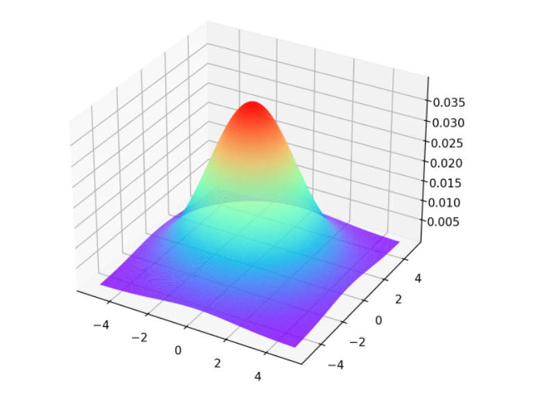
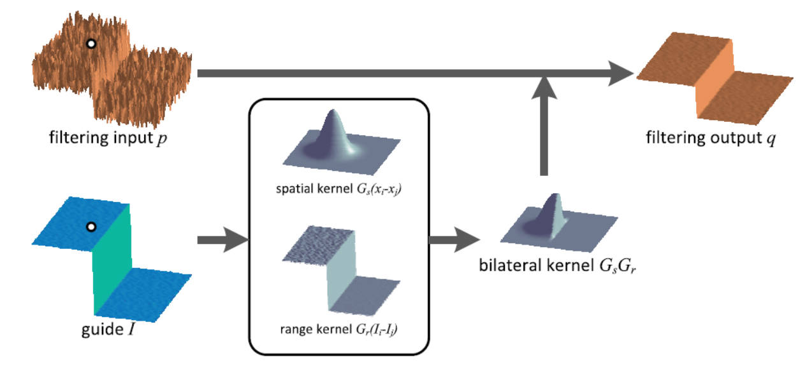

# 图像滤波

# 卷积操作

[图片卷积原理]( DeepLearning/chapter/convolution.md )

<p style="text-align:center;"></p>

```python
# ddepth：图片位深，-1 为默认值
# kernel：卷积核，数据类型为 np.float
# delta：卷积计算后的偏移量 src * kernel + delta
cv2.filter2D(src, ddepth, kernel:np.ndarray[, dst[, anchor[, delta[, borderType]]]]) -> dst
```

# 方盒滤波与均值滤波

- 卷积核
    $$
    K = \alpha \begin{bmatrix}
        1 & 1 & \dotsm & 1 \\
        1 & 1 & \dotsm & 1 \\
         &  & \dotsm &  \\
        1 & 1 & \dotsm & 1 \\
    \end{bmatrix}_{h \times w}
    $$
- 正交化：$\alpha = \frac{1}{h  w}$，即将卷积核对应的值全部相加，再求平均。正交化的方盒滤波也称之为「均值滤波」


```python
# 方盒滤波
# normalize：正交化，一般都设置为 True
cv2.boxFilter(src, ddepth, kernelSize:tuple[, dst[, anchor[, normalize[, borderType]]]]) -> dst

# 均值滤波
cv2.blur(src, kernelSize:tuple[, dst[, anchor[, borderType]]]) -> dst
```
- 效果：卷积核框住的像素点求均值

<p style="text-align:center;"></p>

# 高斯滤波

## 高斯分布

<!-- panels:start -->
<!-- div:left-panel -->
一维高斯分布概率密度函数：

$$
f(x) = \frac{1}{\sigma \sqrt{2 \pi}} e^{-\frac{(x-\mu)^2}{2 \sigma^2}}
$$

其中 $\mu$ 为样本均值；$\sigma$为样本标准差。
<!-- div:right-panel -->
<p style="text-align:center;"></p>
<!-- panels:end -->

<!-- panels:start -->
<!-- div:left-panel -->
二维高斯分布概率密度函数：

$$
f(x, y)=\left(2 \pi \sigma_{1} \sigma_{2} \sqrt{1-\rho^{2}}\right)^{-1} \exp \left[-\frac{1}{2\left(1-\rho^{2}\right)}\left(\frac{\left(x-\mu_{1}\right)^{2}}{\sigma_{1}^{2}}-\frac{2 \rho\left(x-\mu_{1}\right)\left(y-\mu_{2}\right)}{\sigma_{1} \sigma_{2}}+\frac{\left(y-\mu_{2}\right)^{2}}{\sigma_{2}^{2}}\right)\right]
$$

其中 $\mu_1,\mu_2$ 为 $x,y$ 的均值；$\sigma_1,\sigma_2$ 为 $x,y$ 的标准差；$\rho$ 为 $x,y$ 的相关系数。

<!-- div:right-panel -->
<p style="text-align:center;"></p>
<!-- panels:end -->

二维高斯分布太复杂，作如下假设：
- $\mu_1 = \mu_2 = 0$
- $\rho = 0$

得

$$
f(x,y) = \frac{1}{2 \pi \sigma_1 \sigma_2} \exp{ \left [ - \frac{1}{2}(\frac{x^2}{\sigma_1^2}  + \frac{y^2}{\sigma_2^2} ) \right ]}
$$

## 滤波

1. 假定卷积核的中心坐标 $(x,y)$ 为 $(0,0)$ ，然后得到周围的坐标值
    <p style="text-align:center;"></p>
2. 将坐标值带入简化后的二维高斯分布概率密度函数，并取 $\sigma_1 = \sigma_2 =1.5$
    <p style="text-align:center;"></p>
3. 由于计算得到的值只是概率密度，并非概率值，所以还需要将其转为概率。求得整个卷积核的总加和值，然后每个值再除以总和值，得到高斯模板卷积核
    <p style="text-align:center;"></p>
4. 整数高斯模板：所有概率值除以左上角的概率值，然后四舍五入获得整数值。
5. 最后用获得的高斯模板卷积核，进行卷积计算

## OpenCV 代码

```python
# sigmaX ：x 的标准差，不指定的话，根据 kernelSize 进行计算
# sigmaY ：y 的标准差，默认等于 sigmaX 
cv2.GaussianBlur(src, kernelSize:tuple, sigmaX[, dst[, sigmaY[, borderType]]]) -> dst
```

- 效果：卷积核框住的所有像素进行加权平均，中心点权重大，远离中心点的像素权重值小；卷积核尺寸控制了参与加权平均的像素范围。

<p style="text-align:center;"></p>

# 中值滤波

- **实现：** 对卷积核框住的像素值进行排序；取中间值作为输出结果。

```python
cv2.medianBlur(src, kernelSize:int[, dst]) -> dst
```
- **椒盐噪声**：随机出现的「纯白点」或者「纯黑点」
- 效果：去除「椒盐噪声」效果最好
<p style="text-align:center;"></p>

# 双边滤波

## 原理

- **原因：** 高斯滤波在去除高斯噪声的同时，也会不加区分的将图像中的「边缘」一并给加权平均了，所以就导致图片整体看起来很模糊。为了保护边缘，就产生了「双边滤波算法」。
- **图像边缘：** 边缘的产生就是因为相邻的像素的颜色通道差别太大，因此，对相邻像素的颜色做差，就能标记出边缘（差值越大，就说明边缘的可能性越高）。
- **算法思路：** 在高斯滤波的基础上在添加一个灰度距离权重。灰度距离越大，灰度距离权重越小，这样像素在高斯模糊中的占比就越小，进而**实现只对颜色相近的像素进行高斯滤波**。

<p style="text-align:center;"></p>

- **算法：**

    $$
    I_{bf} = \frac{1}{W} \sum_{p \in K} G_s(p)G_r(p) I_p
    $$

    - $I_{bf}$：卷积操作后像素输出值
    - $K$：卷积核框住的像素
    - $G_s(p)$：高斯概率密度函数，卷积核中心像素坐标 $q(x_q,y_q)$，卷积核中某一像素坐标 $p(x_p,y_p)$，
        $$
        \begin{aligned}
        G_s(p) &= \exp{(-\frac{||p-q||^2}{2\sigma_s^2})} \\
            &= \exp{(-\frac{(x_p-x_q)^2 + (y_p - y_q)^2}{2\sigma_s^2})}
        \end{aligned}
        $$
    - $G_r(p)$：灰度值距离权重，灰度距离越大，灰度距离权重越小。卷积核中心像素 $I_q$，积核中某一像素 $I_p$
        $$
        \begin{aligned}
            G_r(p) &= \exp (- \frac{||I_p - I_q||^2}{2 \sigma_r^2}) \\
            &= \exp (-\frac{[ \rm gray(I_p) - gray(I_q) ]^2}{2\sigma_r^2})
        \end{aligned}
        $$
    - $W$：$\sum\limits_{p \in K} G_s(p)G_r(p)$ 的值并不等于`1`，所以还需要进行权重的归一化
        $$
        W = \sum\limits_{p \in K} G_s(p)G_r(p)
        $$

## OpenCV 代码

```python
# sigmaColor：sigma_s，高斯分布的标准差
# sigmaSpace：sigma_r，灰度距离的控制值 
cv2.bilateralFilter(src, kernelSize:int, sigmaColor, sigmaSpace[, dst[, borderType]]) -> dst
```
- **效果：** 同样的 $\sigma_s$ 值和卷积核大小，双边滤波轮廓清晰度更高，去高斯噪声能力相对弱一点。

<p style="text-align:center;"></p>