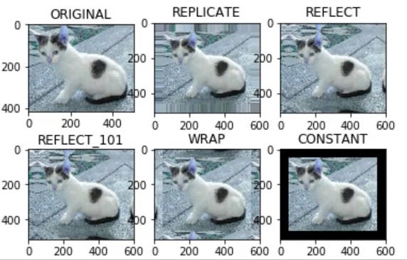

# 基础操作

# OpenCV安装

1. 安装 <a href="https://www.anaconda.com/" class="jump_link"> Anaconda </a>
2. 利用`anaconda`低版本`Python`，例如 `Python 3.6.13 `

    ```term
    triangle@LEARN:~$ conda create --name 新环境名 python=版本号 
    triangle@LEARN:~$ conda activate 环境名 // 切换python版本
    triangle@LEARN:~$ conda deactivate // 退出当前Python环境，回到默认环境
    triangle@LEARN:~$ conda info --envs // 查看虚拟环境
    triangle@LEARN:~$ conda remove -n 环境名 --all // 删除虚拟环境
    ```
3. 将安装的Python添加到`jupyter`中，<span style="color:red;font-weight:bold"> 一定要切换回基础环境，再向 jupyter 中添加内核 </span>
   ```term
    (base) triangle@LEARN:~$ conda activate python36 // 切换到新环境
    (python36) triangle@LEARN:~$ pip install ipykernel // 安装该版本的内核
    (python36) triangle@LEARN:~$ conda deactivate //  注意：一定要切换换回基础环境 
    (base) triangle@LEARN:~$ python -m ipykernel install --name python36 // 将新环境的内核添加到 jupyter 中
    (base) triangle@LEARN:~$ jupyter kernelspec list // 查看添加的内核
    Available kernels:
    python3     D:\Program\anaconda3\share\jupyter\kernels\python3
    python36    C:\ProgramData\jupyter\kernels\python36
    (base) triangle@LEARN:~$ jupyter kernelspec remove 内核名 // 移除内核
   ```
5. 在指定`Python`版本的环境中安装 `OpenCV`。<span style="color:red;font-weight:bold"> 推荐安装 3.4.2 之前版本的  OpenCV 因为新版有些算法不在支持开源；安装时需要使用 pip ，而非 pip3 ，否则可能搜索不到下面这个版本。</span>
    ```term
    triangle@LEARN:~$ pip install opencv-python==3.4.1.15 opencv-contrib-python==3.4.1.15
    ```

# OpenCV 界面

```python
# 导入 OpenCV
import cv2

# 创建窗口，
cv2.namedWindow('window',cv2.WINDOW_NORMAL)

# 更改窗口：window_autosize，设置大小无用
cv2.resizeWindow('window',width=800,height=600)

# 展示窗口、图片等
cv2.imshow('window',0)

# 等待按键
# 1. 将窗口堵塞。等带按键、并会返回按键的ASCII码
# 2. 可以设置等待的时间，单位 ms
# 3. 等待时间为 0 ，则为一直等待 
key = cv2.waitKey(0)

# ord()：获取字符的ASCII码
# key & 0xFF：将 int 类型的低字节给提去出来，因为ASCII码为一字节
if key & 0xFF == ord('q'):
    # 销毁窗口
    cv2.destroyAllWindows()
```

# 图像基本操作

## 图像的输入与输出

```python
# 读取图片
cv2.imread(图片路径,flags)

# 显示图片
cv2.imshow('名字',image)

# 图片保存
cv2.imwrite(保存路径)

# 图片显示函数
def showImage(name:str,image):
    """ 显示图片的函数 """
    cv2.imshow(name,image)
    cv2.waitKey(0) 
    cv2.destroyAllWindows()
```

- `imread`的 flags 
  - `cv2.IMREAD_COLOR`：以彩色读取
  - `cv2.IMREAD_GRAYSCALE`：以灰度图形式读取（黑白图片）

## 图片的数组本质

- **图片数据类型：** 读取的图片类型为 `<class 'numpy.ndarray'>`，即图片其实是一个数据
  - **数组类型：** `uint8`，一字节的无符号整数
  - **数组维度：** 三维，[高度像素，宽度像素，RGB值]

> [!note|style:flat]
> - 由`OpenCV`读取的图片，其通道顺序为：B、G、R；并非一般的R、G、B
> - 根据图片的数组本质，就能通过 numpy 自定义纯色图片：`blackImage = np.zeros(shape=(height,width,3),dtype=np.uint8)`

```python
# 裁剪图片：将原图片的高度 100 - 200 的像素；宽度 50 - 100 的像素。提取出来
img[ 100:200,50:100,: ]

# RGB 通道的拆分：结果为：高度像素 x 宽度像素 的二维数组
b,g,r = cv2.split(img)
b = img[:,:,0]
g = img[:,:,1]
r = img[:,:,2]

# 合并多个被拆分出来的通道：将三个二维数组，组合成三维的数组
img = cv2.merge((b,g,r)) 

# 单通道图片
b = img[:,:,0]
g = img[:,:,1] * 0
r = img[:,:,2] * 0
imgB = cv2.merge((b,g,r)) 

# 图像直接相加
img + img
cv2.add(img,img)
cv2.addWeighted(imgA, alpha, imgB, beta, gamma)

# 黑色图片
blackImage = np.zeros(shape=(380,640,3),dtype=np.uint8)
```

- **图像相加：**
  - `imgA + imgB`：**当数值大于一个字节时，大于一个字节的位数都被丢失了**。
    $$
    (A + B) \ \% \ 256
    $$

  - `cv2.add(imgA,imgB)`：**当数值超过`255`时，取值为`255`**
    $$
    \min(A+B,255)
    $$
   
  - `cv2.addWeighted(imgA, alpha, imgB, beta, gamma)`：
    $$
    \rm min(round(A*\alpha + B *\beta + \gamma),255) 
    $$

```python
# 阈值操作
ret,destImg = cv2.threshold(img,threshVal,maxVal,flags)
```

- **图像阈值类型：** 
  - `cv2.THRESH_BINARY`：
    - `> threshVal`：通道值大于阈值时，取值为`maxVal`
    - `< threshVal`：通道值大于阈值时，取值为`0`
  - `cv2.THRESH_BINARY_INV`：计算方式与上面相反
  - `cv2.THRESH_TOZERO`：
      - `> threshVal`：通道值大于阈值时，不变
      - `< threshVal`：通道值大于阈值时，取值为`0`
  - `cv2.THRESH_TOZERO_INV`：计算方式与上面相反
  - `cv2.THRESH_TRUNC`：
      - `> threshVal`：通道值大于阈值时，取值为`maxVal`
      - `< threshVal`：通道值大于阈值时，不变

  <p style="text-align:center;"></p>

## 修改像素尺寸

**作用：** 图像数据本质上就是一个「三维矩阵」，在对多个图像进行数学运算时，就需要同步矩阵维度。

```python
# (width, height)：直接指定需要的像素值
# fx,fy：当设定(width, height)为(0,0)时，fx与fy分别表示图片两个方向上的缩放比列
cv2.resize(img, Tuple[width, height], fx, fy)
cv2.resize(img,(0,0),fx=1.5,fy=1)
```

## 图像边界扩展

**作用：** 当图像需要变大，但是不想直接缩放，则可以选择不同的方法将图片外围进行扩展，使得原图变大

```python
destImage = cv2.copyMakeBorder(src: Mat, 
                              top_size, bottom_size, left_size, right_size, 
                              borderType)
```
- `top_size, bottom_size, left_size, right_size`：图片上下左右，需要填充的像素值
- `borderType`：填充方式
  - `BORDER_REPLICATE`:复制法，将最边缘像素向外复制。
  - `BORDER_REFLECT`:反射法，对感兴趣的图像中的像素在两边进行复制例如：dcba | abcd（原图） | dcba
  - `BORDER_REFLECT1O1`:反射法，也就是以最边缘像素为轴，例如 dcb | abcd（原图） | cba，**没有复制最边缘的像素**
  - `BORDER_WRAP`:外包装法，abcd | abcd | abcd ，重复原图
  - `BORDER_CONSTANT`:常量法，边界用常数值填充。111 | abcd | 111

  <p style="text-align:center;"></p>

# 视频的基本操作

## 视频本质

视频本质上就是由一个图片的数组加音频组合而成的文件。视频播放时，就是按照一定时间间隔依次读取图片数组中的图片并显示。这个时间间隔为帧数，即一秒钟中能显示多少张图片。

## 视频输入与输出

### 视频文件读取

```python
import cv2
# 读取视频
video = cv2.VideoCapture('视频路径')

# 视频读取
while video.isOpened():
    # 读取一帧
    flag,frame = video.read()

    # 显示
    if flag == True:
        cv2.imshow('video',frame)

    # 控制播放速度：以 60 帧的速度进行图片显示
    if cv2.waitKey(1000 // 60) == ord('q'):
        break 

# 释放
video.release()
cv2.destroyAllWindows()
```

### 摄像头捕获

> [!tip]
> 只要修改`cv2.VideoCapture()`的参数就行，其余和读取视频文件一样

```python
import cv2
# 调用摄像头，抓取图片。设备连接的摄像头从 0 开始编号
video = cv2.VideoCapture(0)

# 视频读取
while video.isOpened():
    
    # 读取一帧
    flag,frame = video.read()

    # 显示
    if flag == True:
        cv2.imshow('video',frame)

    # 控制播放速度：以 60 帧的速度进行图片显示
    if cv2.waitKey(1000 // 60) == ord('q'):
        break 

# 释放
video.release()

cv2.destroyAllWindows()
```
### 视频保存

```python
import cv2
# 调用摄像头，抓取图片。设备连接的摄像头从 0 开始编号
video = cv2.VideoCapture(0)

# 视频保存格式
videoForm = cv2.VideoWriter_fourcc(*'mp4v')

# 保存视频的类，输入参数为：
# 保存路径，保存格式，保存的视频帧数，（宽度像素，高度像素） 
videoSave = cv2.VideoWriter('./asset/capture.mp4',videoForm,24,(640, 480))

# 视频读取
while video.isOpened():

    # 读取一帧
    flag,frame = video.read()

    # 是否读取成功
    if flag == True:
        # 显示
        cv2.imshow('video',frame)
        # 保存
        videoSave.write(frame)

    # 控制播放速度：以 60 帧的速度进行图片显示
    if cv2.waitKey(1000 // 24) == ord('q'):
        break 

# 释放
videoSave.release()
video.release()

cv2.destroyAllWindows()
```

- **帧数**：视频输出的帧率由 `cv2.VideoWriter` 所指定，而`cv2.waitKey(1000 // 24)`规定的是摄像头拍照的帧数，**该值的上限由摄像头所决定，硬件不行，设置多大都没用。**

- **摄像头的像素：** 
  ```python
  import cv
  # 读取视频
  video = cv2.VideoCapture(0)

  # 读取一帧
  flag,frame = video.read()

  # 查看像素
  print(frame)
  ```

  > [!note]
  > 这里`print(frame)`输出的像素值为 `(高度，宽度，颜色通道)`，而`cv2.VideoWriter`设定的像素值应当是 `(宽度，高度)`


# 回调函数

**作用：** 当某一个「事件」发生，就能马上执行对应处理程序，例如，点击鼠标右键，可以弹出菜单。**处理程序靠「回调函数」实现，即当发生某个事件时，就会调用某个函数。**

```python
import cv2
import numpy as np

# 定义鼠标回调函数
# event：事件类型
# x,y：鼠标所在像素值
# userdata：用户传入数据
def mouse_callback(event,x,y,flags,userdata:any):
    if event == cv2.EVENT_LBUTTONDOWN:
        print(event,x,y,flags,userdata)

# 创建窗口
cv2.namedWindow('Event Test',cv2.WINDOW_NORMAL)
cv2.resizeWindow('Event Test',width=640,height=380)

# 鼠标事件指定回调函数
cv2.setMouseCallback('Event Test',mouse_callback,"userdata")

# 生成一个背景图片
bg = np.zeros((380,640,3),dtype=np.uint8)

while True:
    cv2.imshow('Event Test',bg)
    if cv2.waitKey(0) == ord('q'):
        break

cv2.destroyAllWindows()
```

> [!note|style:flat]
> 只有在`cv2.imshow()`中显示了一张「像素图片」后，`mouse_callback`中的`(x,y)`才能正确的输出鼠标的位置坐标值。

# 附录

<a href="https://github.com/spite-triangle/artificial_intelligence/tree/master/example/computerVision/foundation" class="jump_link"> 本章测试程序 </a>

