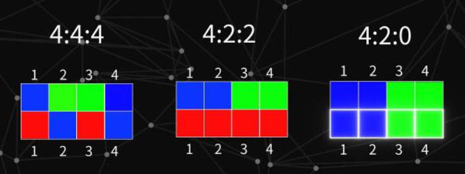
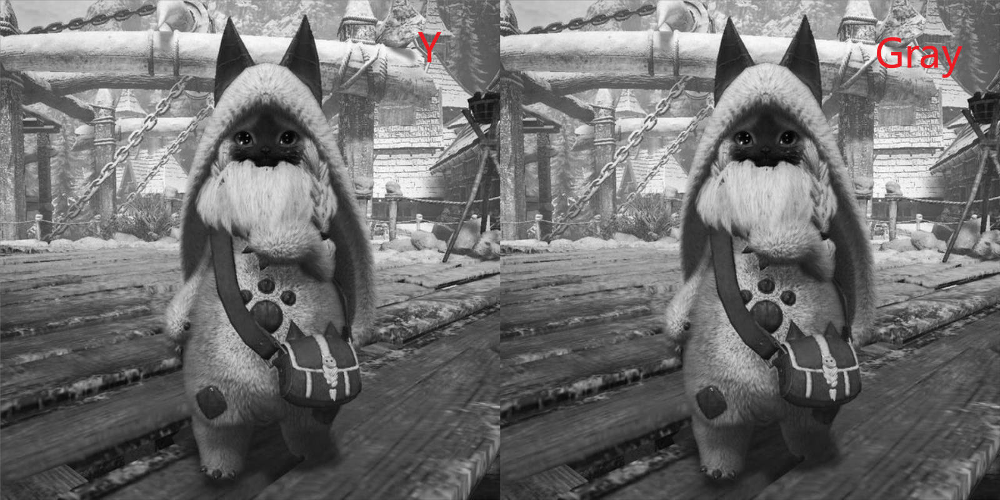

# 图像基础理论


# 色彩空间

<p style="text-align:center;"></p>

图片放大后，就是由带有不同「颜色」的「像素块」所构成。**色彩空间就是描述每个像素块的颜色在数学上应该怎么表示**。

## RGB 模型


<!-- panels:start -->
<!-- div:left-panel -->

根据光学三原色而来，图像中的一个像素点由一个数组`[R,G,B]`构成，一般该数组的类型为「一个字节的无符号整型」。

**而在 OpenCV 中，采用的是反人类的`[B,G,R]`。**

<!-- div:right-panel -->

<p style="text-align:center;"></p>

<!-- panels:end -->

## HSV 模型


<!-- panels:start -->
<!-- div:left-panel -->

HSV 模型的像素点也是通过一个「三维向量」进行表示：
- `Hue`：色相，将所有颜色通过一个数值进行表示
- `Saturation`：饱和度，**颜色与「白色」的混合程度**
- `Value`：明度，颜色的明亮程度


<!-- div:right-panel -->

<p style="text-align:center;"></p>

<!-- panels:end -->

RGB 转 HSV 公式：<a href="https://www.rapidtables.org/zh-CN/convert/color/rgb-to-hsv.html" class="jump_link"> 公式测试 </a>
$$
\begin{aligned}
    r =& \frac{R}{255}, g = \frac{G}{255}, b = \frac{B}{255} \\
    c_{max} &= \max (r,g,b) \\
    c_{min} &= \min (r,g,b) \\
    \delta &= c_{max} - c_{min} \\
    L &= c_{max} \\
    S &= \left\{ \begin{aligned}  \frac{\delta}{c_{max}}, \ c_{max} \neq 0 \\
       0 \quad \quad , c_{max} = 0
    \end{aligned}  \right . \\
    H &= \left \{ \begin{aligned}
       & \frac{g-b}{6 \delta}, \ c_{max}=R \\
       & \frac{b-r}{6\delta} + \frac{1}{3}, \ c_{max}=G \\
       & \frac{r-g}{6\delta} + \frac{2}{3}, \ c_{max}=B \\
       & \qquad 0 \qquad,\delta = 0
    \end{aligned} \right .
\end{aligned}
$$

## HSL 模型

<p style="text-align:center;"></p>

整个形式和 HSV 类似
- `Hue`：色相，与 HSV 一样
- `Saturation`：饱和度，**颜色的稀释程度**
- `Lightness/Brightness`：被灯光照射的亮度


<center>

|     | 色相     | 饱和度                 | 明亮度                                     |
| --- | -------- | ---------------------- | ------------------------------------------ |
| HSV | 所有颜色 | 色相中混入「白色」的量 | 色相中混入「黑色」的量                     |
| HSL | 所有颜色 | 色相被稀释的程度       | 拿灯光照射的情况，没光线就黑，强烈光线就白 |


</center>

RGB转HSL公式：<a href="https://www.rapidtables.org/zh-CN/convert/color/rgb-to-hsl.html" class="jump_link"> 公式测试 </a>

$$
\begin{aligned}
    r =& \frac{R}{255}, g = \frac{G}{255}, b = \frac{B}{255} \\
    c_{max} &= \max (r,g,b) \\
    c_{min} &= \min (r,g,b) \\
    \delta &= c_{max} - c_{min} \\
    L &= \frac{c_{max} + c_{min}}{2} \\
    S &= \left\{ \begin{aligned}  \frac{\delta}{1 - |2L-1|}, \ \delta \neq 0 \\
       0 \quad \quad , \delta = 0
    \end{aligned}  \right . \\
    H &= \left \{ \begin{aligned}
       & \frac{g-b}{6 \delta}, \ c_{max}=R \\
       & \frac{b-r}{6\delta} + \frac{1}{3}, \ c_{max}=G \\
       & \frac{r-g}{6\delta} + \frac{2}{3}, \ c_{max}=B \\
       & \qquad 0 \qquad,\delta = 0
    \end{aligned} \right .
\end{aligned}
$$

## YUV 模型

- **作用：** 可以对色彩空间进行压缩，说人话就是 **缩减了用来表示像素颜色的数据量**，这就使得该模型在图像、视频压缩上应用广泛。
- **思想：** 由于人眼对颜色的感知能力较弱，反而对光影关系（黑白图）更为敏感。所以，在 YUV 模型中，精确保留了图片的「黑白关系」，而对颜色信息进行了部分删除。
- **通道：**
  - `Y`：该通道储存的是「黑白关系」，即「灰度图」。
  - `UV`：这两个通道储存了颜色信息。在对图片颜色时，首先就会对这个两个通道的颜色数据进行丢弃。
- **色彩空间压缩：** 一共有 4 个像素，每个像素都有3个通道值表示颜色，一个通道为一个字节，那么所有数据一共就有`4 x 3 x 1B = 12B`。现在通过 YUV 模型对图片进行压缩，丢掉一半的颜色信息，Y 通道全部保留`4 x 1B = 4B`，UV 通道丢弃一半就是`2 x 4 x 1B / 2 = 4B`，最后数据大小就为`4B + 4B = 8B`。
- **采样方式：** 对于 Y 全部保留，对 UV 进行不同程度的取舍。

    <p style="text-align:center;"></p>

    <p style="text-align:center;"></p>

- **RGB与YUV转换：**
    $$
    \begin{bmatrix}
    Y \\
    U \\
    V
    \end{bmatrix} = 
    \begin{bmatrix}
    0.299 & 0.587 & 0.114\\
    -0.1687 & -0.3313 & 0.5 \\
    0.5 & -0.4187 & -0.0813
    \end{bmatrix}
    \begin{bmatrix}
    R\\
    G\\
    Ｂ
    \end{bmatrix}＋
    \begin{bmatrix}
    0 \\
    128 \\
    128
    \end{bmatrix}
    $$

## 灰度图

OpenCV中的灰度图其实就是 YUV 模型中的 Y 通道：
$$
Y = 0.299 R + 0.587 G + 0.114 B
$$

<p style="text-align:center;"></p>

<details>
<summary><span class="details-title">Python 程序</span></summary>
<div class="details-content"> 

```python
import cv2 
import numpy as np

img = cv2.imread('./asset/cat.jpeg')

# 拆分通道
b,g,r = cv2.split(img)

# YUV 模型
y = 0.299 * r + 0.587 * g  + 0.114 * b
y = np.round(y).astype(np.uint8)

# cv2转换
gray = cv2.cvtColor(img,cv2.COLOR_BGR2GRAY)

# 显示图片
cv2.imshow('y_gray',np.hstack((y,gray)))

cv2.waitKey(0)
cv2.destroyAllWindows()
``` 
</div>
</details>

## OpenCV 色彩空间转换

```python
# code : cv2.COLOR_ 指定图片色彩空间的转换方式
cvtColor(srcimage, code[, dst[, dstCn]]) -> dstImage
```

# 图片的存储

- **Python实现：** 读取的图片类型为 `<class 'numpy.ndarray'>`，即图片其实是一个数据
  - **数组类型：** `uint8`，一字节的无符号整数
  - **数组维度：** 三维，[高度像素，宽度像素，RGB值]

- **C++底层实现：** Python 的 OpenCV 其实就是对 C++ 的版本进行了再次封装实现。在 C++ 中采用数据结构`Mat`来对图片进行存储。
   ```cpp
   class CV EXPORTS Mat{
    public:
        int dims;//维数
        int roWs,cols;//行列数
        unsigned char * data;//存储数据的指针
        int* refcount;//引用计数
       ........
   }
   ```
   **从 `Mat` 中可以看出，图片数据其实是存放在一个`unsigned char *`指向的一片内存空间中，也就是说「图片数据」与「Mat类型」是分开存放的，这就存在「深浅拷贝问题」。而 numpy 也很好的将该结构继承了下来。**

- **numpy 深浅拷贝：**

<!-- panels:start -->
<!-- div:left-panel -->

```python
import numpy as np

a = np.array([1,2,3,4,5])

# 浅拷贝
b = a
c = a.view()

# 深拷贝
d = a.copy()

# 查看数据的真实内存地址
print("a: ",a.__array_interface__['data'])
print("b: ",b.__array_interface__['data'])
print("c: ",c.__array_interface__['data'])
print("d: ",d.__array_interface__['data'])
```
<!-- div:right-panel -->

```term
triangle@LEARN:~$ python test.py
a:  (2753486185808, False)
b:  (2753486185808, False)
c:  (2753486185808, False)
d:  (2753486186544, False)
```

<!-- panels:end -->