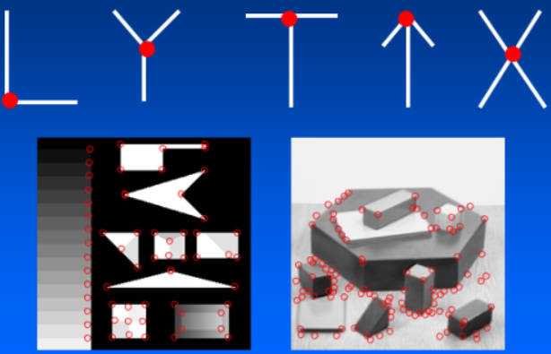
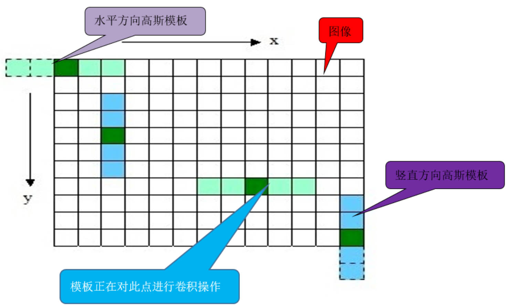
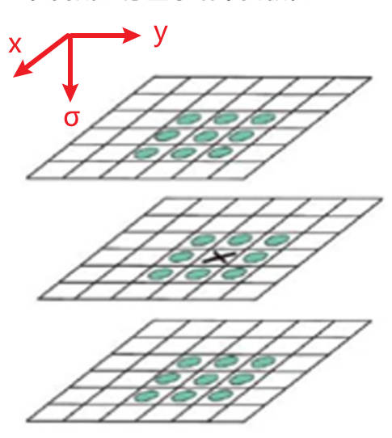
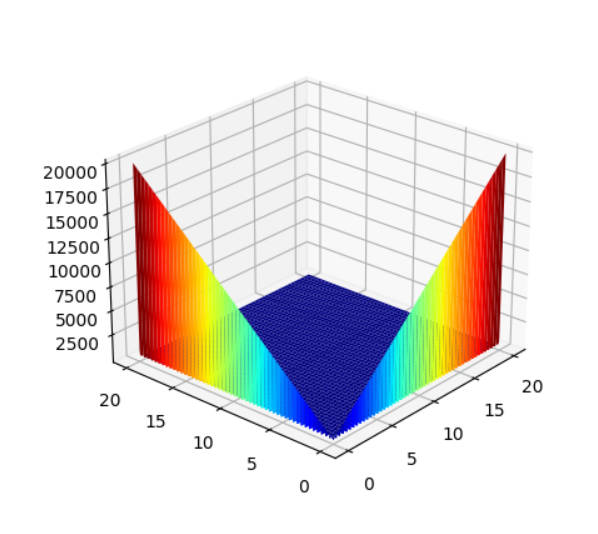
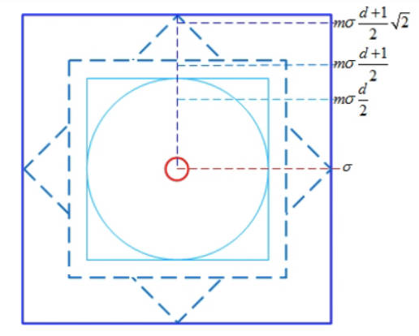
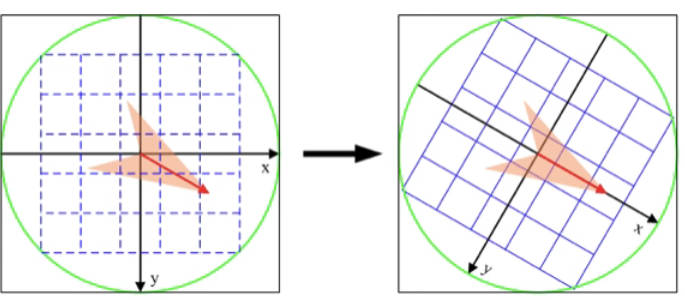
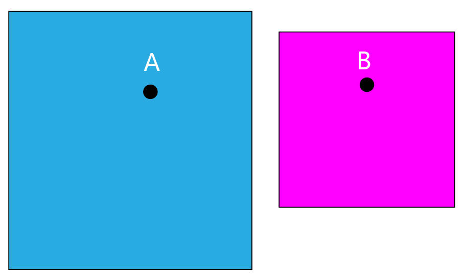

# 图像特征

# 角点检测

## 角点

- **定义：**  两条边的交点，或者说角点的局部邻域应该具有两个不同区域的不同方向的边界

    <p style="text-align:center;"></p>

## 原理

<p style="text-align:center;"></p>

- **基本思想：** 角点周围的灰度值变化肯定较大
- **检测原理：** 使用一个滑动窗口在灰度图上进行任意方向上的滑动，比较滑动前与滑动后两个位置的灰度值：
  - 几乎没有变化：滑动窗口处于颜色填充区域，例如左图所示
  - 在一个方向上有变化：滑动窗口处于图片边缘，例如中间图所示
  - 各个方向变化剧烈：滑动窗口极有可能处于角点位置，例如右图所示

## Harris 算法

- **定义灰度差异：** 
    
    滑动窗口前后位置灰度值的变化程度，可以对前后两个位置处灰度值做差来衡量

    $$
    c(x,y;\Delta x ,\Delta y) = \sum_{(u,v) \in \Omega} (I(u,v) - I(u+\Delta x,v+\Delta y))^2
    $$

    其中，$\Omega$ 表示滑动窗口；$(x,y)$为滑动窗口中心在原图中的坐标；$I(u,v)$ 表示窗口移动前的灰度值；$I(u+\Delta x,v + \Delta y)$ 表示窗口移动 $(\Delta x ,\Delta y)$ 距离后的灰度值。**又由于上述一顿操作下来，只计算了原图「 $(x,y)$ 点」在窗口移动前后的差异，按道理说，距离点 $(x,y)$ 越远点，对其影响应该越小，所以又添加了一个权值进行控制**

    $$
    C(x,y;\Delta x ,\Delta y) = \sum_{(u,v) \in \Omega} w(u,v) (I(u,v) - I(u+\Delta x,v+\Delta y))^2
    $$

    权值可为考高斯分布、也可取常值。

- **求解差异：** 

    **实际使用中，不可能对滑动窗口进行移动后，根据公式定义计算差异，计算量太大且窗口移动方向不定。** 为了近似求解差异，首先 $I(u,v)$ 附近进行泰勒一阶展开

    $$
    I(u + \Delta x,v +\Delta y) =  I(u,v) + I'_x(u,v) \Delta x + I'_y(u,v) \Delta y 
    $$

    得

    $$
    I(u + \Delta x,v +\Delta y) - I(u,v) = I'_x(u,v) \Delta x + I'_y(u,v) \Delta y 
    $$

    公式回代就是

    $$
    c(x,y;\Delta x ,\Delta y) = \sum_{(u,v) \in \Omega}(I'_x(u,v) \Delta x + I'_y(u,v) \Delta y)^2
    $$

    并根据线性代数，将上式转换为二次型

    $$
    c(x,y;\Delta x ,\Delta y) = [\Delta x, \Delta y] M(u, v)\left[\begin{array}{c}
    \Delta x \\
    \Delta y
    \end{array}\right]
    $$

    其中

    $$
    \begin{aligned}
        M(u, v) &=\sum_{\Omega}\left[\begin{array}{cc}
        I'_{x}(u, v)^{2} & I'_{x}(u, v) I'_{y}(u, v) \\
        I'_{x}(u, v) I'_{y}(u, v) & I'_{y}(u, v)^{2}
        \end{array}\right] \\
        &=\left[\begin{array}{cc}
        \sum\limits_{\Omega} I'_{x}(u, v)^{2} & \sum\limits_{\Omega} I'_{x}(u, v) I'_{y}(u, v) \\
        \sum\limits_{\Omega} I'_{x}(u, v) I'_{y}(u, v) & \sum\limits_{\Omega} I'_{y}(u, v)^{2}
        \end{array}\right] \\
        &=\left[\begin{array}{ll}
        A & C \\
        C & B
        \end{array}\right]
    \end{aligned}
    $$

    最终得到

    $$
    \begin{aligned}
        c(x,y;\Delta x ,\Delta y) &= [\Delta x, \Delta y] M(u, v)\left[\begin{array}{c}
        \Delta x \\
        \Delta y
        \end{array}\right] \\
        &= A \Delta x ^2 + 2C \Delta x \Delta y + B \Delta y^2
    \end{aligned}
    $$

    > [!note]
    > $I'_{x}，I'_{y}$ 可以通过 Sobel 算子进行近似计算。

- **等效椭圆：** 

    上述化简结果从形式上看就是一个非标准的椭圆

    $$
    \frac{(x - x_c)^2}{a} + \frac{(y-y_c)^2}{b} = 1
    $$

    为了观察方便，肯定是要将椭圆标准化为

    $$
    \frac{x^2}{a} + \frac{y^2}{b} = 1
    $$

    由于 $M$ 为对角线矩阵

    $$
    \begin{aligned}
        M(u, v) &= \begin{bmatrix}
            A & C \\
            C & B \\
        \end{bmatrix} \\
        &= P^T \begin{bmatrix}
            \lambda_1 & 0 \\
            0 & \lambda_2 \\
        \end{bmatrix} P
    \end{aligned}
    $$

    回代就为

    $$
    \begin{aligned}
        c(x,y;\Delta x ,\Delta y) &= [\Delta x, \Delta y] M(u, v)\left[\begin{array}{c}
        \Delta x \\
        \Delta y
        \end{array}\right] \\
        &= [\Delta x, \Delta y] P^T \begin{bmatrix}
            \lambda_1 & 0 \\
            0 & \lambda_2 \\
        \end{bmatrix} P \left[\begin{array}{c}
        \Delta x \\
        \Delta y
        \end{array}\right] \\
        &=\left (  P \left[\begin{array}{c}
        \Delta x \\
        \Delta y
        \end{array}\right] \right)^T
        \begin{bmatrix}
        \lambda_1 & 0 \\
        0 & \lambda_2 \\
        \end{bmatrix} \left (  P \left[\begin{array}{c}
        \Delta x \\
        \Delta y
        \end{array}\right] \right) \\
    &= \lambda_1 \Delta \hat{x}^2 + \lambda_2 \Delta \hat{y}^2
    \end{aligned} 
    $$

    **即对 $\left[\begin{array}{c} \Delta x \\  \Delta y \end{array}\right]$ 进行坐标变换，将原来的椭圆变换成了标准椭圆。$\lambda_1$值越大，说明对 $\hat{x}$ 方向上的移动越敏感，也就是说该方向上灰度值变化很大，$\lambda_2$同理。**

    <p style="text-align:center;"></p>

- **特征值与角点：**
    <p style="text-align:center;"></p>

- **角点判断指标：**
    $$
    R = \lambda_1 \lambda_2 - k (\lambda_1 + \lambda_2)^2
    $$

    - $R > 0$：角点的可能最大
    - $R \approx 0$：光滑区域
    - $R < 0$：边缘


## OpenCV 代码

```python
import cv2
import numpy as np

img = cv2.imread('./card.jpg')
imgGray = cv2.cvtColor(img,cv2.COLOR_BGR2GRAY)

# blockSize: 滑动窗口
# ksize：sobel 算子计算梯度的卷积核尺寸
# k：R系数的k值
# cornerHarris(src:np.float32, blockSize:int, ksize:int, k[, dst[, borderType]]) -> dst
imgGray = np.float32(imgGray)
dst = cv2.cornerHarris(imgGray,2,3,0.04)

# 标记出角点
img[dst > 0.1 * dst.max()] = [0,0,255]

cv2.imshow('test',img)
cv2.waitKey(0)
cv2.destroyAllWindows()
```
<p style="text-align:center;"></p>

# SIFT 算法

> - <a href="https://www.cs.ubc.ca/~lowe/pubs.html" class="jump_link"> David Lowe 大佬论文 </a>
> - <a href="/artificial_intelligence/paper/Distinctive_Image_Features.pdf" class="jump_link"> Distinctive Image Features from Scale-Invariant Keypoints </a>
> - <a href="/artificial_intelligence/paper/Scale_space_thoery.pdf" class="jump_link"> 尺度空间理论：Scale Space Thoery </a>
> - <a href="http://weitz.de/sift/index.html?size=large" class="jump_link"> SIFT - Scale-Invariant Feature Transform </a>
> - <a href="https://www.cnblogs.com/Alliswell-WP/p/SIFT.html" class="jump_link"> SIFT 算法详解 </a>

## 尺度空间

- **人眼视觉：** 
  - **近大远小**：同一物体，近处看时感觉比较大，远处看时感觉比较小；
  - **模糊**：更准确说应该是「粗细」，我们看近处，可以看到物体的细节（人会觉得比较清楚）。

- **尺度空间作用：** 对输入图片模拟出图片信息近大远小以及模糊的效果，从而使得机器对同一张图片的感知与人眼近似。


## 尺度空间实现

- **SIFT尺度空间**：不同大小的高斯核函数对图像进行卷积滤波同时在层级变换之间进行下采样来构建金字塔模式下的尺度空间。

    <p style="text-align:center;"></p>

    1. **近大远小**：不同的`Octave`具有不同的分辨率。
    2. **模糊**：同一`Octave`下的图片，进行不同程度的「高斯滤波」

- **高斯金字塔构建：**

    <p style="text-align:center;"></p>

    1. 输入图像首先会进行一次高斯上采样（放大，红色箭头），然后再进行高斯模糊、高斯下采样得到金字塔的第一张图片（黄色箭头）。
    2. 高斯模糊标准计算公式为
        $$
        \sigma(o,r) = \sigma_0 2^{o + \frac{s}{n}}\qquad o \in [0,\dotsm,O-1],s \in [0,\dotsm,S-1]
        $$
        其中 $O$为 Octave 总数目；$o$ 为 Octave 索引号；$S$ 为一级 Octave 所内包含图片的总数；$s$ 为一级 Octave 图片索引号；$n$ 为一级 Octave 所能产生的「特征层」（之后说明）总数。
        $$
        S = n + 3
        $$
    3. **每一级 Octave 的第一张图片，都可以抽取上一 Octave 的倒数第三张图片（索引号$s=S-2$）进行一次「高斯下采样」获取（蓝色箭头）。**
    4. 对图片进行高斯模糊实际上可以通过上一张图片得到，而不用从原图获取。具体计算公式为 （具体细节见 <a href="./artificial_intelligence/ComputerVision/chapter/imageFeature.md" class="jump_link"> 高斯滤波的叠加性 </a>）
        $$\sigma=\sqrt{\sigma_{target}^2 - \sigma_{last}^2}$$
    5. 高斯核的大小为 $(3\sigma + 1 \times 3 \sigma + 1)$ ，因为高斯分布的置信区间为 $[-3\sigma,3\sigma]$，利用上述「高斯滤波的叠加性」还能缩小每一次高斯核的尺寸，加快速度。
    6. 为了加速高斯滤波，高斯滤波还能分解为在水平方向一维滤波一次，然后再垂直方向再一维滤波一次。
        <p style="text-align:center;"></p>

## 高斯差分金字塔

- **实现：** 高斯金字塔中，同一级 Octave 中，不同模糊程度的相邻图片之间做差。**做差之后，相同的部分被剔除，差异部分被保留。** 

    <p style="text-align:center;"></p>

- **数学描述：** 
    
    $$
    \begin{aligned}
        D(x,y,\sigma) &= \left[ G(x,y,k \sigma) - G(x,y,\sigma) \right] * I(x,y) \\
        &= L(x,y,k \sigma) - L(x,y, \sigma)
    \end{aligned}
    $$

- **高斯差分的原因：** 
    
    <span style="color:red;font-weight:bold">     高斯核的差分计算结果可以当作是高斯拉普拉斯 $\sigma^2 \nabla^{2} G$ 的近似值，研究已经表明高斯拉普拉斯的极大值与极小值产生的「图像特征」效果最好。（原理看不懂、反正这就是结论 (￣_￣|||)）</span>

    $$
    \begin{aligned}
        G(x,y,\sigma) &= \frac{1}{2 \pi \sigma^2} e^{-\frac{x^2+y^2}{2\sigma^2}} \\
        \frac{\partial G}{\partial \sigma} &=\frac{-2 \sigma^{2}+x^{2}+y^{2}}{2 \pi \sigma^{5}} e^{-\left(x^{2}+y^{2}\right) / 2 \sigma^{2}} \\
        \nabla^{2} G &=\frac{\partial^{2} G}{\partial x^{2}}+\frac{\partial^{2} G}{\partial y^{2}}=\frac{-2 \sigma^{2}+x^{2}+y^{2}}{2 \pi \sigma^{6}} e^{-\left(x^{2}+y^{2}\right) / 2 \sigma^{2}} \\
        \frac{\partial G}{\partial \sigma} &=\sigma \nabla^{2} G \approx \frac{G(x,y,k \sigma) - G(x,y,\sigma)}{k\sigma - \sigma}
    \end{aligned}
    $$

## 关键点初步查找

- **关键点：** 能稳定确定图像特征的点。**从上文可知，在 SIFT 算法中，就是差分金字塔中的极大值与极小值位置对应的点。**
- **查找步骤：**
    1. **阈值检测：** 去除一些噪点或其它一些不稳定像素点，大于阈值的点才进行初步检测
        $$
        \rm abs(D(x,y,\sigma)) > \frac{T}{2n} \qquad 通常取：T=0.04
        $$
    2. **初步查找：** 
        <p style="text-align:center;"></p>

        在「高斯差分金字塔」中，当前点（`x`位置）与邻近点（绿色圆圈）进行比较，判断当前点是否为局部极值，若是，就把「当前位置」记录下来。

> [!note]
> 同一级 Octave 产生的差分层至少要有`3`层才能进行极值查找，`3`层差分层最后极值位置查找结果又构成一层「特征层」。一级 Octave 包含有 S 张图片，S 张图片进行高斯差分能产生 S - 1 层，S - 1 层差分层的最上层与最下层无法构成特征层，所以将产生 S - 3 层特征层。因此特征层与高斯层的层数关系为
> $$ S = n + 3 $$

## 关键点精确定位

<p style="text-align:center;"></p>

又由于差分层中的点为离散点，这样查找出来的关键点位置不一定是真正的极值点位置，所以还需要对其位置进行补偿。

对初步查找到的关键点 $X$，在其领域（坐标附近一个很小范围）内进行泰勒展开

$$
\begin{aligned}
D(X_{i+1})&=D\left(X_i \right)+\frac{\partial D^{\mathrm{T}}}{\partial X_i} \hat{X_i}+\frac{1}{2} \hat{X_i}^{\mathrm{T}} \frac{\partial^{2} D}{\partial X_i^{2}} \hat{X_i} \\
X_i &= \begin{bmatrix}
    x_i \\ y_i \\ \sigma
\end{bmatrix} \qquad \hat{X_i} = X_{i+1} - X_i
\end{aligned} 
$$

极值的条件就为

$$
D'(X_{i+1}) = 0
$$

求解得

$$
\hat{X_i}=-\frac{\partial^{2} D^{-1}}{\partial X_i^{2}} \frac{\partial D}{\partial X_i}
$$

就是说在位置 $X_{i+1}=X_i + \hat{X_i}$ 取得真正的极值。将结果进行回代的

$$
D(X_{i+1})=D(X_i)+\frac{1}{2} \frac{\partial D^{T}}{\partial X_i} \hat{X_i}
$$

对上述步骤进行迭代，当 $\hat{X_i}$ 小于一定值时，就终止；若计算发散、超出迭代次数，则舍弃掉该点。

最后，再对迭代计算得到的极值进行校验，不满足条件，则丢掉。

$$
\rm abs(D(x,y,\sigma)) > \frac{T}{2n} \qquad 通常取：T=0.04
$$

> [!tip]
> - 公式中所涉及的偏导数，均可通过差分公式进行计算，在图像滤波章节已进行过推导，因此不再重复。
> - 经过校验得到的关键点坐标 $[x,y,\sigma]^T$ 其取值已经不在是「整数」，极大可能已经变为「浮点数」，**但是，不用做整型处理**。

## 边缘效应

### Hessian 矩阵算法

- **边缘效应：** 高斯差分对「边缘」有很强的灵敏度，这样就会选择出一些不稳定的边缘特征，因此需要排除这些特征。

- **算法：** 
    
    1. 求解高斯差分的 Hessian 矩阵
        $$
        \mathbf{H}=\left[\begin{array}{cc}
        D_{x x} & D_{x y} \\
        D_{x y} & D_{y y}
        \end{array}\right]
        $$

    2. 令矩阵的特征值为 $\lambda_1、\lambda_2$ 且满足关系 $\lambda_1 = \gamma \lambda_2 , \gamma > 1$
        $$
            \begin{aligned}
                Tr(H) &= DD_{xx} + DD_{yy} = \lambda_1 + \lambda_2 \\
                Det(H) &= DD_{xx} - DD_{yy}^2 = \lambda_1 \lambda_2
            \end{aligned}
        $$
    3. 极值的 Hessian 矩阵要满足下列条件才保留，否则剔除掉。$\hat{r}$ 为指定阈值
        $$
        0 < \frac{(\lambda_1 + \lambda_2)^2}{\lambda_1\lambda_2} = \frac{(r+1)^2}{r} < \frac{(\hat{r}+1)^2}{\hat{r}}
        $$

### 直观解释

首先回忆求 $f(x,y)$ 极值的流程：

1. 求解驻点
    $$
    \begin{aligned}
        f'_x(x,y) = 0 \\
        f'_y(x,y) = 0
    \end{aligned}
    $$
3. 对驻点进行检验
    $$
        A=f_{xx}(x,y)，B=f_{xy}(x,y)，C=f_{yy}(x,y)
    $$

    - 若 $AC - B^2 > 0$：是极点
    - 若 $AC - B^2 < 0$：不是极点
    - 若 $AC - B^2 = 0$：鞍点

将上述 $A,B,C$ 写成矩阵形式

$$
H = \begin{bmatrix}
    A & B \\
    B & C
\end{bmatrix} = \begin{bmatrix}
    f_{xx}(x,y) & f_xy(x,y) \\
    f_{xy}(x,y) & f_{yy}(x,y)
\end{bmatrix}
$$

**这不就是 Hessian 矩阵，$Dec{( H )} = AC - B^2$。和求解 $f(x,y)$ 极值不同的是SFTI算法中是直接比较得到局部极值，然后再通过泰勒展开来进一步定位极值。** <span style="color:red;font-weight:bold"> Hessian 矩阵的作用说白了就是对得到的极值再进行一次理论上的判定。 </span>

此外，不同于二元函数极值检测，SFTI 算法中还对 Hessian 矩阵的特征值进行了阈值限定

$$
\frac{(\lambda_1 + \lambda_2)^2}{\lambda_1\lambda_2}  < \frac{(\hat{r}+1)^2}{\hat{r}}
$$

绘制出 $\lambda_1 \in [0.001,20],\lambda_2 \in [0.001,20]$ 区域内， $f(\lambda_1 , \lambda_2) = \frac{(\lambda_1 + \lambda_2)^2}{\lambda_1\lambda_2}$ 的三维图，如下图所示。**可以看见当 $\lambda_1$ 或 $\lambda_2$ 某一个值太大时，就会导致 $f(\lambda_1,\lambda_2)$ 的值过大**。

<p style="text-align:center;"></p>

为了观察 $\lambda_1$ 、$\lambda_2$ 对平面的影响，定义一个简单的二维平面 

$$
f(x,y) = a x^2 + b y^2
$$

其 Hessian 矩阵就为

$$
\begin{bmatrix}
    a & 0 \\
    0 & b \\
\end{bmatrix}
$$

其中 $a$、$b$ 就是特征值 $\lambda_1$ 、$\lambda_2$

<p style="text-align:center;"></p>

<span style="color:red;font-weight:bold"> 从图中可以直观感受，不能放任 $\frac{(\lambda_1 + \lambda_2)^2}{\lambda_1\lambda_2}$ 的值过大，也不能让其为负数。该值过大时，就会导致所得到的极值点不明显；该值为负数时，得到的关键点为鞍点，不能要。</span>

<details>
<summary><span class="details-title">案例代码</span></summary>
<div class="details-content"> 

```python
import numpy as np
import matplotlib.pyplot as plt
from mpl_toolkits import mplot3d

# a=np.linspace(0.001,20,1000)
# b=np.linspace(0.001,20,1000)
# x,y=np.meshgrid(a,b)
# z = (x + y)**2 / (x*y)

a=np.linspace(-50,50,1000)
b=np.linspace(-50,50,1000)
x,y=np.meshgrid(a,b)
c1 = 10
c2 = 10
z = c1 * x**2  + c2 * y**2 

ax = plt.axes(projection='3d')
ax.plot_surface(x,y,z,cmap="jet")
plt.title('a='+str(c1)+' b='+str(c2),y=-0.1)
plt.show()
``` 

</div>
</details>

## 关键点方向

**通过上面的操作从高斯差分金字塔中获取到了一系列的关键点位置，「高斯差分金字塔」的任务也就完成了，下文开始所有操作回到「高斯金字塔」。**

<p style="text-align:center;"></p>

1. 由于查找精确位置时，已经将 $[x,y,\sigma]^T$ 的值变成其他「浮点数」，这就导通过该坐标无法直接定位「高斯金字塔」的具体像素坐标了，例如图片中，根本不存在像素坐标 `[3.5,4.2]` 。
2. **定位图片**：关键点坐标中的 $\sigma$ 距离哪张图片最近就选择哪张图片。
3. **定位像素**：以关键点 $(x,y)$ 为中心点，以图像的高斯尺度 $\sigma_{img}$ 的 $1.5$ 倍为半径，去框图片的像素点。
4. **幅值与角度**：需要计算被框住的像素点的幅值与角度
    $$
    \begin{array}{c}
    m(x, y)=\sqrt{(L(x+1, y)-L(x-1, y))^{2}+(L(x, y+1)-L(x, y-1))^{2}} \\
    \theta(x, y)=\tan ^{-1}((L(x, y+1)-L(x, y-1)) /(L(x+1, y)-L(x-1, y)))
    \end{array}
    $$

    其中 $L(x,y)$ 为高斯金字塔灰度值；$m(x, y)$ 为幅值；$\theta(x, y)$为方向

5. **$\theta(x, y)$ 简化**：由于方位角是 $[0^\circ,360^\circ]$ 全部角度都采用，就太丧心病狂了，SIFT 算法只选取了`8`个方向（每间隔$45^\circ$为一个方向），计算出来的  $\theta(x, y)$ 距离哪个方向最近，就是选择哪个方向。

6. **幅值处理：** 为了秉承距离关键点越近，影响越大的原则，所有幅值还要计算一次高斯滤波，给幅值添加权重。

7. **直方图统计**：以方向为横坐标，对加权后的幅值进行累加，如上图所示。<span style="color:blue;font-weight:bold"> 为了防止某个梯度方向角度因受到噪声的干扰而突变，还可以对直方图进行平滑处理。 </span>
8. **方向选择：** 
    - **主方向：** 柱子最高的
    - **辅方向：** 当柱子高度大于主方向的 `80 %`时，定义为辅方向
    - **后续处理中，主方向与辅方向看作是同一位置的两个不同关键点。**

## 关键点描述符

走完上面的所有步骤后，就确定了关键点的位置、方向。接下来就对关键点进行数学上的定义。

1. **定位像素：** 同样以 $(x,y)$ 为中心点，取半径为
    $$
    r =  m\sigma_{img}(d+1)\frac{\sqrt{2}}{2}
    $$

    其中 $m$ 可以取 `3`（$3\sigma_{img}$ 的置信度区间）；$d$ 描述符的尺寸。

    <p style="text-align:center;"></p>

2. 定位到的像素块朝关键点的方向进行旋转：**为了将关键点特征归一化，使其在不同的角度下都能恒定不变。旋转方法为「仿射变换」，具体介绍见图像变换章节。**
    <p style="text-align:center;"></p>

3. **像素点差值扩充：**  被框选住的像素点，还不够用于建立描述符，所以需要对原来的像素进行差值扩充，像素尺寸扩展到 `16 x 16`

    <p style="text-align:center;"></p>

4. **计算幅值与方向：** 同上文所述，计算 `16 x 16` 中每个像素点的梯度幅值与方向
5. **描述符创建：** 将 `16 x 16` 拆分为 `16` 个 `4x4` 的小区域，并且每个区域进行直方图统计，记录下`8`个方向上的幅值，因此，一个关键点描述符的维度就为 `4*4*8=128`。
6. 重复上述步骤，将高斯金字塔中的所有关键点描述符创建出来。

## OpenCV 代码

```python
img = cv2.imread('./cat.jpeg')
imgGray = cv2.cvtColor(img, cv2.COLOR_BGR2GRAY)

# 创建 SIFT 算法
# nfeatures：特征层数
# nOctaveLayers：高斯金字塔 octave 组数
# contrastThreshold：极值点阈值
# edgeThreshold：边缘效应阈值
# SIFT_create([, nfeatures[, nOctaveLayers[, contrastThreshold[, edgeThreshold[, sigma]]]]]) -> retval
sift = cv2.SIFT_create()

# 查找关键点位置
kp = sift.detect(imgGray,None)

# 计算特征
# keypoints：所有关键点
# descriptors：关键点的描述符
# compute(img,KeyPoints:tuple) -> KeyPoints:tuple, descriptors:np.ndarray
kp,des = sift.compute(imgGray,kp)

# 将上面两步骤合并为一个函数
kp,des = sift.detectAndCompute(imgGray,None)

# 绘制关键点
# drawKeypoints(image, keypoints, outImage[, color[, flags]]) -> outImage
cv2.drawKeypoints(img,kp,img)
```

> [!tip]
> 如果程序不能运行，就卸载掉已经安装的旧版 `opencv-contrib-python`，然后直接安装最新版的。SIFT 算法专利已经过期，最新版本又能继续使用了。


- <a href="https://docs.opencv.org/4.x/d2/d29/classcv_1_1KeyPoint.html" class="jump_link"> 关键点类 </a>

    ```python
    # 得到的是 KeyPoint 类的一个元组
    kps = sift.detect(img,None)
    kp = kps[0]

    # 坐标位置
    kp.pt

    # 关键点的角度
    kp.angle

    # 关键点的幅值
    kp.response
    ```

# BF特征匹配
## 理论
- **思路：** 暴力匹配，遍历两张图片关键点的描述符，然后比较两个描述符之间的差异，例如计算两个描述符之间的距离。

- **交叉检测（crossCheck）：** 蓝色图的关键点A与紫色图的关键点B匹配时，A 描述符与紫图中所有描述符最接近的点是 B，同时 B 描述符与蓝图中所有描述符最接近的点也要是 A，这样才认为 A 点与 B 点匹配。
    <p style="text-align:center;"></p>


## 1对1匹配


```python
sift = cv2.SIFT_create()
kp1,des1 = sift.detectAndCompute(img1Gray,None)
kp2,des2 = sift.detectAndCompute(img2Gray,None)
# 建立匹配算法
# normType：两个描述符距离的计算方式，默认为 cv2.NORM_L2，两个坐标的欧式距离 
# cv2.BFMatcher(normType, crossCheck)
bf = cv2.BFMatcher(crossCheck=True)

# 匹配
# imgSrc：被匹配的图片
# imgTemp：模板
# res：DMatch类型的数组
# match(imgSrc,imgTemp) -> res:list
matchRes = bf.match(des1,des2)
matchRes = sorted(matchRes,key=lambda x:x.distance)

# 绘制匹配
# drawMatches(img1, keypoints1, img2, keypoints2, matches1to2, 
#           outImg[, matchColor[, singlePointColor[, matchesMask[, flags]]]]) -> outImg
imgMatch = cv2.drawMatches(img1,kp1,img2,kp2,matchRes[:15],None,flags=2)
```
<p style="text-align:center;"></p>


- <a href="https://docs.opencv.org/3.4/d4/de0/classcv_1_1DMatch.html" class="jump_link"> DMatch类 </a>：匹配返回的结果
    - `DMatch.queryIdx`：对应匹配第一张输入图片（imgSrc）的 `KeyPoint` 对象的索引
    - `DMatch.trainIdx`：对应匹配第二张输入图片（imgTemp）的 `KeyPoint` 对象的索引
    - `DMatch.distance`：关键点描述符的距离
- <a href="https://docs.opencv.org/3.4/de/d30/structcv_1_1DrawMatchesFlags.html" class="jump_link">  `DrawMatchesFlags` </a>：控制匹配结果如何绘制


## 1对多匹配

- **k对最佳匹配**：每一个特征点在另一张图片上都会有多个最匹配的点存在，即同一个特征点对应多个匹配对象。实现方法与1对1匹配大同小异。

```python
# 建立匹配算法
bf = cv2.BFMatcher()

# 匹配
# k：一张图的关键点可以与另一张图的 k 个关键点相匹配
# knnMatch(imgSrc,imgTemp,k) -> res:tuple
matchRes = bf.knnMatch(des1,des2,k=2)

# 筛选匹配，获得最佳匹配
goodMatchs=[]
for m, n in matchRes:
    if m.distance < 0.75*n.distance:
        goodMatchs.append([m]) 

# 绘制匹配
# drawMatchesKnn(img1, keypoints1, img2, keypoints2, matches1to2, 
#           outImg[, matchColor[, singlePointColor[, matchesMask[, flags]]]]) -> outImg
imgMatch = cv2.drawMatchesKnn(img1,kp1,img2,kp2,goodMatchs,None,flags=2)
```

- **`BFMatcher`**：不用启用交叉检测，之后的筛选匹配步骤就能规避
- **`knnMatch`结果**：该匹配算法返回的结果为`tuple`，是一组`DMatch`类型。其含义为一张图片中的一个关键点与另一张图片关键点的 k 个对应值。
- **筛选匹配：** 每一个特征点（设为A）都有最匹配的另外两个特征点在另一张图上，设为B和C。其中AB的距离最短，AC的距离次短。那么规定，如果AB间的距离小于AC间距离的0.75倍，则认为AB的匹配度远远大于A与其他任何点的匹配度，则将AB两点连起来。

