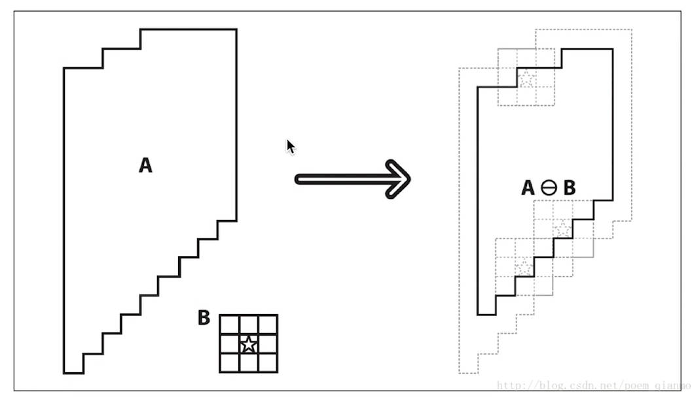

# 形态学操作

> [!note]
> 形态学操作，主要是对二值图像进行一系列处理。

# 阈值控制

```python
# 阈值控制
ret,destImg = cv2.threshold(img,threshVal,maxVal,flags)
```
- **作用：** 根据设定的「阈值」将图像拆分为两个部分，例如纯黑-纯白图。

- **图像阈值类型：** 
  - `cv2.THRESH_BINARY`：
    - \> threshVal：通道值大于阈值时，取值为`maxVal`
    - < threshVal：通道值大于阈值时，取值为`0`
  - `cv2.THRESH_BINARY_INV`：计算方式与上面相反
  - `cv2.THRESH_TOZERO`：
      - \> threshVal：通道值大于阈值时，不变
      - < threshVal：通道值大于阈值时，取值为`0`
  - `cv2.THRESH_TOZERO_INV`：计算方式与上面相反
  - `cv2.THRESH_TRUNC`：
      - \> threshVal：通道值大于阈值时，取值为`maxVal`
      - < threshVal：通道值大于阈值时，不变

  <p style="text-align:center;"></p>


# 腐蚀和膨胀

## 腐蚀

<p style="text-align:center;"></p>

- **原理：**  卷积核中值为`1`框住的像素中，存在「零」时，卷积核中心对于的像素为「零」。

```python
# iterations：腐蚀操作重复多少次
cv2.erode(src, kernel:np.ndarray[, dst[, anchor[, iterations[, borderType[, borderValue]]]]]) -> dst

# cv2生成卷积核
# shape ：cv2.MORPH_
cv2.getStructuringElement(shape, ksize[, anchor]) -> retval
```

<p style="text-align:center;"></p>

## 膨胀

<p style="text-align:center;"></p>

- **原理：** 卷积核中值为`1`框住的像素中，存在「非零」时，卷积核中心对于的像素为「非零」。

```python
# iterations：膨胀操作重复多少次
cv2.dilate(src, kernel:np.ndarray[, dst[, anchor[, iterations[, borderType[, borderValue]]]]]) -> dst
```


<p style="text-align:center;"></p>

# 形态学操作

```python
# op：cv2.MORPH_ 形态学的操作类型
cv2.morphologyEx(src, op, kernel:np.ndarray[, dst[, anchor[, iterations[, borderType[, borderValue]]]]]) -> dst
```

- 开运算 `cv2.MORPH_OPEN`：先腐蚀、再膨胀
- 闭运算 `cv2.MORPH_CLOSE`：先膨胀、再腐蚀
- 梯度运算 `cv2.MORPH_GRADIENT`：膨胀 - 腐蚀
- 礼帽 `cv2.MORPH_TOPHAT`：原始 - 开运算
- 黑帽 `cv2.MORPH_BLACKHAT`：闭运算 - 原始