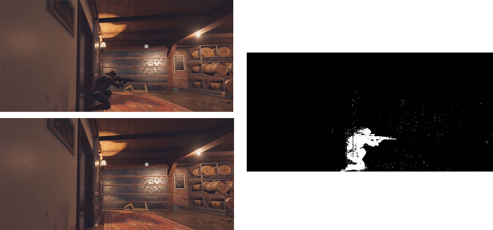

# 运动检测
<a href="https://github.com/spite-triangle/artificial_intelligence/tree/master/example/computerVision/motion" class="jump_link"> 本章测试程序 </a>
# 背景建模

## 帧差法

- **思想：** 由于场景中的目标在运动，目标的影像在不同图像帧中的位置不同。该类算法对时间上连续的两帧图像进行差分运算，不同帧对应的像素点相减，判断灰度差的绝对值，当绝对值超过一定阈值时，即可判断为运动目标，从而实现目标的检测功能。

- **实现：** 
    1. 相邻两张图片做差值
        $$
        D_{n}(x, y)=\left|I_{n}(x, y)-I_{n-1}(x, y)\right| \\
        $$
    2. 标记出灰度变化大于阈值的部分
        $$
        \begin{array}{l}
        R_{n}(x, y)=\left\{\begin{array}{l}
        255, \quad D_{n}(x, y)>Threshold \\
        0, \quad \text { other }
        \end{array}\right.
        \end{array}
        $$
    3. $R_{n}$ 标记出来的部分就认为就是非背景部分

- **缺陷：** 
  - **容易引入噪点**：<span style="color:red;font-weight:bold"> 摄像机稍微动一下，前后背景的像素位置就发生变化 </span> 
  - 输出结果具有空洞

```python
bgimg = cv2.imread('./asset/diffFrame_background.jpg')
fgimg = cv2.imread('./asset/diffFrame_people.jpg')
bgimgGray = cv2.cvtColor(bgimg,cv2.COLOR_BGR2GRAY)
fgimgGray = cv2.cvtColor(fgimg,cv2.COLOR_BGR2GRAY)

# 灰度差值运算
diff = np.abs(cv2.subtract(bgimgGray,fgimgGray))

# 标记灰度变化较大的部分
mask = np.zeros_like(diff)
mask[diff > 12] = 255
```

<p style="text-align:center;"></p>

## 混合高斯模型

### 理论

- **高斯混合模型：** 是由 `K` 个单高斯模型组合而成的模型，这 `K` 个子模型是混合模型的隐变量（Hidden variable）。
    - **高斯模型：** 一组数据的分布遵循高斯分布

- **背景建模思路：** <span style="color:blue;font-weight:bold">一定时间范围内，位置固定的摄像机视角下， </span> 背景可以视为不变，每个灰度值对应多个高斯模型，即一个像素点对应一个高斯混合模型，其中的每个高斯模型又对应一个权重值
    $$
    \sum_{i}^k w_i(x,y,t) = 1    
    $$
    一个像素点定位 $I(x,y,t)$ ，一个高斯模型的确定 $(\mu,\sigma,w)$

- **模型建立步骤：** 
    1. 根据第一帧图片 $I_0(x,y)$ 对每个像素点的高斯混合模型中的第一个高斯模型进行初始化
        $$
         \left \{ 
        \begin{aligned}
            \mu_0(x,y) &= I(x,y,0) \\
            \sigma_0(x,y) &= \sigma_{define} \\
            w_0(x,y) &= 1
        \end{aligned}
        \right.
        $$
        $\sigma_{define}$ 标准差初始值。
    2. 传入第 $i$ 帧图片 $I_i(x,y)$，对每个像素点的高斯混合模型进行更新
        - 存在 $|I(x,y,i) - \mu_j(x,y)| \le \lambda \sigma_j(x,y)，j=0,,n$：则认为该位置的像素值 $I(x,y,i)$ 满足高斯模型 $(\mu_j,\sigma_j,w_j)$ 是背景像素点。并对该高斯模型进行更新
            $$
            \left \{ 
            \begin{aligned}
                \mu_j(x,y) &= (1-\alpha) \mu_j(x,y) + \alpha I(x,y,i)  \\
                \sigma_j(x,y) &= (1-\alpha) \sigma_j(x,y) + \alpha |I(x,y,i) - \mu_j(x,y)| \\
                w_j(x,y) &= w_j(x,y) + \alpha (1 - w_j(x,y))
            \end{aligned}
            \right.
            $$
        - 满足 $|I(x,y,i) - \mu_j(x,y)| > \lambda \sigma_j(x,y)，j=0,,n$：则认为 $(x,y)$ 位置产生了新的高斯分布，需要新建一个高斯模型进行描述。若高斯模型的个数 $n == k$ （该像素位置的混合高斯模型数已经达到最大值），则需要对该像素位置的高斯模型进行删减，然后建立新的高斯模型，初始化同步骤1，其权重值给定一个小值，例如 $w_{n+1}(x,y) = 0.0001$

    3. 将权重归一化
        $$
        w_j(x,y) = \frac{w_j(x,y)}{\sum\limits_i^k w_i(x,y)}
        $$
    4. 重复上述步骤

- **模型删减：** 权重值越大，方差越小（像素变化不大）的模型应当保留。
    1. 根据 $key$ 值对高斯模型「降序」排序
        $$
        key = \frac{w_j(x,y)}{\sigma_j(x,y)}
        $$
    2. 若前 $N$ 个模型满足
        $$
        \sum_i^N w_i(x,y) > T
        $$
        则将 $N$ 之后的所有模型删除。

- **模型背景检测：** 输入第 $i$ 帧图片  $I_i(x,y)$ 
    - 存在 $|I(x,y,i) - \mu_j(x,y)| \le \lambda \sigma_j(x,y)，j=0,,n$：则认为像素点 $I(x,y,i)$ 为背景
    - 满足 $|I(x,y,i) - \mu_j(x,y)| > \lambda \sigma_j(x,y)，j=0,,n$：则认为像素点 $I(x,y,i)$ 非背景

### 案例

```python
# 高斯混合模型
GaussModel = cv2.createBackgroundSubtractorMOG2()
# 高斯混合
mask = GaussModel.apply(img)
```

<p style="text-align:center;"></p>


# 光流估计

## 理论

- **光流**：空间运动物体在观测成像平面上的像素运动的「瞬时速度」，根据各个像素点的速度矢量特征，可以对图像进行动态分析，例如目标跟踪。

- **分类**
  - 稀疏光流：选择运动物体的特征点进行光流估计
  - 稠密光流：选择整个运动物体进行光流估计

## Lucas-Kanade 算法

> **假设：**
>   - **亮度恒定**：待估计光流的两帧图像的同一物体的亮度不变，一瞬间前后两帧图片的亮度变化基本不变。
>   - **两帧之间为小运动**：只有小运动情况下才能用前后帧之间单位位置变化引起的灰度变化去近似灰度对位置的偏导数。
>   - **邻域光流相似**：一个场景上邻近的点投影到图像上也是邻近点，且邻近点速度一致。

根据「亮度恒定」假设，可知前后两帧的亮度变化 $I(x,y,t)$ 与 $I(x+dx,y+dy,t+dt)$ 满足

$$
I(x,y,t) = I(x+dx,y+dy,t+dt)
$$

对后者进行一阶泰勒展开

$$
I(x,y,t) = I(x,y,t) + I'_x dx + I'_y dy + I'_t dt
$$

根据 「两帧之间为小运动」 $I'_x,I'_y,I'_t$ 均可以根据差分公式进行计算，已经介绍过很多次了，不再赘述。化简上式得

$$
 0 = I'_x dx + I'_y dy + I'_t dt
$$

两边通除 $dt$

$$
 0 = I'_x \frac{dx}{dt} + I'_y \frac{dy}{dt} + I'_t 
$$

令 $u=\frac{dx}{dt}，v=\frac{dy}{dt}$ 得

$$
- I'_t = \begin{bmatrix}
    I'_x & I'_y
\end{bmatrix} \begin{bmatrix}
    u \\
    v
\end{bmatrix}
$$

 $(u,v)$ 就是我们需要的「光流」，但是两个未知数只有一个方程。又根据「邻域光流相似」描述，相邻的像素点对应的光流是一样的

$$
\left[\begin{array}{cc}
I_{x}^{\prime(1)} \quad I_{y}^{\prime(1)} \\
I_{x}^{\prime(2)} \quad I_{y}^{\prime(2)} \\
\cdots \\
I_{x}^{\prime(n)} \quad I_{y}^{\prime(n)}
\end{array}\right]\left[\begin{array}{l}
u \\
v
\end{array}\right]=\left[\begin{array}{c}
- I_t'^{(2)} \\
- I_{t}'^{(2)} \\
\cdots \\
- I_{t}'^{(n)}
\end{array}\right]
$$

上述式子简写为

$$
Ax = b
$$

根据最小二乘法，可以求解得

$$
x = (A^TA)^{-1} A^T b
$$

$$
A^{T} A=\left[\begin{array}{cc}
\sum I_{x}'^{2} & \sum I_{x}' I_{y}' \\
\sum I_{x}' I_{y}' & \sum I_{y}'^{2}
\end{array}\right]
$$


> [!tip]
> - Lucas-Kanade算法还借助了图像金字塔（Pyramid）的方式，在高层低分辨率图像上，大的偏移将变为小的偏移。
> - 求解 $(A^TA)^{-1}$ 需要保证 $A^TA$ 可逆。$A^TA$ 的展开形式与「Harris 算法」中的特征矩阵形式一样，而 Harris 的特征矩阵是能保证可逆的，**因此，Lucas-Kanade算法可用于对「角点」进行光流估计。**


<!-- panels:start -->
<!-- div:left-panel -->

```python
# 获取角点
# qualityLevel：筛选角点的阈值，评估 lambda1 与 lambda2
# minDistance：在这个距离内，有比当前角点更好的，那就不要当前这个点了
# goodFeaturesToTrack(image, maxCorners, qualityLevel, minDistance[, 
#                       corners[, mask[, blockSize[, useHarrisDetector[, k]]]]]) -> corners
lastPoints = cv2.goodFeaturesToTrack(lastFrameGray,100,qualityLevel=0.2,minDistance=7)

# 光流估计
# winSize：领域区间
# maxLevel：金字塔层数
# curPoints：上一步特征点当前跑到哪个位置了
# state：上一步的特征点当前找没找到
curPoints,statas,err = cv2.calcOpticalFlowPyrLK(lastFrameGray,curFrameGray,lastPoints,None,winSize=(15,15),maxLevel=2)
```

<!-- div:right-panel -->

<p style="text-align:center;"></p>

<!-- panels:end -->
