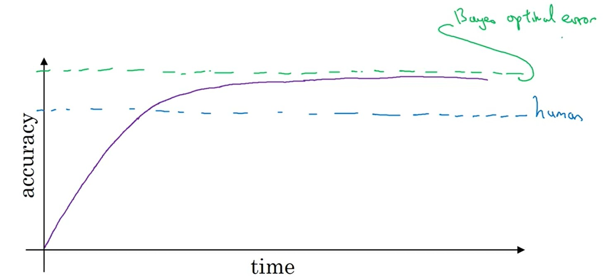
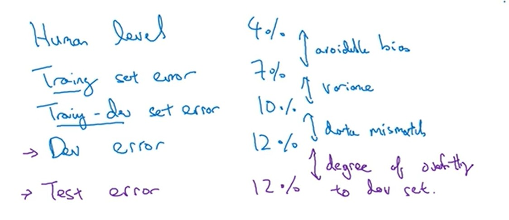
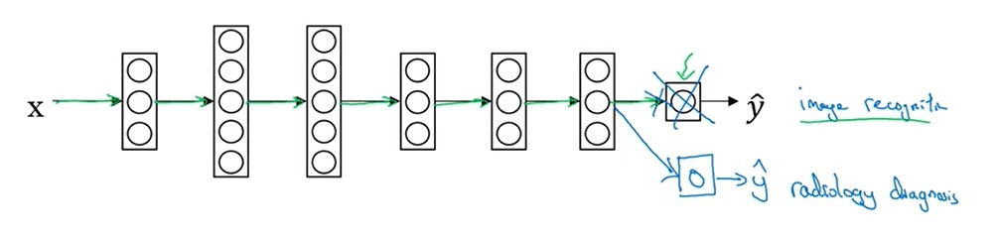
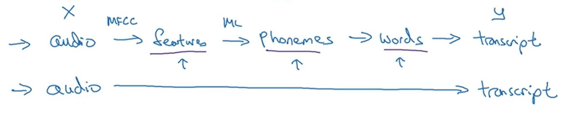

# 结构化机器学习策略

# 一、正交化（orthogonalization）
&emsp;&emsp;**正交化：每次调整的选项最好只影响一个阶段，尽量不要影响其他阶段。**

对于模型训练遇到的问题可以分四个阶段：
1. **首先，确保训练集的结果能达到human-level**
    > 1. 扩大模型的规模
    > 1. 更换训练方法
2. **其次，开发集的结果能够让人接收**
    > 1. 添加正则
    > 1. 增加训练数据量
3. **然后，测试集的结果能达到目标**
    > 1. 更大的训练数据量
4. **最后，模型正式使用没问题**
    > 1. 修改cost Function
    > 1. 修改指标

# 二、评价指标

&emsp;&emsp;**评价指标是在对模型各个阶段的结果进行评价，不是cost function。**

## 2.1 单一评价指标

&emsp;&emsp;**评价结果好坏的标准应当体现在最终的一个值上（多个评价指标也要规划成一个指标），方便人做出判断，避免选择综合症。**

1. F1 分数（调和评价）

    查全率（recall）：分辨出的猫的数量 / 猫的总量
    查准率（precision）：分类正确的量 / 总的样本量

    $$
        F1 = \frac{2}{\frac{1}{P} + \frac{1}{R}} \tag{2.1}
    $$

2. 加权平均

## 2.2 满足和优化指标

&emsp;&emsp;当单一评价指标不能对训练目标进行很好描述时，可以使用 **满足（satisfacting metrics）+ 优化（optimizing metrics）**。 将所有涉及的指标描述成一个**带约束的优化问题**，这样就又能形成一个单一的指标。

> optimizing metrics : 主要优化的目标。
> satisfacing metrics : 其余指标的约束条件。

## 2.3 什么时候应当调整指标

&emsp;&emsp;**当前的模型指标产生的结果，偏离了或者不满足正式使用的需求，就得马上更改。**

# 三、Human-level

## 3.1 自然感知问题（natural perception problem）

&emsp;&emsp;自然感知类问题：就是人类能根据自身经验做出判断的问题。例如：图像识别，语言识别，给人看病。。。

> 1. 在人类的水平（human-level）以下，精度上升很快，当超过人类水平，速度缓慢，逐渐收敛
> 1. 理论上模型能达到的最高精度称之为 **贝叶斯最优估计（Bayes optimal error）** 
> 1. **对于自然感知类问题，人类水平基本上靠近贝叶斯估计，也会直接用人类水平代替贝叶斯估计。**
> 1. **对于模型指标低于人类水平，上面所述的方法有效；当超过人类水平，上面所述的方法可能就效果不明显了。**

## 3.1.1 可避免偏差(avoidable Bias)

&emsp;&emsp;**以human-level为基准，来进行偏差和方差分析（分析方法同上一章），然后在采用不同的方法来优化模型训练。**

$$
avoidable Bias = training error - human-level \tag{3.1}
$$

$$
variance = dev error - training error \tag{3.2}
$$

## 3.1.2 human-level取值

&emsp;&emsp;human-level的取值应当根据具体的问题要求进行选择。

## 3.2 超人类水平问题（surpassses human-level）

&emsp;&emsp;超人类水平问题：模型的表现远远超过超人类水平的问题，例如广告分析，由A到B汽车行驶时间等等。 **对于这些问题的表现超出人的表现，主要是因为模型训练涉及到了大量数据的处理。对于这些问题以人类水平作为基础的模型训练方案就不再适用了。**

# 四、错误分析

&emsp;&emsp;当发现开发集，训练集的指标结果很差劲，可以对 **开发集识别错误的样本进行人工分析**。
> 1. 将所有**猜想的导致错误的原因** 列向标出；所有 **错误的样本** 在横向列出
> 1. **人工逐列分析各个样本错误的原因，并统计**
> 1. **最后分析结果，确定优化的方向。**

# 五、样本的结论存在问题

## 5.1 问题分析
&emsp;&emsp;对于收集的样本，如果**只是一小部分**输入x与输入y之间的对应关系存在问题：
> 训练集：一般不用修改这些错误，因为训练集样本量大，且算法具有鲁棒性。
> 开发集：首先进行 **错误分析** ，问题样本导致的误差挺大的，就要修正开发集。

## 5.2 问题修正
&emsp;&emsp;当发现问题很严重时，需要就行样本修正：
> * **修正后，保证开发集和测试集的分布一致性。**
> * **也要尽量去检验那些  侥幸计算对的样本 **
> * **修复了开发集和测试集，可能导致与训练集的分布不统一**

# 六、训练的起步

*  先搭建一个简单的模型，不用想太多 

*  进行样本错误分析与各个集的误差分析，确定模型优化方向 

# 七、训练集与开发集，测试集分布不同

## 7.1 实践样本太少的样本划分

&emsp;&emsp;当模型实际应用的样本太少或者不好获取时，对于样本的分布就不能在采用训练集，开发集，测试集样本均匀分布的方案，**应当将实践样本全划分到开发集和测试集，让模型训练是朝着期望走。**

## 7.2 数据不匹配判别及处理

&emsp;&emsp;**数据不匹配问题：由于开发集，测试集同训练集的分布不同，可能会导致训练的模型不能达到我们的预期。** 为了观测出 **是不是由于这问题导致了模型的不准确** 又引入了一个 **训练-开发集：该集合的样本分布与训练集相同。**

&emsp;&emsp;**当 dev error 相对于 train-dev error 比较大时，就存在数据不匹配问题。**
> * 对比训练集样本与实际样本之间的差别
> * 增加实际情况的样本数据
> * 人工制造实际情况样本数据，尽量增加数据的多样性（**可能会导致对单一情况的过拟合**）

# 八、迁移学习

&emsp;&emsp;**迁移学习：继承其他已经成功的模型，来继续训练当前的模型。**

> * **A模型的x与B模型的x相同**
> * **A模型训练的样本量 相对于 B模型的样本量大的多。**
> * **A模型最开始的几层网络能提升B模型性能的可能性最大：模型从后向前进行修改。**

# 九、多任务学习

&emsp;&emsp;**多任务学习：将多个训练目的全放到一个模型中进行训练。** 对于无人驾驶而言，可以把识别人，车，路标等功能都集成到一个模型中进行训练。
> * 多个任务可以共用一套浅层的网络
> * **多个任务分开时，样本量应当能保证大体一致，数量平均**
> * **当效果不好时，主要因素是网络结构太小**
> * **softmax: 分辨的是什么。多任务学习：分辨的是有什么**

# 十、端对端学习

&emsp;&emsp;**直接使用x映射到y，进行神经网络学习，中间不做任何的内容处理，完全的黑箱。**

> 好处：
>> 1. 模型完全依赖数据
>> 1. 在x -> y的过程中，不用再考虑添加其他处理流程。
>
> 坏处：
>> 1. 一般需要大量的数据才能出效果
>> 1. 人工控制降低
