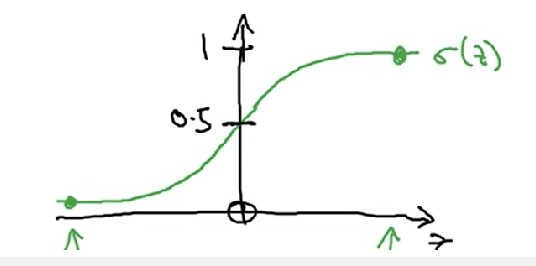
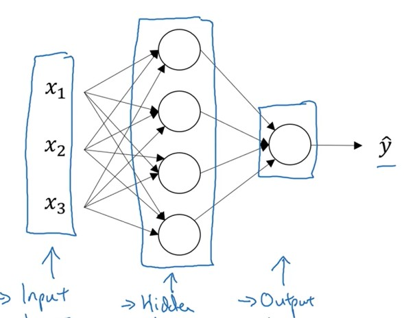
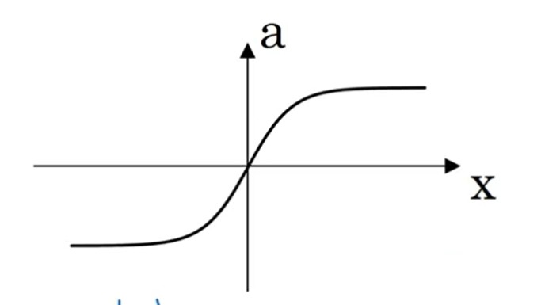
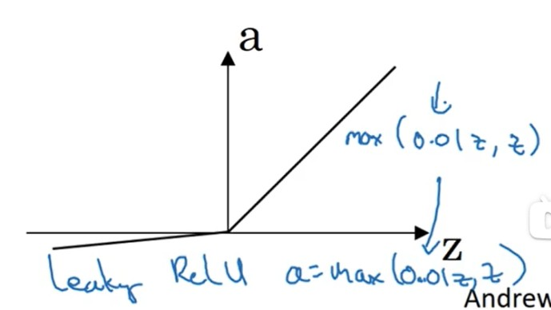

# 神经网络基础

# 一、逻辑回归( Logic Regression )

## 1 问题的模型
**模型**：

$$
\left \{ 
\begin{array}{ l }
z = w^T x + b \\
\hat{y} = \sigma(z) 
\end{array}   
\right . \tag{1.1}
$$

其中$x$为输入量，$\hat{y}$预测量，$\sigma()$激活函数。
&emsp;&emsp;逻辑回归主要用于**二分类**问题的拟合：$ 0 \le \hat{y} = P(y=1 | x)  \le 1$，$\sigma(z)$如图：

**问题**：
> 对于模型$(1.1)$，需要通过一系列的样本$(x,y=\{0,1\})$，求解出系数$w,b$。

**求解**：
> **转为最优化问题，然后对未知系数进行求解**。

## 2 最优化问题求解

## 2.1 损失函数(Loss Function)

1. 作用：
    &emsp;&emsp;用于衡量**单个样本**，在进行模型预测后 $y$ 与 $\hat{y}$ 之间的差距。
1. 二分问题的损失函数
    $$
    L(y,\hat{y}) = -(y \ln \hat{y} + (1 - y) \ln (1 - \hat{y})) \tag{2.1a}
    $$

1. 拟合问题的一般损失函数

    $$
    L(y,\hat{{y}}) = ||y-\hat{y}||^2
    $$

**注意**：
> $L()$函数应该是**凸集**，防止在寻优的过程中出现多个局部最优解。($y = x^2 $就是典型的凸集)

## 2.2 消耗函数(Cost Function)

&emsp;&emsp;用于对**全部**的样本的预测结果进行评估。也就是最终寻优的**目标函数**。

$$
J(w,b) = \frac{1}{m} \sum_{i=1}^{m} L(y^{(i)},\hat{y}^{(i)}) \tag{2.2}
$$

## 2.3 寻优方法

&emsp;&emsp;对于目标函数$J$使用梯度下降法进行寻优，迭代更新$(w,b)$，最终得到使得$J$最小的变量值$(w,b)$就是模型$(1.1)$的解。也就完成了对于模型的训练。

$$
\left \{ 
\begin{array}{l}
w = w - \alpha \frac{\mathrm{d} J}{\mathrm{d} w} \\
\\
b = b - \alpha \frac{\mathrm{d} J}{\mathrm{d} b}    
\end{array}
\right. \tag{2.3}
$$

# 二、浅层神经网络(Shallow Neural Network)

## 2.1 模型结构

&emsp;&emsp;BP神经网络层只有三层：Input layer，Hiden layer，Output layer；

节点的计算与逻辑回归相似。

$$
\left \{ 
\begin{array}{ l }
z^{[i]} = (w^{[i]})^T x + b^{[i]} \\
a^{[i]} = \sigma(z^{[i]}) 
\end{array}   
\right . \tag{2.4}
$$

## 2.2 激活函数

1. sigmoid

    > **二分问题，输出节点必使用sigmoid。**

    $$
    \left \{
    \begin{array}{l}
        a =\frac{1}{1+e^{-z}} \\
        \frac{\mathrm{d} a}{\mathrm{d} z} = a(1-a)
    \end{array}
    \right . \tag{2.5}
    $$
    
    

    
    

3. tanh (tansig)
    MATLAB中的 **tansig** 激活函数，就是tanh的化解形式。
    $$
    \left \{
    \begin{array}{l}
        a =\frac{e^z - e^{-z}}{e^z + e^{-z}}\\
        \frac{\mathrm{d} a}{\mathrm{d} z} = 1 - a^2
    \end{array}
    \right . \tag{2.6}
    $$
    
    

    
    

4. ReLU
    > **拟合问题，输出节点必使用ReLU**

    $$
    \left \{
    \begin{array}{l}
        a =max(0,z)\\
        \frac{\mathrm{d} a}{\mathrm{d} z} = if(z \ge 0): 1, 0
    \end{array}
    \right . \tag{2.7}
    $$
    
    

    
    

1. Leaking ReLU

    $$
    \left \{
    \begin{array}{l}
        a =max(0.01 z,z)\\
        \frac{\mathrm{d} a}{\mathrm{d} z} = if(z \ge 0): 1, 0.01
    \end{array}
    \right . \tag{2.7}
    $$
    
    

    
    

## 2.3 正向传播(frontpropagation)与反向传播(backpropagation)

1. 正向传播

    

    
    

2. 反向传播
    $$
    \begin{array}{l}
        d z^{[2]}=a^{[2]}-y \\
        d W^{[2]}=d z^{[2]} a^{[1]^{T}} \\
        d b^{[2]}=d z^{[2]} \\
        d z^{[1]}=W^{[2] T} d z^{[2]} * g^{[1]^{\prime}}\left(\mathrm{z}^{[1]}\right) \\
        d W^{[1]}=d z^{[1]} x^{T} \\
        d b^{[1]}=d z^{[1]}
    \end{array} \tag{2.8}
    $$

>    **注意**：
> * 代表的是：numpy.multiply()
> * **上述反向传播公式只适用于二分问题**

## 2.4 w系数初始化

* 隐含层节点的**初始化值应当不同**；否则会导致节点的计算结果一样，多节点无意义。
* **W的初始化值应当较小**；使得激活函数落在斜率大的地方，梯度下降法收敛快。