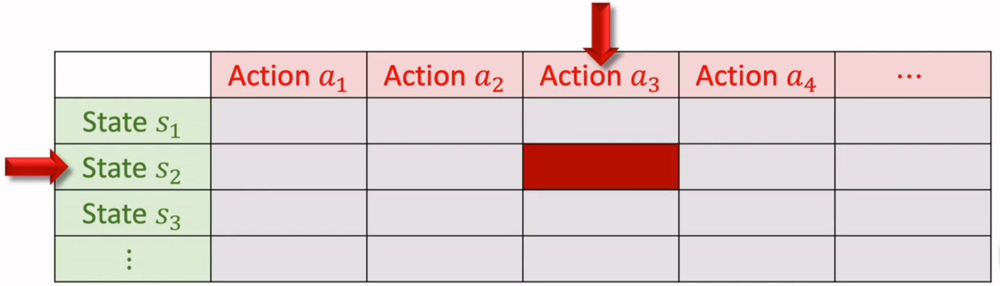
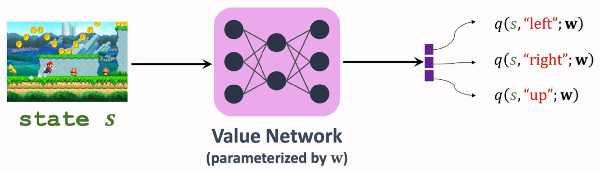
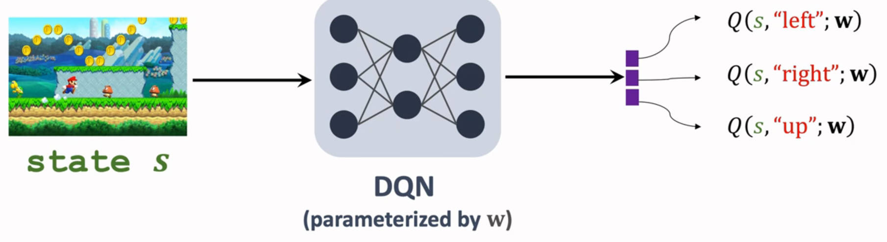

# TD算法

# sarsa

## TD目标

- **折扣回报：** $U_t = R_t + \gamma U_{t+1}$
- **动作价值：**
    $$
    \begin{aligned}
        Q_\pi (s_t,a_t) &= E[U_t|s_t,a_t] \\
        &= E [R_t + \gamma U_{t+1} | s_t,a_t] \\
        &= E [R_t] + \gamma E [U_{t+1} | s_t,a_t] \\
        &= E [R_t] + \gamma E [Q_\pi (S_{t+1},A_{t+1}) | s_t,a_t] \\
        &= E [R_t + \gamma Q_\pi (S_{t+1},A_{t+1})]
    \end{aligned}
    $$
- **TD目标：** 对「动作价值」进行蒙特卡洛近似，得 $y_t = r_t + \gamma Q_\pi (s_{t+1},a_{t+1})$

## 表格形式

**形式**：利用一个表格来记录 $Q
_\pi(s,a)$，行为状态 $s$，列为动作 $a$。 

**算法：**
1. 观测一次状态：$(s_t,a_t,r_t,s_{t+1})$
2. 通过策略函数 $\pi (a|s)$ 预测下一个动作 $a_{t+1}$
3. TD目标：$y_t = r_t + \gamma Q_\pi (s_{t+1},a_{t+1})$
4. TD误差：$\delta_t = Q_\pi (s_t,a_t) - y_t$
5. 更新 $Q_\pi$：$Q_\pi(s_t,a_t) = Q_\pi(s_t,a_t) - \alpha \delta_t$

- <a href="https://github.com/spite-triangle/artificial_intelligence/tree/master/example/reinforcementLearning/findWay_Sarsa" class="jump_link"> Sarsa 案例 </a>

## 神经网络形式 

**思路：** 利用神经网络 $q(s,a;w)$ 来近似动作价值函数 $Q_\pi(s,a)$。 输入为状态，输出为各个动作对应的价值 

**算法：**
1. 观测一次状态：$(s_t,a_t,r_t,s_{t+1})$
2. 通过策略函数 $\pi (a|s)$ 预测下一个动作 $a_{t+1}$
3. TD目标：$y_t = r_t + \gamma q (s_{t+1},a_{t+1};w)$
4. TD误差：$\delta_t = q (s_t,a_t;w) - y_t$
5. 损失函数：$L=\frac{1}{2} \delta_t^2$
6. 更新系数：$w = w - \alpha \delta_t \frac{\partial q(s_t,a_t;w)}{\partial w}$

# Q Learning

## TD目标

- **最优动作价值：**
    $$
    \begin{aligned}
        Q_\pi (s_t,a_t) &= E [R_t + \gamma Q_\pi (S_{t+1},A_{t+1})] \\
        Q^* (s_t,a_t) &= E [R_t + \gamma Q^* (S_{t+1},A_{t+1})] \\
        &= E [R_t + \gamma \max\limits_a Q^* (S_{t+1},a)]
    \end{aligned}
    $$
- **TD目标：** 对「最优动作价值」进行蒙特卡洛近似，得 $y_t = r_t + \gamma \max\limits_a Q^* (s_{t+1},a)$

## 表格形式

**形式**：利用一个表格来记录 $Q^*(s,a)$，行为状态 $s$，列为动作 $a$。 

1. 观测一次状态：$(s_t,a_t,r_t,s_{t+1})$
2. TD目标：$y_t = r_t + \gamma \max\limits_a Q^* (s_{t+1},a)$
3. TD误差：$\delta_t = Q^*(s_t,a_t) - y_t$
4. 更新 $Q_\pi$：$Q^*(s_t,a_t) = Q^*(s_t,a_t) - \alpha \delta_t$

- <a href="https://github.com/spite-triangle/artificial_intelligence/tree/master/example/reinforcementLearning/findWay_QLearning" class="jump_link"> Q Learning 案例 </a>

## 神经网络形式

**思路：** 利用神经网络 $Q(s,a;w)$ 来近似动作价值函数 $Q^*(s,a)$。

**算法：**
1. 观测一次状态：$(s_t,a_t,r_t,s_{t+1})$
2. TD目标：$y_t = r_t + \gamma \max\limits_a Q (s_{t+1},a;w)$
3. TD误差：$\delta_t = Q(s_t,a_t;w) - y_t$
1. 损失函数：$L=\frac{1}{2} \delta_t^2$
2. 更新系数：$w = w - \alpha \delta_t \frac{\partial q(s_t,a_t;w)}{\partial w}$

> [!note|style:flat]
> - **sarsa：** 近似的是「价值函数 $Q_\pi(s,a)$」
> - **Q Learning：** 近似的是「最优价值函数 $Q^*(s,a)$」
> - **神经网络版的 Q Learning 就是 DQN 算法**

# multi-step TD

- **思路：** 之前的算法都是利用一次 $r$ 进行算法更新，还可以采用多次 $r$ 来更新算法。

- **multi-step TD 目标：** 利用多次 $r$ 构造的TD目标

- **回报展开：**
    $$
    \begin{aligned}
        U_t &= R_t + \gamma U_{t+1} \\
        &= R_t + \gamma R_{t+1} + \gamma^2 U_{t+2} \\
        &= R_t + \gamma R_{t+1} + \gamma^2 R_{t+2} + \gamma^3 U_{t+3} \\
        &= \sum\limits_{i=0}^{m-1}\gamma^i R_{t+i} + \gamma^m U_{t+m}
    \end{aligned}
    $$

- **sarsa multi-step TD 目标:** 
    $$
    y_t = \sum\limits_{i=0}^{m-1}\gamma^i r_{t+i} + \gamma^m Q_\pi(s_{t+m},a_{t+m})
    $$

- **sarsa multi-step TD 目标:** 
    $$
    y_t = \sum\limits_{i=0}^{m-1}\gamma^i r_{t+i} + \gamma^m \max\limits_a Q^*(s_{t+m},a)
    $$
