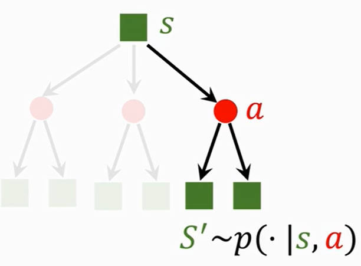
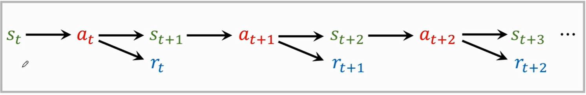

# 基础概念

# 1. 基本术语

> [!attention|style:flat]
> - **大写字母：** 具有随机性的变量
> - **小写字母：** 实实在在的数值

- **代理（agent）**：需要控制的角色
- **环境（environment）**：角色所在的游戏
- **状态（state）**：角色所处的某一时刻的游戏场景
- **动作（action）**：能对角色能进行的操作
- **策略（policy）**：描述角色在某一状态产生某个动作的概率，**控制角色在当前状态下所有动作的概率，不就是一种行动的决策**。在环境`s`，角色产生动作`a`的概率：
    $$
    \pi(a|s) = P(A=a|S=s) 
    $$
- **奖励（reward）**：在某一状态下，角色采取某一动作后，对该动作的评价
- **状态转移（state transition）**：从旧状态到新状态；**状态转移是随机的，因为角色是不清楚游戏场景将如何变化**。角色在旧环境`s`，发生动作`a`后，游戏环境变为新状态`s'`的概率：
    $$
    p(s'|s,a) = P(S'=s'|S=s,A=a)
    $$

# 2. 角色与环境的交互

## 2.1. 交互流程

1. 角色根据「决策函数 $\pi(a|s)$ 」在当前环境状态下选择一个动作

2. 环境受到角色动作的影响进入下一个状态，并对角色的动作给出奖励。环境也根据「状态转移函数 $p(s'|s,z)$」进入下一个状态

3. 重复上述步骤

## 2.2. 随机性

- **动作的随机性**：角色在当前状态下，会采取什么动作是随机的

- **状态转移的随机性**：角色做出一个动作后，环境状态的变化是随机的

# 3. 奖励、回报、价值函数

## 3.1. 奖励

**奖励（reward）：** 对当前状态下的某一动作进行评价；**「奖励」越大，说明离「目标」越接近，例如赢得本局游戏。**

## 3.2. 回报

**回报（return）：** 未来的累计奖励，即从当前时刻到结束的奖励之后。

$$
U_t = R_t + R_{t+1} + R_{t+2} + \dotsm + R_{t + n}
$$

**折扣回报（discounted return）：** 由于当前奖励是马上能得到的，而未来的奖励变数较大，所以需要给未来的奖励降低比重。**$\gamma$ 就为折扣率**

$$
U_t = R_t + \gamma R_{t+1} + \gamma^2 R_{t+2} + \dotsm + \gamma^n  R_{t + n}
$$

> [!tip]
> 回报（return）是具有「随机性」的。因为 $U_t$ 取决于 $R_{t+i}$ ，而 $R_{t+i}$ 又与将来的「状态」和「动作」有关。 

## 3.3. 价值函数

- **动作价值函数（action-value function）**：由于「回报 $U_t$」是具有随机性的，并与将来的状态和动作有关，但是角色并不能知道未来会发生什么，所以角色在游戏过程中无法使用「回报」来评估当前的动作。**为了对当前动作的价值进行评估，就对 $U_t$ 求解期望，过滤掉随机性。**

    $$
    Q_\pi (s_t,a_t) = E [U_t|S_t = s_t,A_t = a_t]
    $$

    其中，$Q_\pi (s_t,a_t)$ 为动作价值函数，根据动作概率分布函数 $\pi(a_t|s_t)$ 进行计算，所以就不需要将来的 $R_{t+i}$ 值参与计算。 $s_t,a_t$ 均为小写字母，均是实实在在的数值，所以 $Q_\pi (s_t,a_t)$ 是一个数值 

- **最优动作价值函数（Optimal action-value function）**：由于「动作价值函数 $Q_\pi$ 」与「策略函数 $\pi$」有关，不同的「策略函数」就会对应不同的「动作价值函数」。**为了对「动作价值函数」进行统一，就选则使用「最优的策略函数」，因此「最优动作价值函数」主要用来评价「动作」的好坏**

    $$
    Q^*_\pi = max \ Q_\pi (s_t,a_t)
    $$

- **状态价值函数（state-value function）：** 对动作价值函数 $Q_\pi (s_t,A)$ 关于自变量 $A$ 进行期望计算。 由于 $A$ 是大写字母，是一个具有随机性的变量，$Q_\pi (s_t,A)$ 则为一个关于 $A$ 的函数 。**$V_\pi (s_t)$ 可以用来评价角色当前所处状态的好坏**
  - **动作离散**： 

    $$
    V_\pi (s_t) = E_A [Q_\pi (s_t,A)] = \sum \pi(a|s_t) Q_\pi (s_t,a)
    $$

  - **动作连续**：
  
    $$
    V_\pi (s_t) = E_A [Q_\pi (s_t,A)] = \int \pi(a|s_t) Q_\pi (s_t,a) d a
    $$

> [!tip]
> - **动作价值函数：** 评价角色在状态`s`所作出的动作`a`的好坏
> - **状态价值函数：** 评价角色在状态`s`所处局势的好坏，例如当前不论做什么动作，都输定了

# 4. 角色的控制

- **基于决策函数方案**：给角色定制了一个非常棒的动作产生策略
    1. 观察游戏环境状态 $s_t$
    2. 根据决策函数 $\pi(a|s_t)$ 获取一个动作 $a_t$

- **基于最优动作价值函数方案**：从所有可能的决策中，选择最优的动作
    1. 观察游戏环境状态 $s_t$
    2. 根据最优动作价值函数 $Q^*$：$a_t = argmax_a Q^*(s_t,a)$

- **学习的过程**：不断的重复 $(s_i,a_i,r_i)$ 的过程，最终实现奖励的最大化。
    

