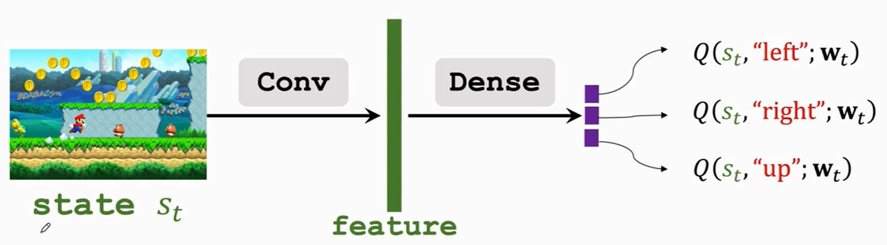
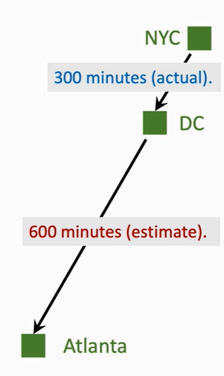

# 价值学习

# 1. Deep Q-Network（DQN）

## 1.1. 算法思路

- **目标**：赢得这场游戏，即实现「回报」最大。
- **策略**：得到「最优价值函数 $Q^*(s,a)$」，这样就能通过带入状态 $s$，解算出最优动作 $a^* = argmax_a \ Q^*(s,a)$
- **问题**： $Q^*(s,a)$ 只能通过上帝视角得到，角色是无法认知。
- **解决**：利用一个神经网络 $Q(s,a;w)$ 来近似拟合出 $Q^*(s,a)$
  - `s`：神经网络的输入
  - `a`：神经网络的输出
  - `w`：神经网络的参数 

## 1.2. DQN神经网络构造

1. 一张游戏画面当作一个「状态」，状态通过「卷积层」实现特征提取
2. 特征输入给「权连接层」进行 $Q^*(s,a)$ 拟合
3. 「权连接层」输出每个动作的 $Q^*(s,a)$ 结果

## 1.3. DQN运行流程

1. 通过当前的状态 $s_t$，利用神经网络计算出当前最优的动作 $a_t = argmax_a \ Q(s_t,a;w)$
2. 执行动作$a_t$后，给出奖励$r_t$
3. 环境状态转移，得到下一个状态 $s_{t+1}$
4. 重复上述步骤

# 2. DQN训练

## 2.1. 时间差分算法（Temporal Different）

1. 问题模型

**问题：** 设计一个神经网络 $Q(w)$，对从`NYC`驾驶到`atlanta`所要花费的时间进行预测。

2. 梯度下降算法

1. 模型估计时间： $q=Q(w) = 1000 min$；
2. 真实驾驶时间： $y = 860 min$
3. 计算损失值：$L = \frac{1}{2} ( q - y )^2$
4. 计算关于系数 $w$ 的梯度：$\frac{\partial L}{\partial w} = \frac{\partial L}{\partial q} \frac{\partial q}{ \partial w} = (q - y) \frac{\partial Q(w)}{\partial w}$
5. 更新系数：$w = w - \alpha \frac{\partial L}{\partial w}$

> [!tip]
> 梯度下降法只能利用从`NYC`驾驶到`atlanta`跑完全程的时间作为真实时间 $y$ 进行计算，不能利用其中一段的时间。而DT算法则对这个情况进行改进。

3. 时间差分算法

1. 模型估计时间： $q=Q(w) = 1000 min$；
2. 真实驾驶时间只有从`NYC`到`DC`的 300 min，剩余的路程可以通过模型估计：$y = 300 + 600 = 900 min$
3. 计算损失值：$L = \frac{1}{2} ( q - y )^2$
4. 计算关于系数 $w$ 的梯度：$\frac{\partial L}{\partial w} = \frac{\partial L}{\partial q} \frac{\partial q}{ \partial w} = (q - y) \frac{\partial Q(w)}{\partial w}$
5. 更新系数：$w = w - \alpha \frac{\partial L}{\partial w}$

> [!tip]
> - **TD目标**：TD算法中的`y`
> - **TD误差**：D算法中的`q - y`

## 2.2. TD训练DQN

**思路：** 由于DQN算法的目标是实现 $U_t$ 的最大化

$$
\begin{aligned}
U_t &= R_t + \gamma R_{t+1} + \gamma^2 R_{t+2}  + \gamma^3 R_{t + 3} + \dotsm \\
U_{t+1} &= R_{t+1} + \gamma R_{t+2}  + \gamma^2 R_{t + 3} + \dotsm \\
\end{aligned}
$$

对公式进行简化

$$
\begin{aligned}
U_t &= R_t + \gamma U_{t+1}
\end{aligned}
$$

**将上述公式与DT算法进行对照：**

1. $U_t$ 与 $U_{t+1}$ 就是 $Q(s,a;w)$ 模型的预测值：$Q(s_t,a_t;w)$ 、$Q(s_{t+1},a_{t+1};w)$ 
2. $R_t$就是一次工况下的部分真实测量值
3. TD目标就为：
    $$
    \begin{aligned}
        y_t =& R_t + \gamma Q(s_{t+1},a_{t+1};w) \\
        =& R_t +\gamma \ max \ Q(s_{t+1},a;w)
    \end{aligned}
    $$
4. TD误差就为：
    $$
    Q(s_t,a_t;w) - [R_t + \gamma Q(s_{t+1},a_{t+1};w)]
    $$
