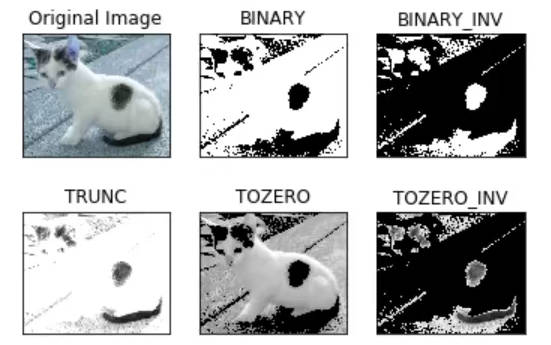
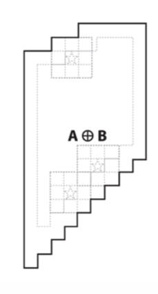
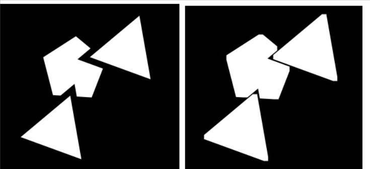

# 形态学操作

> [!note]
> 形态学操作，主要是对二值图像进行一系列处理。

# 阈值控制

```python
# 阈值控制
ret,destImg = cv2.threshold(img,threshVal,maxVal,flags)

# 自动计算 threshVal 值
ret,destImg = cv2.threshold(img,0,maxVal,flags | cv2.THRESH_OTSU)

# 自适应阈值算法
# adaptiveMethod：cv2.ADAPTIVE_THRESH_ 自适应算法 
# blockSize：多大的图像才进行局部阈值计算
cv2.adaptiveThreshold(src, maxValue, adaptiveMethod, thresholdType, blockSize, C[, dst]) -> dst
```
- **作用：** 根据设定的「阈值」将图像拆分为两个部分，例如纯黑-纯白图。

- **图像阈值类型：** 
  - `cv2.THRESH_BINARY`：
    - \> threshVal：通道值大于阈值时，取值为`maxVal`
    - < threshVal：通道值大于阈值时，取值为`0`
  - `cv2.THRESH_BINARY_INV`：计算方式与上面相反
  - `cv2.THRESH_TOZERO`：
      - \> threshVal：通道值大于阈值时，不变
      - < threshVal：通道值大于阈值时，取值为`0`
  - `cv2.THRESH_TOZERO_INV`：计算方式与上面相反
  - `cv2.THRESH_TRUNC`：
      - \> threshVal：通道值大于阈值时，取值为`maxVal`
      - < threshVal：通道值大于阈值时，不变
  - **`cv2.THRESH_OTSU`：自动计算 `threshVal` 值**
  <p style="text-align:center;"></p>

> [!tip]
> 当图片的明暗分布不能简单的通过一个`threshVal`进行划分时，就要使用自适应算法`adaptiveThreshold`

# 腐蚀和膨胀

## 腐蚀

<p style="text-align:center;"></p>

- **原理：**  卷积核中值为`1`框住的像素中，存在「零」时，卷积核中心对于的像素为「零」。

```python
# iterations：腐蚀操作重复多少次
cv2.erode(src, kernel:np.ndarray[, dst[, anchor[, iterations[, borderType[, borderValue]]]]]) -> dst

# cv2生成卷积核
# shape ：cv2.MORPH_
cv2.getStructuringElement(shape, ksize[, anchor]) -> retval
```

<p style="text-align:center;"></p>

## 膨胀

<p style="text-align:center;"></p>

- **原理：** 卷积核中值为`1`框住的像素中，存在「非零」时，卷积核中心对于的像素为「非零」。

```python
# iterations：膨胀操作重复多少次
cv2.dilate(src, kernel:np.ndarray[, dst[, anchor[, iterations[, borderType[, borderValue]]]]]) -> dst
```


<p style="text-align:center;"></p>

# 形态学操作

```python
# op：cv2.MORPH_ 形态学的操作类型
cv2.morphologyEx(src, op, kernel:np.ndarray[, dst[, anchor[, iterations[, borderType[, borderValue]]]]]) -> dst
```


<center>


| 名称     | 操作           | OpenCV               | 应用                                                               |
| -------- | -------------- | -------------------- | ------------------------------------------------------------------ |
| 开运算   | 先腐蚀、再膨胀 | `cv2.MORPH_OPEN`     | 去除边界上的毛刺、去二值图的噪点 （**去掉较小的形状**）            |
| 闭运算   | 先膨胀、再腐蚀 | `cv2.MORPH_CLOSE`    | 中空形状或者邻近的形状形成一整块                                   |
| 梯度运算 | 膨胀 - 腐蚀    | `cv2.MORPH_GRADIENT` | 二值图的边缘                                                       |
| 礼帽     | 原始 - 开运算  | `cv2.MORPH_TOPHAT`   | 把由「开运算」去除的像素，从原图中截取出来。（**去掉较大的形状**） |
| 黑帽     | 闭运算 - 原始  | `cv2.MORPH_BLACKHAT` | 将「闭运算」填充的像素，从原图中截取出来                           |

</center>


