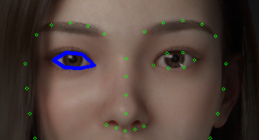
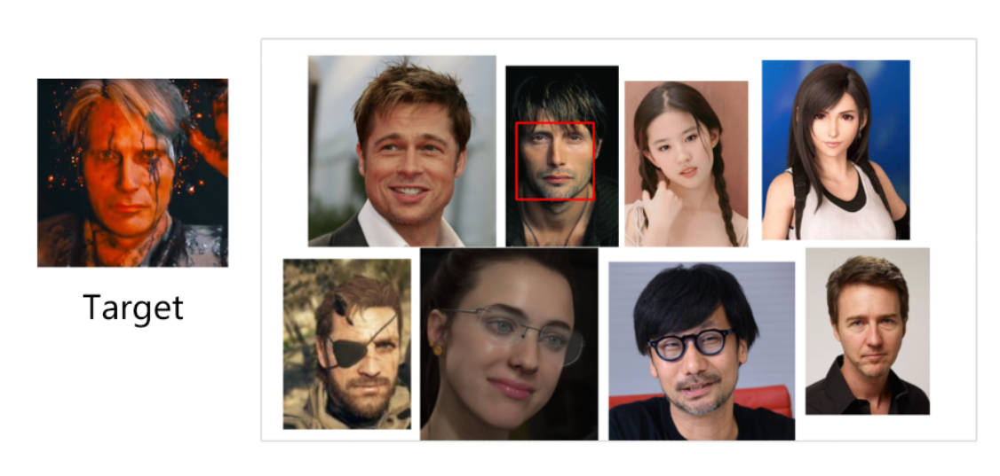
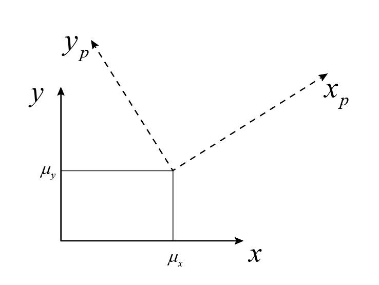

# 目标识别


# Opencv 实现

## 人脸检测

> [!tip]
> haar 算法计算速度快，但是精度相对较低。   


- **作用：** <span style="color:red;font-weight:bold"> 从图像中找出人脸的位置。 </span> 

<!-- panels:start -->
<!-- div:left-panel -->

- <a href="https://www.cnblogs.com/wumh7/p/9403873.html" class="jump_link"> haar 算法实现 </a>：
  1. 提取类Haar特征：
  2. 利用积分图法对类Haar特征提取进行加速；
  3. 使用Adaboost算法训练强分类器，根据特征区分出人脸和非人脸；
  4. 使用筛选式级联把强的分类器级联在一起，从而提高检测准确度。

<!-- div:right-panel -->
<p style="text-align:center;"></p>
<!-- panels:end -->


- **haar 特征提取：** 将 Haar-like 特征在图片上进行滑动，在每个位置计算白色区域对应的像素值的和减去黑色区域对应的像素值的和，从而提取出该位置的特征，
    <p style="text-align:center;"></p>

- <a href="https://github.com/opencv/opencv/tree/4.x/data/haarcascades" class="jump_link">OpenCV 提供的模型  </a>

```python

# 加载模型
detector = cv2.CascadeClassifier('./asset/haarcascade_frontalcatface.xml')

# scaleFactor：两个相邻窗口的间隔比例
# minNeighbors：弱分类器要满足多少个，才认为是目标
# flags：兼容旧版
# minSize：目标对象可能的最小尺寸
# maxSize：目标对象可能的最大尺寸
# objects：所有目标的 x,y,w,h
# cv.CascadeClassifier.detectMultiScale(image[, scaleFactor[, minNeighbors[, flags[, minSize:tuple [, maxSize: tuple]]]]] -> objects
faces = detector.detectMultiScale(frameGray,1.2,3,0)
```

<p style="text-align:center;"></p>

## 人脸识别

**OpenCV 实现太繁琐，方法太旧，懒得学了 (￣_,￣ ) ， dlib 要更靠谱一些。**

- **作用：**  <span style="color:red;font-weight:bold">  对人脸特征进行对比，区分出谁是谁。 </span>

- **算法：**  
    - <a href="https://cloud.tencent.com/developer/article/1082468" class="jump_link"> EigenFace </a>
    - FisherFace
    - LBPH

- **PCA 主成分分析：** EigenFace 算法会利用到的一种算法。**通过PCA方法可以对原始数据进行降维处理，重点对特征分量进行分析。**
    - 使得数据集更易使用。
    - 降低算法的计算开销。
    - 去除噪声。
    - 使得结果容易理解。

    <p style="text-align:center;"></p>

## 非特定目标

**同上，OpenCV 实现太繁琐，方法也旧。**

- **作用：** 对自定义的目标进行识别


# dlib 实现

## dlib 安装

> - <a href="http://dlib.net/" class="jump_link"> dlib 官网 </a>
> - <a href="https://github.com/sachadee/Dlib" class="jump_link"> python 3.7 ~ 3.9 编译好版本 </a>
> - <a href="https://pypi.org/simple/dlib/" class="jump_link"> python 3.4 ~ 3.6 编译好版本 </a>
> - <a href="https://www.bilibili.com/video/BV1Ht4y1U7Do" class="jump_link"> 自己编译 </a>

## 人脸检测

人脸检测的内部实现靠的就是 HOG 描述符、SVM 等算法实现。

```python
# 获取默认的检测
detector = dlib.get_frontal_face_detector()

# upsample_num_times ：对图片进行上采样（放大）多少次
# return：rectangles
# 对图片进行检测
faces = detector(image: array, upsample_num_times: int=0L)

# rectangle 类
y1 = rectangle.bottom()  # detect box bottom y value
y2 = rectangle.top()  # top y value
x1 = rectangle.left()  # left x value
x2 = rectangle.right()  # right x value
```
<p style="text-align:center;"></p>

## 人脸追踪

上述的人脸检测步骤其实只适用于「单张图片」的人脸检测，如果对视频的每一帧都使用同样的方法一帧图片一帧图片检测，在 dlib 中可能会很慢。为了加快视频中的人脸检测，可以采用追踪的方式。

```python
# 获取默认的检测
detector = dlib.get_frontal_face_detector()

# 追踪器
tracker = dlib.correlation_tracker()

# 定位人脸
face:dlib.rectangle = detector(frame,0)[0]

# 启动追踪
tracker.start_track(frame,face)

# 更新追踪
tracker.update(frame)
# NOTE -  追踪的结果为浮点数，需要转为整型
face:dlib.drectangle = tracker.get_position()
```

> [!tip|style:flat]
> - 追踪器其实只要初始化时，给定一个 `dlib.rectangle`位置，之后就会追踪这个区域，因此，只要初始化时，给定一个目标位置，追踪器就能够对目标进行追踪，不一定非得是人脸。
> - 当被追踪的目标跑出画面后，然后又跑回来，追踪器就可能追踪不了了。


## 人脸特征位置

- <a href="http://dlib.net/files/" class="jump_link"> dlib 人脸关键点预测模型 </a>

- <a href="https://blog.csdn.net/YeziTong/article/details/86177846" class="jump_link"> 具体实现 </a>


**获取特征点位置：**

```python
# 加载关键点预测器
predictor:dlib.shape_predictor = dlib.shape_predictor('./asset/shape_predictor_68_face_landmarks.dat')

# 预测关键点
points: dlib.full_object_detection = predictor(img,face)

# 遍历点
for i in range(len(points.parts())):
    point:dlib.point = points.part(i)
    # x 坐标
    point.x
    # y 坐标
    point.y
```

<p style="text-align:center;"></p>

**对于 dlib 通过模型找出的人脸特征点，输出结果是具有顺序的。通过对应位置的特征点，我们就能标记出眼睛、鼻子、嘴巴、眉毛的位置。** <span style="color:red;font-weight:bold"> 图上特征点的索引是从`1`开始的，在编程的时候，数组索引是从`0`开始的。 </span>

<p style="text-align:center;"></p>

**特征点连线：**

```python
# 转化点的类型
pts = np.array([( point.x,point.y )for point in points.parts()],dtype=np.int32)

# 左眼提取点全部连起来
cv2.polylines(img, [pts[36:42]], True,(255,0,0),2)
```

<p style="text-align:center;"></p>

## 人脸识别

> - <a href="http://dlib.net/files/" class="jump_link"> 残差神经网络模型 </a>

**实现步骤：**
1. 检测出人脸位置
2. 预测出人脸的特征点位置
3. 将特征点通过残差神经网络转化为`128`维的特征描述符
4. 对比两张人脸图片的特征描述符（最简单的方法就是计算欧式距离），就能确定两个图片是否为同一个人

```python
# 加载残差神经网络模型
encoder = dlib.face_recognition_model_v1('./asset/dlib_face_recognition_resnet_model_v1.dat')

# 生成 128 维的特征描述符 
description = encoder.compute_face_descriptor(img,keypointsLoc,jet)
```

<details>
<summary><span class="details-title">案例代码</span></summary>
<div class="details-content"> 

```python
import dlib
import numpy as np
import  cv2

def preprocess(path,fx=0.5,fy=0.5):
    img = cv2.imread(path)
    img = cv2.resize(img, (0,0),fx=fx,fy=fy)
    imgGray = cv2.cvtColor(img, cv2.COLOR_BGR2GRAY)
    return (img,imgGray)

def imshow(img,title='untitled'):
    cv2.imshow(title, img)
    cv2.waitKey(0)

def lableFaces(canvas,facesLocs):
    for face in facesLocs:
        y1 = face.bottom()  # detect box bottom y value
        y2 = face.top()  # top y value
        x1 = face.left()  # left x value
        x2 = face.right()  # right x value
        cv2.rectangle(canvas,(x1,y1),(x2,y2),(0,0,255),2)

def facesKeypointDescritptions(img,imgGray,facesLocs,predictor,encoder,jet=1):
    # 特征点位置
    keypointsLocs = [predictor(img,faceLoc) for faceLoc in facesLocs]

    # 获取描述符
    return np.array([encoder.compute_face_descriptor(img,keypointsLoc,jet) for keypointsLoc in keypointsLocs])

if __name__ == '__main__':
    # 载入图片
    facesImg,facesImgGray = preprocess('./asset/faces.jpg')
    targetImg,targetImgGray = preprocess('./asset/mads.png')

    # 人脸检测器
    detector = dlib.get_frontal_face_detector()

    # 特征点预测器
    predictor = dlib.shape_predictor('./asset/shape_predictor_68_face_landmarks.dat')

    # 特征描述生成模型
    encoder = dlib.face_recognition_model_v1('./asset/dlib_face_recognition_resnet_model_v1.dat')
    
    #  标定人脸位置
    facesLocs = detector(facesImgGray,0)
    targetLocs = detector(targetImgGray,0)

    # 获取人脸特征描述
    facesDescriptions = facesKeypointDescritptions(facesImg,facesImgGray, facesLocs, predictor, encoder)
    targetDescription = facesKeypointDescritptions(targetImg,targetImgGray, targetLocs, predictor, encoder)

    print(facesDescriptions.shape)
    print(targetDescription.shape)

    # 描述符对比，计算欧氏距离
    distances = np.linalg.norm(facesDescriptions - targetDescription,axis=1)

    print(np.argmin(distances))

    # 将结果标记出来
    lableFaces(facesImg, [facesLocs[np.argmin(distances)]])

    imshow(facesImg)
    imshow(targetImg)
``` 

</div>
</details>

<p style="text-align:center;"></p>


# 附录：协方差矩阵


## 1. 介绍

- **定义**

  1. 方差(variance)：体现的是数据偏离期望值(均值)的程度

      $$
      \sigma^2_x = \frac{1}{n}[(x_1 - \overline{x})^2 + (x_2 - \overline{x})^2 + \dotsm +(x_n - \overline{x})^2 ]
      $$

  2. 协方差(Covariance)：衡量两个变量的总体误差
      $$
      \sigma_{xy}^2 = \frac{1}{n}[(x_1 - \overline{x})(y_2 - \overline{y}) + \dotsm +(x_n - \overline{x})(y_n - \overline{y}) ]
      $$

  3. 协方差矩阵：囊括了多个变量的方差和协方差
      $$
      \begin{array}{r}
      x \qquad y \qquad z \qquad \\
      \begin{array}{l}
          x \\
          y \\
          z \\
      \end{array}
      \begin{bmatrix}
          \sigma_x^2 & \sigma_{xy}^2 & \sigma_{xz}^2 \\
          \sigma_{yx}^2 &  \sigma_y^2 & \sigma_{yz}^2 \\
          \sigma_{zx}^2 & \sigma_{zy}^2 & \sigma_z^2
      \end{bmatrix}
      \end{array}
      $$

- **计算**：以三个变量为例
   1. 过度矩阵
       $$
       A =
       \begin{bmatrix}
           x_1 & y_1 & z_1 \\
           x_2 & y_2 & z_2 \\
           x_3 & y_3 & z_3 
       \end{bmatrix}
       - \frac{1}{3}
       \begin{bmatrix}
           1 & 1 & 1 \\    
           1 & 1 & 1 \\    
           1 & 1 & 1 \\    
       \end{bmatrix}
       \begin{bmatrix}
           x_1 & y_1 & z_1 \\
           x_2 & y_2 & z_2 \\
           x_3 & y_3 & z_3 
       \end{bmatrix}
       $$
   2. 协方差矩阵：$M = \frac{1}{3}A^TA$

## 2. 协方差矩阵的含义

协方差矩阵为对称矩阵，因此可以进行正交分解

$$
M = P \Lambda P^T
$$

以下内容均以二维数据为例 $(x,y)$，高维数据同理。对协方差矩阵进行分解后得到的 $\Lambda$ 可以看作是原数据 $(x,y)$ 经过 $P$ 矩阵坐标转换后的数据

$$
\begin{bmatrix}
    x \\
    y
\end{bmatrix} = p^T
\begin{bmatrix}
    x_p \\
    y_p
\end{bmatrix}
$$

<p style="text-align:center;"></p>

这样就产生了一个事实：**$M$，$\Lambda$ 为不同角度对数据的协方差进行描述**
- $M$ 为数据在 $xy$ 坐标系下的协方差矩阵
- $\Lambda$ 为数据在 $x_py_p$ 坐标系下的协方差矩阵

其中 $\Lambda$ 为特征值矩阵

$$
\Lambda=\left[\begin{array}{ccc}
\lambda_{1} & \cdots & 0 \\
\vdots & \ddots & \vdots \\
0 & \cdots & \lambda_{n}
\end{array}\right]
$$

<span style="color:red;font-weight:bold"> 这就使得，数据在坐标系 $x_p y_p$ 下，各个方向上是相互独立的，只存在方差，不存在协方差，且 $\lambda$ 就是对应的方差值。 </span> 并且对于坐标系 $x_p y_p$ 的基向量在 $xy$ 坐标系中的描述为 $\alpha_1,\alpha_2$，其本质就是

$$
P = \begin{bmatrix}
    \alpha_1,\alpha_2
\end{bmatrix}
$$

<span style="color:red;font-weight:bold">这样在 $xy$ 坐标系下 $\lambda_1$ 与 $\alpha_1$ 的含义就是：在 $\alpha_1$ 方向，数据的方差就为 $\lambda_1$，且该方向与其他正交方向相互独立。这样就能知道数据在哪个方向上，分布最大，该方向上数据特征也最为明显。</span>

<p style="text-align:center;"></p>


