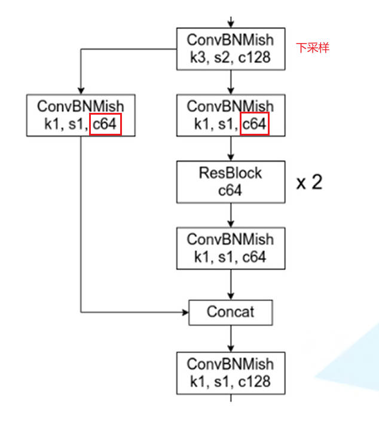
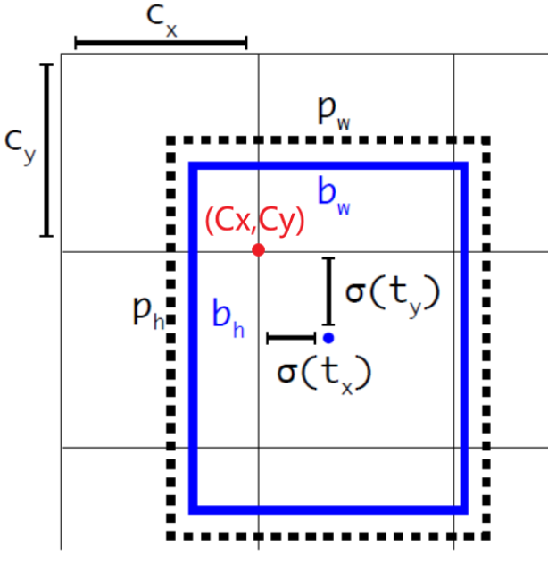
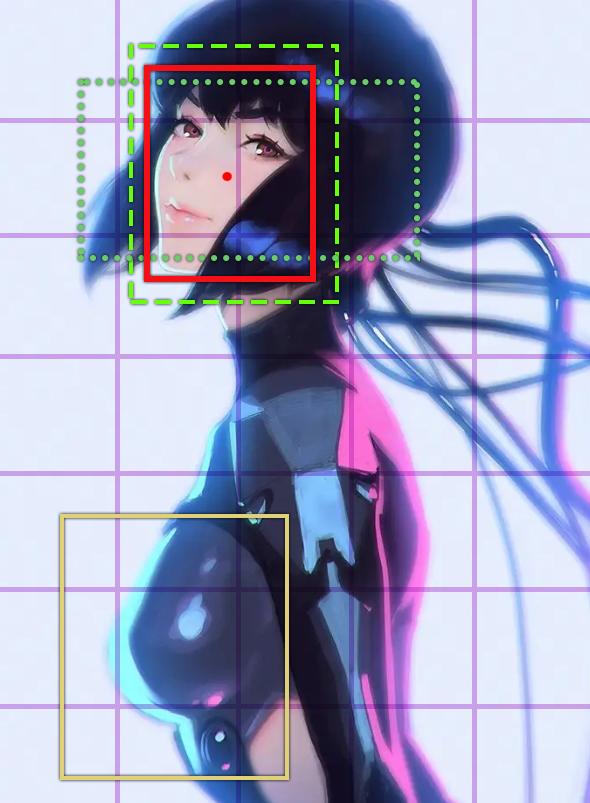

# YOLO - V4

# 网络结构

## 网络模型

- <a href="https://img-blog.csdnimg.cn/46b1677d53514b37ad9d01f1177e8755.png?x-oss-process=image/watermark,type_d3F5LXplbmhlaQ,shadow_50,text_Q1NETiBA5aSq6Ziz6Iqx55qE5bCP57u_6LGG,size_20,color_FFFFFF,t_70,g_se,x_16#pic_center" class="jump_link"> backbone </a>  网络的组成单元不再是 RES 模块，而是 CSP 模块；
- backbone 网络的输出会经过一个 SPP 模块；
- Neck 部分则借鉴了 PAN 模块

## CSP 模块

- **CSP 结构：** 
    

    其中 Mish 表示的是 Mish 激活函数

    $$
    Mish(x) = x \tanh(\ln(1 + e^x))
    $$

- **优点：**
  1. 更快的学习速度
  2. 减少了内存消耗
  3. 加快计算速度

## PAN 模块

- **PAN 模块：** 先对主干网络从上到下进行特征融合，之后再从下到上进行特征融合得到预测结果
  

- **YOLO V4 中的实现：** 在原来 v3 预测网络的结构上，又进行了一次特征层融合，最终得到最后的输出结果。

# 预测框中心坐标改进

外接矩形框中心点坐标为：

$$
\begin{aligned}
    b_x &= \sigma(t_x) + C_x \\
    b_y &= \sigma(t_y) + C_y \\
    \sigma (x) &= \frac{1}{1+e^{-x}}
\end{aligned}
$$

在 v2 与 v3 版本中，利用 $\sigma (x)$ 函数来约束 $t_x,t_y$ ，约束后的取值范围为 $(0,1)$。当 $x \rArr + \infin$ 时，$\sigma(x) = 1$；当 $x \rArr - \infin$ 时，$\sigma(x) = 0$，**这就导致Ground True Box的中心点在网格边界上时，模型预测困难。** 为了解决该问题，在 v4 中将约束后的取值范围进行拓宽，外接矩形框中心点坐标修改为

$$
\begin{aligned}
    b_x &= \left [  \sigma(t_x) S - \frac{S - 1}{2}  \right ] + C_x \\
    b_y &= \left [  \sigma(t_y) S - \frac{S - 1}{2}  \right ] + C_y \\
\end{aligned}
$$

一般对于 $S$ 的取值为，$S = 2$

$$
\begin{aligned}
    b_x &= \left [ 2 \sigma(t_x) - 0.5  \right ] + C_x \\
    b_y &= \left [ 2 \sigma(t_y) - 0.5  \right ] + C_y \\
\end{aligned}
$$

**经过上述公式进行约束后，取值范围就变为 $(-0.5,1.5)$，就解决了取值范围的问题。**

# 正样本改进

## v3 版本缺点

在 v3 版本中，假设 Ground True Box 与 Anchor Box 中心重合，然后计算 IOU ，并根据 IOU 结果来确定 Ground True Box 与哪个 Anchor Box 所对应，将 IOU 最大的Anchor Box 视为 Ground True Box 的预选框，即正样本（虚线框），而 IOU 大于阈值，但并非最大值的 Anchor Box （点虚线框） 则舍弃，并不参与损失计算。**这就使得一个 Ground True Box 只与模型中的一个预测结果所对应。**

 从上述  Ground True Box 与 Anchor Box 的匹配规则中可以看出：对于最终预测结果而言，正样本的数量是远小于负样本数量的。为了提高正样本的数量，v4 对匹配规则进行改进。 

## v4 版本改进

Box 中心点约束取值范围的扩大： $(0,1)$ 扩展为 $(=0.5,1.5)$ ，这就使得一个 $(b_x,b_y)$ 坐标可以通过不同的 $(c_x,c_y)$ 进行表示。例如上图中的 $(b_x,b_y)$
- 根据 v3 版本的定义，$(b_x,b_y)$ 肯定可以通过 $(c_{x1},c_{y2})$ 进行描述
- 由于 $b_y < c_{y1} + 1.5$，$(b_x,b_y)$ 也可以通过 $(c_{x1},c_{y1})$ 进行描述
- 由于 $b_x < c_{x2} + 1.5$，$(b_x,b_y)$ 也可以通过 $(c_{x2},c_{y2})$ 进行描述

**因此，一个  Ground True Box 可以对应预测结果中三个位置的单元格。 至于三个单元格中，哪个  Anchor Box 与 Ground True Box 先对应，则和 v3 版本一样，还是根据 IOU 进行匹配， 但是不同于 v3 版本，在 v4 中，认为所有 IOU 大于阈值的 Anchor Box 对应的预测结果均是与 Ground True Box 对应的正样本。 经过上述处理，正样本数量得到了扩充。**

上文只讨论了 Ground True Box 与网格中单元格的一种匹配情况，还有其他不同的匹配情形：

