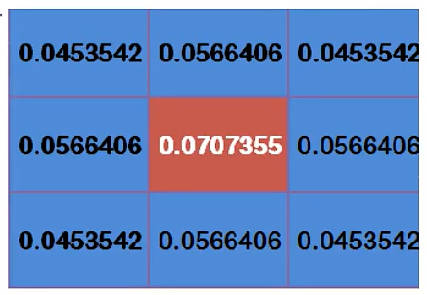
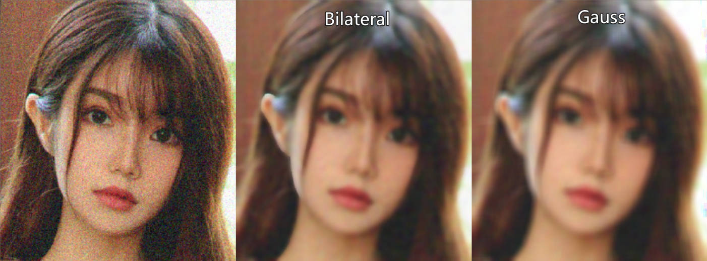
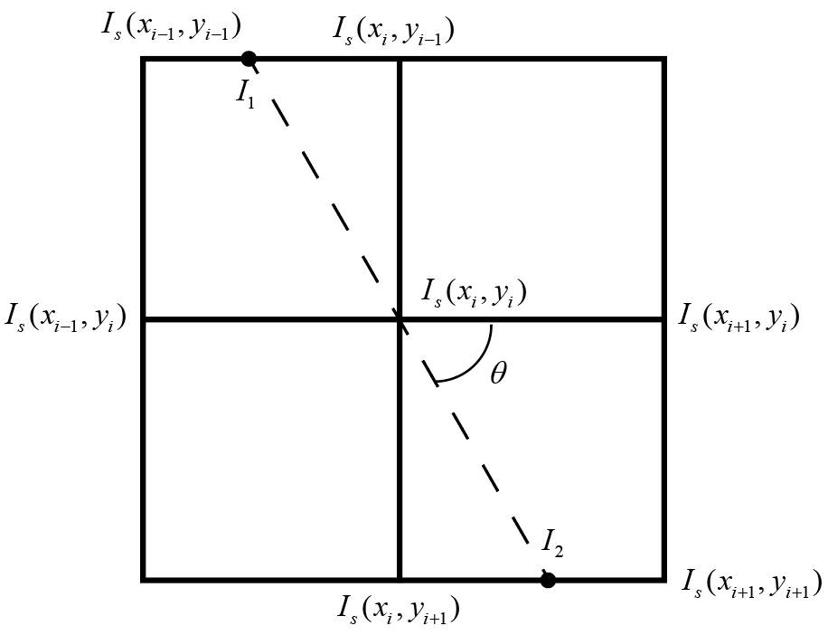

# 图像滤波

<a href="https://github.com/spite-triangle/artificial_intelligence/tree/master/example/computerVision/filter" class="jump_link"> 本章测试程序 </a>

# 卷积操作

[图片卷积原理]( DeepLearning/chapter/convolution.md )

<p style="text-align:center;"></p>

```python
# ddepth：图片位深，-1 为默认值
# kernel：卷积核，数据类型为 np.float
# delta：卷积计算后的偏移量 src * kernel + delta
cv2.filter2D(src, ddepth, kernel:np.ndarray[, dst[, anchor[, delta[, borderType]]]]) -> dst
```

# 低通滤波

> [!note]
> - 消除图片中的高斯噪声
> - 消除图片中的椒盐噪声
> - 图片模糊

## 方盒滤波与均值滤波

- 卷积核
    $$
    K = \alpha \begin{bmatrix}
        1 & 1 & \dotsm & 1 \\
        1 & 1 & \dotsm & 1 \\
         &  & \dotsm &  \\
        1 & 1 & \dotsm & 1 \\
    \end{bmatrix}_{h \times w}
    $$
- 正交化：$\alpha = \frac{1}{h  w}$，即将卷积核对应的值全部相加，再求平均。正交化的方盒滤波也称之为「均值滤波」


```python
# 方盒滤波
# normalize：正交化，一般都设置为 True
cv2.boxFilter(src, ddepth, kernelSize:tuple[, dst[, anchor[, normalize[, borderType]]]]) -> dst

# 均值滤波
cv2.blur(src, kernelSize:tuple[, dst[, anchor[, borderType]]]) -> dst
```
- 效果：卷积核框住的像素点求均值

<p style="text-align:center;"></p>

## 高斯滤波

### 高斯分布

<!-- panels:start -->
<!-- div:left-panel -->
一维高斯分布概率密度函数：

$$
f(x) = \frac{1}{\sigma \sqrt{2 \pi}} e^{-\frac{(x-\mu)^2}{2 \sigma^2}}
$$

其中 $\mu$ 为样本均值；$\sigma$为样本标准差。
<!-- div:right-panel -->
<p style="text-align:center;"></p>
<!-- panels:end -->

<!-- panels:start -->
<!-- div:left-panel -->
二维高斯分布概率密度函数：

$$
f(x, y)=\left(2 \pi \sigma_{1} \sigma_{2} \sqrt{1-\rho^{2}}\right)^{-1} \exp \left[-\frac{1}{2\left(1-\rho^{2}\right)}\left(\frac{\left(x-\mu_{1}\right)^{2}}{\sigma_{1}^{2}}-\frac{2 \rho\left(x-\mu_{1}\right)\left(y-\mu_{2}\right)}{\sigma_{1} \sigma_{2}}+\frac{\left(y-\mu_{2}\right)^{2}}{\sigma_{2}^{2}}\right)\right]
$$

其中 $\mu_1,\mu_2$ 为 $x,y$ 的均值；$\sigma_1,\sigma_2$ 为 $x,y$ 的标准差；$\rho$ 为 $x,y$ 的相关系数。

<!-- div:right-panel -->
<p style="text-align:center;"></p>
<!-- panels:end -->

二维高斯分布太复杂，作如下假设：
- $\mu_1 = \mu_2 = 0$
- $\rho = 0$

得

$$
f(x,y) = \frac{1}{2 \pi \sigma_1 \sigma_2} \exp{ \left [ - \frac{1}{2}(\frac{x^2}{\sigma_1^2}  + \frac{y^2}{\sigma_2^2} ) \right ]}
$$

### 滤波

1. 假定卷积核的中心坐标 $(x,y)$ 为 $(0,0)$ ，然后得到周围的坐标值
    <p style="text-align:center;"></p>
2. 将坐标值带入简化后的二维高斯分布概率密度函数，并取 $\sigma_1 = \sigma_2 =1.5$
    <p style="text-align:center;"></p>
3. 由于计算得到的值只是概率密度，并非概率值，所以还需要将其转为概率。求得整个卷积核的总加和值，然后每个值再除以总和值，得到高斯模板卷积核
    <p style="text-align:center;"></p>
4. 整数高斯模板：所有概率值除以左上角的概率值，然后四舍五入获得整数值。
5. 最后用获得的高斯模板卷积核，进行卷积计算

### OpenCV 代码

```python
# sigmaX ：x 的标准差，不指定的话，根据 kernelSize 进行计算
# sigmaY ：y 的标准差，默认等于 sigmaX 
cv2.GaussianBlur(src, kernelSize:tuple, sigmaX[, dst[, sigmaY[, borderType]]]) -> dst
```

- 效果：卷积核框住的所有像素进行加权平均，中心点权重大，远离中心点的像素权重值小；卷积核尺寸控制了参与加权平均的像素范围。

<p style="text-align:center;"></p>

## 中值滤波

- **实现：** 对卷积核框住的像素值进行排序；取中间值作为输出结果。

```python
cv2.medianBlur(src, kernelSize:int[, dst]) -> dst
```
- **椒盐噪声**：随机出现的「纯白点」或者「纯黑点」
- 效果：去除「椒盐噪声」效果最好
<p style="text-align:center;"></p>

## 双边滤波

### 原理

- **原因：** 高斯滤波在去除高斯噪声的同时，也会不加区分的将图像中的「边缘」一并给加权平均了，所以就导致图片整体看起来很模糊。为了保护边缘，就产生了「双边滤波算法」。
- **图像边缘：** 边缘的产生就是因为相邻的像素的颜色通道差别太大，因此，对相邻像素的颜色做差，就能标记出边缘（差值越大，就说明边缘的可能性越高）。
- **算法思路：** 在高斯滤波的基础上在添加一个灰度距离权重。灰度距离越大，灰度距离权重越小，这样像素在高斯模糊中的占比就越小，进而**实现只对颜色相近的像素进行高斯滤波**。

<p style="text-align:center;"></p>

- **算法：**

    $$
    I_{bf} = \frac{1}{W} \sum_{p \in K} G_s(p)G_r(p) I_p
    $$

    - $I_{bf}$：卷积操作后像素输出值
    - $K$：卷积核框住的像素
    - $G_s(p)$：高斯概率密度函数，卷积核中心像素坐标 $q(x_q,y_q)$，卷积核中某一像素坐标 $p(x_p,y_p)$，
        $$
        \begin{aligned}
        G_s(p) &= \exp{(-\frac{||p-q||^2}{2\sigma_s^2})} \\
            &= \exp{(-\frac{(x_p-x_q)^2 + (y_p - y_q)^2}{2\sigma_s^2})}
        \end{aligned}
        $$
    - $G_r(p)$：灰度值距离权重，灰度距离越大，灰度距离权重越小。卷积核中心像素 $I_q$，积核中某一像素 $I_p$
        $$
        \begin{aligned}
            G_r(p) &= \exp (- \frac{||I_p - I_q||^2}{2 \sigma_r^2}) \\
            &= \exp (-\frac{[ \rm gray(I_p) - gray(I_q) ]^2}{2\sigma_r^2})
        \end{aligned}
        $$
    - $W$：$\sum\limits_{p \in K} G_s(p)G_r(p)$ 的值并不等于`1`，所以还需要进行权重的归一化
        $$
        W = \sum\limits_{p \in K} G_s(p)G_r(p)
        $$

### OpenCV 代码

```python
# sigmaColor：sigma_s，高斯分布的标准差
# sigmaSpace：sigma_r，灰度距离的控制值 
cv2.bilateralFilter(src, kernelSize:int, sigmaColor, sigmaSpace[, dst[, borderType]]) -> dst
```
- **效果：** 同样的 $\sigma_s$ 值和卷积核大小，双边滤波轮廓清晰度更高，去高斯噪声能力相对弱一点。

<p style="text-align:center;"></p>

# 高通滤波

> [!note]
> - 边缘监测
> - 图像边缘：图像的灰度图中，相邻像素灰度值差距较大的位置

<p style="text-align:center;"></p>

## sobel 算子

- **原理**：对图像邻近的灰度像素进行求导，斜率较大的地方，边缘的概率最大。
    <p style="text-align:center;"></p>
- **差分法**：图像中近似求导的方法
    $$
    I'(x_i) = \frac{I(x_{i+1}) -I(x_i) }{x_{i+1} - x_i}
    $$

    **这里只对像素的一个方向进行求偏导（x方向或者y方向）。求导的实际操作仍然是卷积操作，所以对于分母差值也可以省略掉**

    $$
    I'(x_i) = I(x_{i+1}) -I(x_i)
    $$

- **卷积核**
    - x方向求偏导：提取竖向的边缘，目标像素左右的像素进行差值计算
        $$
        G_x = \begin{bmatrix}
            -1 & 0 & +1 \\
            -2 & 0 & +2 \\
            -1 & 0 & +1 \\
        \end{bmatrix}
        $$
    - y方向求偏导：提取横向的边缘，目标像素上下的像素进行差值计算
        $$
        G_y = \begin{bmatrix}
            -1 & -2 & -1 \\
            0 & 0 & 0 \\
            +1 & +2 & +1 \\
        \end{bmatrix}
        $$

```python
# ddepth：cv2.CV_， 结果图像的位深
# dx：对 x 方向求偏导
# dy：对 y 方向求偏导
# ksize：卷积核大小
cv2.Sobel(src, ddepth, dx:bool, dy:bool[, dst[, ksize:int[, scale[, delta[, borderType]]]]]) -> dst

# src中的数据取绝对值
cv2.convertScaleAbs(src[, dst[, alpha[, beta]]]) -> dst
```

<details>
<summary><span class="details-title">代码案例</span></summary>
<div class="details-content"> 

```python
import cv2 
import numpy as np

img = cv2.imread('./cat.jpeg',cv2.IMREAD_GRAYSCALE)
img = cv2.resize(img,(0,0),fx=0.6,fy=0.6)

# Sobel(src, ddepth, dx, dy[, dst[, ksize:int[, scale[, delta[, borderType]]]]]) -> dst
# 竖着的边界
imgv = cv2.Sobel(img,cv2.CV_16S,dx=1,dy=0,ksize=3)
imgv = cv2.convertScaleAbs(imgv)

# 横着的边界
imgh = cv2.Sobel(img,cv2.CV_16S,dx=0,dy=1,ksize=3)
imgh = cv2.convertScaleAbs(imgh)

# 边界叠加
imga = cv2.add(imgh,imgv)

cv2.imshow('sobel',np.hstack((img,imgv,imgh,imga)))
cv2.waitKey(0)
cv2.destroyAllWindows()
``` 

</div>
</details>

<p style="text-align:center;"></p>

> [!note]
> - `Sobel`计算，会导致像素值为负，因此输出图像的位深`ddepth`应当使用「有符号类型」，例如`cv2.CV_16S`、`cv2.CV_32F`等
> - 颜色通道数值不存在负数，所以还需要对计算结果取绝对值`convertScaleAbs` 
> - 对于横向、竖向的边界提取要分两次进行，一起提取效果很差。


## Schar 算子

- **介绍：** 对 Sobel 算子的改进。

- **卷积核**：<span style="color:red;font-weight:bold"> 卷积核大小固定`3x3` </span>
    - x方向求偏导：提取竖向的边缘，目标像素左右的像素进行差值计算
        $$
        G_x = \begin{bmatrix}
            -3 & 0 & +3 \\
            -10 & 0 & +10 \\
            -3 & 0 & +3 \\
        \end{bmatrix}
        $$
    - y方向求偏导：提取横向的边缘，目标像素上下的像素进行差值计算
        $$
        G_y = \begin{bmatrix}
            -3 & -10 & -3 \\
            0 & 0 & 0 \\
            +3 & +10 & +3 \\
        \end{bmatrix}
        $$

```python
cv2.Scharr(src, ddepth, dx, dy[, dst[, scale[, delta[, borderType]]]]) -> dst
```

## 拉普拉斯算子

- **思想：** Sobel算子是对像素求解一阶导数，最大值处就是边缘；对一阶导数再求导，那么零值处就是边缘，**但是，由于利用差分进行计算而且像素点也是离散的，进度丢失大，这个「零」的表现其实不明显。边界显示的还是主要两边的峰值。**
    <p style="text-align:center;"></p>
- **二阶差分：**

    一阶差分近似为
    $$
    I'(x_{i+1}) = I(x_{i+1}) -I(x_i)
    $$
    对一阶差分求导
    $$
    \begin{aligned}
        I''(x_i) &= I'(x_{i+1}) - I'(x_i) \\
        &=  I(x_{i+1}) - I(x_{i}) - [ I(x_{i}) -I(x_{i-1}) ] \\
        &= I(x_{i+1}) - 2I(x_{i}) + I(x_{i-1})
    \end{aligned}
    $$   
    该求导结果只考虑了一个方向的，现在考虑两个方向
    $$
    \begin{aligned}
        I''(x_i,y_i) &= I''_{xx}(x_{i},y_{i}) + I''_yy(x_i,y_i) + I''_{xy}(x_i,y_i) \\
        &= I''_{xx}(x_{i},y_{i}) + I''_yy(x_i,y_i) 
    \end{aligned}
    $$ 
    其中`x,y`方向是相互独立的 $I''_{xy}=0$，因此求解得
    $$
    I''(x_i,y_i) = I(x_{i+1},y_{i})  + I(x_{i-1},y_{i}) + I(x_{i},y_{i+1}) + I(x_{i},y_{i-1}) - 4I(x_{i},y_{i}) 
    $$
    写成矩阵形式就为
    $$
    I''(x_i,y_i) = \begin{bmatrix}
      0 & 1 & 0 \\  
      1 & -4 & 1 \\  
      0 & 1 & 0 \\  
    \end{bmatrix} * \begin{bmatrix}
        I(x_{i-1},y_{i-1}) & I(x_{i},y_{i-1}) & I(x_{i+1},y_{i-1}) \\
        I(x_{i-1},y_{i}) & I(x_{i},y_{i}) & I(x_{i+1},y_{i}) \\
        I(x_{i-1},y_{i+1}) & I(x_{i},y_{i+1}) & I(x_{i+1},y_{i+1}) \\
    \end{bmatrix}
    $$


- **效果：** 拉普拉斯算子处理渐变图的能力要强于Sobel算子

    ```python
    cv2.Laplacian(src, ddepth:cv2.CV_[, dst[, ksize:int[, scale[, delta[, borderType]]]]]) -> dst
    ```
    <p style="text-align:center;"></p>

## Canny边缘检测

### 算法流程

1. 使用高斯滤波对图像进行滤波
    $$
    I_g = G * I
    $$
2. 利用Sobel算子，计算`x,y`方向的梯度
    $$
    \begin{aligned}
        I_{sx} = G_x * I_g \\
        I_{sy} = G_y * I_g 
    \end{aligned}
    $$
    梯度强度
    $$
    I_s = \sqrt{I_{sx}^2 + I_{sy}^2} \approx |I_{sx}|+|I_{xy}|
    $$
    梯度方向
    $$
    \theta = \arctan (\frac{I_{sy}}{I_{sx}})
    $$
3. 非极大值抑制：得到的 $I_s$ 非局部极大值，就全部舍弃掉。**进行边缘预选**
   1. 线性差值法：对比 $I_s(x_i,y_i)$ 与 $I_1$ 、$I_2$ 的值，若 $I_s(x_i,y_i)$ 最大，则保留作为边界，否则舍弃掉。$I_1$ 、$I_2$ 根据 $\theta$ 进行插值计算。
        <p style="text-align:center;"></p>

    2. 角度近似：将中心点周围的像素非为8个方向（$0^\circ、45^\circ、90^\circ$等），然后 $\theta$ 离哪个角度近，就用这个角度直线上的梯度值与中心点梯度进行比较，中心点最大就保留，否则舍弃。
        <p style="text-align:center;"></p>

4. 双阈值检测：**确定最终边缘**

    <p style="text-align:center;"></p>
    
    - 梯度 > maxVal ：认为是边界像素
    - 梯度 < minVal ：绝对不是边界
    - 梯度介于二者之间：判断当前像素是否和边界连着，若连着则保留，例如 `C`，否则舍弃掉，例如`B`

### OpenCV 代码

```python
#  threshold1：minVal
# threshold2：maxVal
cv2.Canny(image, threshold1, threshold2[, edges[, apertureSize[, L2gradient]]]) -> edges
```
<p style="text-align:center;"></p>

# 附录：高斯滤波的叠加性

假设对图片依次做一次 $\sigma_1$ 、$\sigma_2$ 的卷积

$$
I(x,y) = G(u,v;\sigma_2) * G(u,v;\sigma_1) * I(x,y)
$$

根据「卷积结合律」

$$
I(x,y) =\left[ G(u,v;\sigma_2) * G(u,v;\sigma_1) \right]  * I(x,y)
$$

因此，可以先计算高斯核 $G(u,v;\sigma_2) * G(u,v;\sigma_1)$ 的卷积结果，然后才对原图进行高斯滤波。

这里的高斯核是二维的，为了推导方便，下面主要对一维进行推导，推导结果对二维同理。一维高斯分布

$$
f(x;\sigma) = \frac{1}{\sigma \sqrt{2 \pi}} e^{-\frac{x^2}{2 \sigma^2}}
$$

标准差分别为 $\sigma_1$ 与 $\sigma_2$ 的高斯分布进行卷积

$$
\begin{aligned}
    f(t;\sigma_1) * f(t;\sigma_2) = \int_{- \infin}^{+\infty} f(\tau;\sigma_1) f(t-\tau;\sigma_2) d \tau 
\end{aligned}
$$

根据傅里叶变换卷积定理，可将卷积变为乘积计算

$$
\begin{array}{l}
F\left[f_{1}(t) * f_{2}(t)\right]=\int_{-\infty}^{+\infty}\left[\int_{-\infty}^{+\infty} f_{1}(\tau) f_{2}(t-\tau) d \tau\right] e^{-j w t} d t \\
=\int_{-\infty}^{+\infty} f_{1}(\tau)\left[\int_{-\infty}^{+\infty} f_{2}(t-\tau) e^{-j w t} d t\right] d \tau \\
=\int_{-\infty}^{+\infty} f_{1}(\tau) F_{2}(w) e^{-j w \tau} d \tau \\
=F_{2}(w) \int_{-\infty}^{+\infty} f_{1}(\tau) e^{-j w \tau} d \tau \\
=F_{2}(w) F_{1}(w)
\end{array}
$$

上式就为

$$
F[ f(t;\sigma_1) * f(t;\sigma_2) ] = F(t;\sigma_1) F(t;\sigma_2)
$$

现在就只需要带入高斯分布傅里叶变换即可

$$
F(w) = e^{-\frac{1}{2} w^2 \sigma^2}
$$


<details>
<summary><span class="details-title">高斯分布的傅里叶变换</span></summary>
<div class="details-content"> 

$$
\begin{aligned}
    令： a &= \frac{1}{2\sigma^2}\\
    F(f(x;\sigma)) &= \int_{-\infty}^{+\infty} f(x;\sigma) e^{-j w x} d x \\
    &= \frac{1}{\sigma \sqrt{2 \pi}} \int_{-\infty}^{+\infty} e^{-a x^{2}} e^{-j w x} d x 
\end{aligned}
$$

继续求解积分

$$
\begin{aligned}
    &= \int_{-\infty}^{+\infty} e^{-a x^{2}} e^{-j w x} d x  \\
    &= \int_{-\infty}^{+\infty} e^{-a x^{2} -j w x} d x  \\
    &= \int_{-\infty}^{+\infty} e^{-(\sqrt a x + \frac{jw}{2\sqrt{a}})^2 -\frac{w^2}{4a}} d x  \\
    令：u&= \sqrt a x + \frac{jw}{2\sqrt{a}} \\
     &= e^{ -\frac{w^2}{4a}} \int_{-\infty}^{+\infty} e^{-u^2} \frac{1}{\sqrt{a}} du \\
    &=  e^{ -\frac{w^2}{4a}} \sqrt{\frac{\pi}{a}}
\end{aligned}
$$

<a href="https://blog.csdn.net/zhouchangyu1221/article/details/104178387" class="jump_link"> 积分计算公式 </a>。积分结果回代

$$
\begin{aligned}
    &= \frac{1}{\sigma \sqrt{2 \pi}} \int_{-\infty}^{+\infty} e^{-a x^{2}} e^{-j w x} d x \\
    &= \frac{1}{\sigma \sqrt{2 \pi}} e^{ -\frac{w^2}{4a}} \sqrt{\frac{\pi}{a}} \\
    回代a：&= \frac{1}{\sigma \sqrt{2 \pi}} \sigma\sqrt{2\pi} e^{-\frac{1}{2} w^2 \sigma^2} \\
    &=e^{-\frac{1}{2} w^2 \sigma^2}
\end{aligned}
$$

</div>
</details>

通过傅里叶变换可以求解得

$$
\begin{aligned}
    F[ f(t;\sigma_1) * f(t;\sigma_2) ] &= F(t;\sigma_1) F(t;\sigma_2) \\
    &= e^{-\frac{1}{2} w^2 \sigma_1^2}e^{-\frac{1}{2} w^2 \sigma_2^2} \\
    &= e^{-\frac{1}{2} w^2 (\sigma_1^2 + \sigma_2^2)}\\
    &= F[f(t;\sqrt{\sigma_1^2 + \sigma_2^2})]
\end{aligned}
$$

> [!note|style:flat]
> 对图片依次进行 $\sigma_1$ 与 $\sigma_2$的高斯滤波后，其结果与直接进行 $\sqrt{\sigma_1^2 + \sigma_2^2}$ 的结果等价。
> 
> $$
 G(u,v;\sigma_2) * G(u,v;\sigma_1) = G(u,v;\sqrt{\sigma_1^2 + \sigma_2^2})
$$