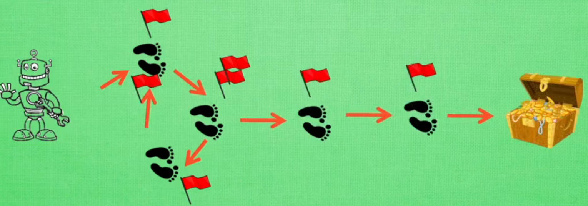

# TD算法

# sarsa

## TD目标

- **折扣回报：** $U_t = R_t + \gamma U_{t+1}$
- **动作价值：**
    $$
    \begin{aligned}
        Q_\pi (s_t,a_t) &= E[U_t|s_t,a_t] \\
        &= E [R_t + \gamma U_{t+1} | s_t,a_t] \\
        &= E [R_t] + \gamma E [U_{t+1} | s_t,a_t] \\
        &= E [R_t] + \gamma E [Q_\pi (S_{t+1},A_{t+1}) | s_t,a_t] \\
        &= E [R_t + \gamma Q_\pi (S_{t+1},A_{t+1})]
    \end{aligned}
    $$
- **TD目标：** 对「动作价值」进行蒙特卡洛近似，得 $y_t = r_t + \gamma Q_\pi (s_{t+1},a_{t+1})$

## 表格形式

**形式**：利用一个表格来记录 $Q
_\pi(s,a)$，行为状态 $s$，列为动作 $a$。 

**算法：**
1. 观测一次状态：$(s_t,a_t,r_t,s_{t+1})$
2. 根据状态 $s_{t+1}$，通过策略函数 $\pi (a|s)$ 预测下一个动作 $a_{t+1}$
3. TD目标：$y_t = r_t + \gamma Q_\pi (s_{t+1},a_{t+1})$
4. TD误差：$\delta_t = Q_\pi (s_t,a_t) - y_t$
5. 更新 $Q_\pi$：$Q_\pi(s_t,a_t) = Q_\pi(s_t,a_t) - \alpha \delta_t$

- <a href="https://github.com/spite-triangle/artificial_intelligence/tree/master/example/reinforcementLearning/findWay_Sarsa" class="jump_link"> Sarsa 案例 </a>

## Sarsa($\lambda$)

### Sarsa 表格的问题

- **问题：** 
    1. Sarsa 算法对于 $Q_{\pi}$ 更新，为单步更新，角色动一次便更新一次 $Q_{\pi}$，这就导致一回合游戏结束后，回顾寻宝「轨迹」，发现在宝藏附近的状态的 $Q_{\pi}$ 才与宝藏关系密切，而前往宝藏之前的轨迹状态则认为与宝藏无关。这就会导致 Sarsa 要在同样的轨迹上重复多次，进行 $Q_{\pi}$ 的更新，才能得到较好的 $Q_{\pi}$，**前提是找到宝藏的情况下，前期没有找到时，决策的随机数得大一些**
    2. 角色可能在前进的轨迹上转圈（在某几个状态上来回切换）

    

- **解决思路：** 
    1. 利用多组状态对 $Q_{\pi}$ 进行更新，增强轨迹上各个状态与宝藏的关联性
    2. 对轨迹上的每个状态进行「标记」，标记值越大的状态，说明该状态对找到宝藏的贡献越大，尽量避免没必要的转圈

### Sarsa($\lambda$) 的实现

- **状态个数：** 利用多少个状态对 $Q_{\pi}$ 进行更新，这里的取值范围为 `1 ~ n`（n：表示一回合结束时，轨迹所包含状态的个数），但是由于我们不会真的一回合才进行更新，所以并不知道一回合会有多少状态。**因此，可以将状态个数映射到 [0,1]，0：表示`1`个状态；1：表示`n`个状态，而我们用于Sarsa更新，使用的状态个数为 $\lambda \in [0,1]$，所以该算法就称之为 Sarsa($\lambda$)**

- **状态标记：** 
    1. 一回合中，每个被经过的状态的标记值都会被记录，放到一个`eligibility_trace`表中
    2. 每个状态被经过一次，将会被标记，标记会随时间衰减
        

    3. 当一个状态被多次经过时，对于标记值的处理方式有两种
       - 标记值直接叠加
       - 标记值限幅
        

- **算法流程**：每一轮游戏的开始前，都会将轨迹表归零，$E = 0$
  1. 观测一次状态：$(s_t,a_t,r_t,s_{t+1})$
  2. 根据状态 $s_{t+1}$，通过策略函数 $\pi (a|s)$ 预测下一个动作 $a_{t+1}$
  3. TD目标：$y_t = r_t + \gamma Q_\pi (s_{t+1},a_{t+1})$
  4. TD误差：$\delta_t = Q_\pi (s_t,a_t) - y_t$
  5. 更新的轨迹表$E$：
       - 方式一：$E(s_t,a_t) = E(s_t,a_t) + 1$
       - 方式二：$E(s_t,:) = 0; \ E(s_t,a_t) = 1$
  6. 更新 $Q_\pi$ 全表：$Q_\pi = Q_\pi - \alpha \delta_t E$
  7. 实现 $E$ 全表中标记值的衰减：$E = \gamma \lambda E$

- <a href="https://github.com/spite-triangle/artificial_intelligence/tree/master/example/reinforcementLearning/findWay_SarsaLambda" class="jump_link"> Sarsa($\lambda$) 案例 </a>

### Sarsa($\lambda$) 解释

- **`e4`时刻的$Q_\pi$ 更新：**

    在`e4`时刻，对于 $Q(e4)$ 的TD误差为

    $$
    \delta_{q4} = Q(e4) - r_4 - \gamma Q(e5)
    $$

    并对 $Q(e4)$ 进行修正
    
    $$
    Q(e4)' = Q(e4) - \alpha \delta_{q4}
    $$

    在`e3`时刻，对于 $Q(e3)$ 的TD误差为

    $$
    \delta_{q3} = Q(e3) - r_3 - \gamma Q(e4)
    $$

    在`e3`时，我们并不知道`Q(e4)`具有误差的情况下，对$Q(e3)$进行了修正

    $$
    Q(e3)' = Q(e3) - \alpha \delta_{q3}
    $$

    在`e4`时刻，我们得到了更准确的 $Q(e4)'$ ，回代修正 $Q(e3)$

    $$
    \begin{aligned}
        \delta_{q3}' &= Q(e3) - r_3 - \gamma Q(e4)' \\
        &= Q(e3) - r_3 - \gamma [ Q(e4) - \alpha \delta_{q4} ] \\
        &= Q(e3) - r_3 - \gamma Q(e4) + \gamma \alpha \delta_{q4} \\
        &= \delta_{q3} + \gamma \delta_{q4}
    \end{aligned}
    $$

    重新对$Q(e3)$进行修正

    $$
    \begin{aligned}
        Q(e3)'' &= Q(e3) - \alpha \delta_{q3}' \\
        &= Q(e3) - \alpha \delta_{q3} - \alpha\gamma \delta_{q4} \\
        &= Q(e3)' - \alpha  \delta_{q4} \gamma
    \end{aligned}
    $$

    最终得到的公式就与计算流程的更新公式所对应：

    $$
    \begin{aligned}
         Q(e3)'' &= Q(e3)' - \alpha  \delta_{q4} \gamma \\
         Q_\pi &= Q_\pi - \alpha \delta_t E
    \end{aligned}
    $$

    其他状态同理，就是一层一层的套娃下去。

- **$Q_\pi$ 更新：** 对于上述的 Sarsa($\lambda$) 算法，并非是一轮游戏结束后，才对 $Q_\pi$ 表进更新。从算法的计算流程可以看出  $Q_\pi$ 表在每一次动作后，都会更新一次，**也就是说，角色每转移一次状态，就会停下来，对之前的轨迹进行一次回顾，修正之前所经历的状态到当前状态 $s_t$ 的关联性。**

- **状态个数：** 在`e4`时刻，对于轨迹状态`e1`的动作价值 $Q_\pi$ 更新，涉及的状态就有`e2 - e4`；对于轨迹状态`e2`而言，就是`e3 - e4`

- **$\lambda$ 实现状态个数控制：** 
    - $\lambda = 0$：这就导致一下次状态的开始，$E=0$，然后轨迹表只有当前状态才有记录：$E(s_t,a_t) = 1$，因此 $Q_\pi = Q_\pi - \alpha \delta_t E$ 实际只更新了当前状态的 $Q_\pi(s_t,a_t)$。
    - $\lambda = 1$：$Q_\pi = Q_\pi - \alpha \delta_t E$  更新了 **从回合开始状态 $s_0$ 到当前状态 $s_t$ 对应的所有 $Q_\pi$值**
    - $\lambda \in (0,1)$：由于 $E = \gamma \lambda E$ 的反复迭代，实现了轨迹标记值的衰减，离当前状态越近的状态，其标记值越大，例如到达`e4`时刻时， `e4 = 1`；`e3 = 0.8`；`e2 = 0.64`，时间越靠前，`e` 值就越小，对`e`值再乘以一个倍数值 $\lambda$，就可以将原来当前时刻的`e`值变得更小，几乎就等于`0`了，这样就实现了类似于 $\lambda = 0$ 时，状态的 $Q_\pi$ 不更新。**即 $\lambda$ 使得比较旧的 $Q_{pi}$ 不再参与到更新，也就控制了「状态个数」**

## 神经网络形式 

**思路：** 利用神经网络 $q(s,a;w)$ 来近似动作价值函数 $Q_\pi(s,a)$。 输入为状态，输出为各个动作对应的价值 

**算法：**
1. 观测一次状态：$(s_t,a_t,r_t,s_{t+1})$
2. 根据状态 $s_{t+1}$，通过策略函数 $\pi (a|s)$ 预测下一个动作 $a_{t+1}$
3. TD目标：$y_t = r_t + \gamma q (s_{t+1},a_{t+1};w)$
4. TD误差：$\delta_t = q (s_t,a_t;w) - y_t$
5. 损失函数：$L=\frac{1}{2} \delta_t^2$
6. 更新系数：$w = w - \alpha \delta_t \frac{\partial q(s_t,a_t;w)}{\partial w}$

# Q Learning

## TD目标

- **最优动作价值：**
    $$
    \begin{aligned}
        Q_\pi (s_t,a_t) &= E [R_t + \gamma Q_\pi (S_{t+1},A_{t+1})] \\
        Q^* (s_t,a_t) &= E [R_t + \gamma Q^* (S_{t+1},A_{t+1})] \\
        &= E [R_t + \gamma \max\limits_a Q^* (S_{t+1},a)]
    \end{aligned}
    $$
- **TD目标：** 对「最优动作价值」进行蒙特卡洛近似，得 $y_t = r_t + \gamma \max\limits_a Q^* (s_{t+1},a)$

## 表格形式

**形式**：利用一个表格来记录 $Q^*(s,a)$，行为状态 $s$，列为动作 $a$。 

1. 观测一次状态：$(s_t,a_t,r_t,s_{t+1})$
2. TD目标：$y_t = r_t + \gamma \max\limits_a Q^* (s_{t+1},a)$
3. TD误差：$\delta_t = Q^*(s_t,a_t) - y_t$
4. 更新 $Q_\pi$：$Q^*(s_t,a_t) = Q^*(s_t,a_t) - \alpha \delta_t$

- <a href="https://github.com/spite-triangle/artificial_intelligence/tree/master/example/reinforcementLearning/findWay_QLearning" class="jump_link"> Q Learning 案例 </a>

## 神经网络形式

**思路：** 利用神经网络 $Q(s,a;w)$ 来近似动作价值函数 $Q^*(s,a)$。

**算法：**
1. 观测一次状态：$(s_t,a_t,r_t,s_{t+1})$
2. TD目标：$y_t = r_t + \gamma \max\limits_a Q (s_{t+1},a;w)$
3. TD误差：$\delta_t = Q(s_t,a_t;w) - y_t$
1. 损失函数：$L=\frac{1}{2} \delta_t^2$
2. 更新系数：$w = w - \alpha \delta_t \frac{\partial q(s_t,a_t;w)}{\partial w}$

> [!note|style:flat]
> - **sarsa：** 近似的是「价值函数 $Q_\pi(s,a)$」
> - **Q Learning：** 近似的是「最优价值函数 $Q^*(s,a)$」
> - **神经网络版的 Q Learning 就是 DQN 算法**

# multi-step TD

- **思路：** 之前的算法都是利用一次 $r$ 进行算法更新，还可以采用多次 $r$ 来更新算法。

- **multi-step TD 目标：** 利用多次 $r$ 构造的TD目标

- **回报展开：**
    $$
    \begin{aligned}
        U_t &= R_t + \gamma U_{t+1} \\
        &= R_t + \gamma R_{t+1} + \gamma^2 U_{t+2} \\
        &= R_t + \gamma R_{t+1} + \gamma^2 R_{t+2} + \gamma^3 U_{t+3} \\
        &= \sum\limits_{i=0}^{m-1}\gamma^i R_{t+i} + \gamma^m U_{t+m}
    \end{aligned}
    $$

- **sarsa multi-step TD 目标:** 
    $$
    y_t = \sum\limits_{i=0}^{m-1}\gamma^i r_{t+i} + \gamma^m Q_\pi(s_{t+m},a_{t+m})
    $$

- **sarsa multi-step TD 目标:** 
    $$
    y_t = \sum\limits_{i=0}^{m-1}\gamma^i r_{t+i} + \gamma^m \max\limits_a Q^*(s_{t+m},a)
    $$
