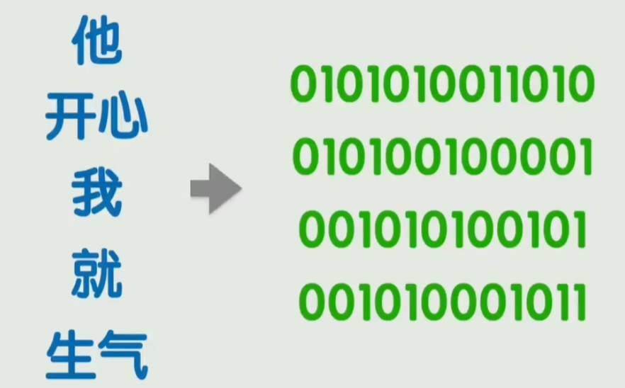
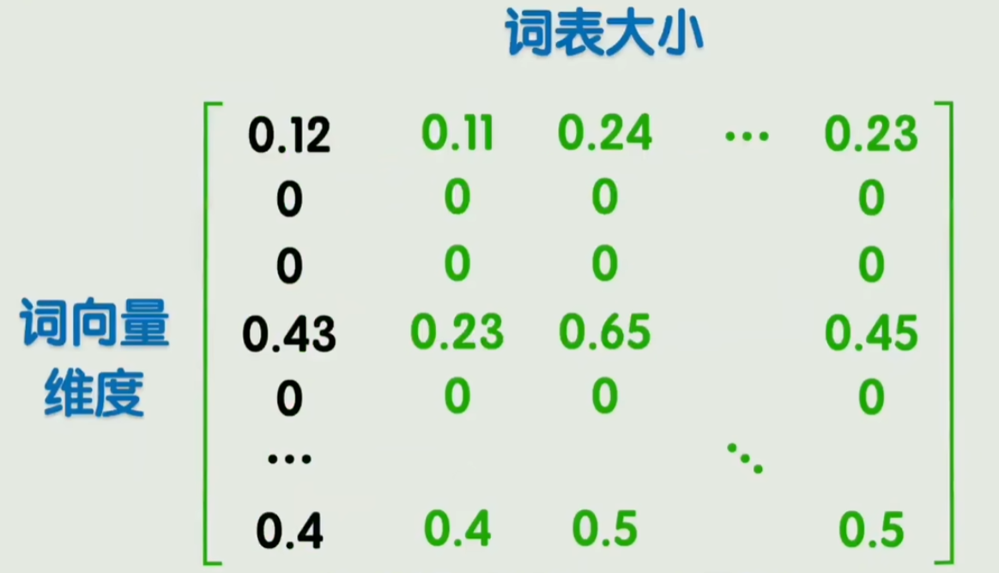
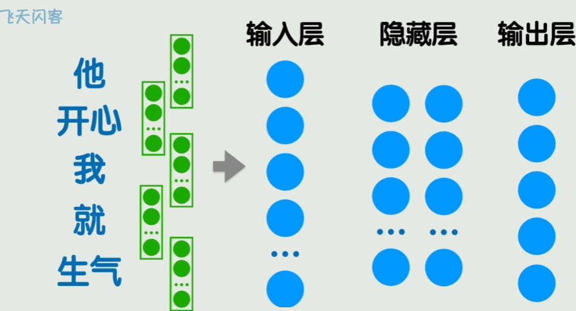
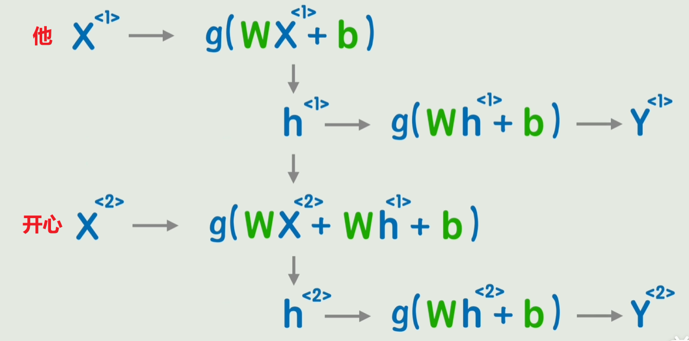
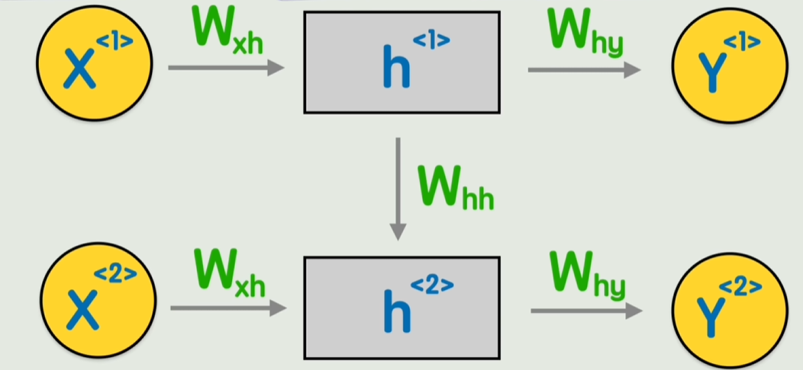
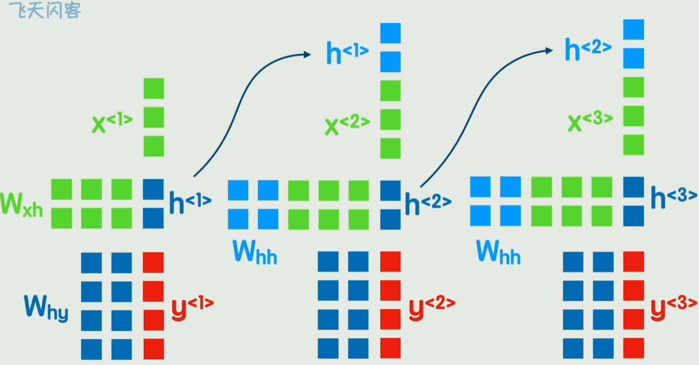

# RNN

# 词嵌入

## 编码

自然语言就是人类用于交流的文字，例如中文、日文、英文。人可通过眼睛识别文字符号，然后通过大脑理解表达含义。对于人而言，文字可以通过「眼睛」直接输入到大脑，但是计算机并没有「眼睛」，因此，需要先将「文字」转换为「二进制」，才能交给计算机进行处理。**将「文字」转换为「二进制」的过程便是编码**。




早期的编码方式
- 编号 : 每个词使用唯一编号进行标记，**维度低，只实现了词的区分，无法表示词之间的关系**

    ```
    他          32
    开心        1240 
    我          12
    ```

- `one hot`: 使用一个高维度向量(向量由`0,1`构成)表示一个词，**维度高，但也只实现了词的区分，无法表示词之间的关系**

    ```
    他          [0,1,0,..,0]
    开心        [0,0,1,..,0]
    我          [0,0,0,..,1]
    ```

## 词嵌入

**词嵌入`word embeddig`**: 每一个词由一个特征向量表示，**维度适中，且可以表达式词之间的关系**


通过特征向量便能进行数学运算
- 加减法：`桌子 - 椅子`, `鼠标 - 键盘`
- 比较运算：`桌子 - 椅子 == 鼠标 - 键盘`
- 点积运算： $\vec{a} \cdot \vec{b}$ ,**常用于判断两个词的相关性**

**嵌入矩阵**：将所有词的特征向量拼接在一起得到的矩阵



> [!note]
> - 输入文本会通过 `Tokenizer` 分词器拆分为词，例如“生物多样性”可能被切成“生物”、“多样”、“性”
>   - 子词切分: `LLM` 使用的主流方案
> - 嵌入矩阵是通过神经网络训练得到，而非人工构建

# RNN

## 背景

文本通过分词器拆分为词，接着查询嵌入矩阵便能得到词相关的特征向量(词嵌入)。将这些特征向量按照文本顺序排列，便得到了模型输入参数。



但如果直接将这些特征向量展开为一维向量输入`FNN`神经网络，显然是不现实的，输入参数太多，例如特征向量维度是 `100`, 那么 `5` 个词构成的句子输出向量的维度便是`5 * 100 = 500`。**因此，诞生了`RNN(Recurrent Neural Network)` 循环神经网络**。

## 网络结构



1. **通过 $<i>$ 表示词的顺序关系**。`他` 的特征向量 $X^{<1>}$ ; `开心` 的特征向量 $X^{<2>}$，
2. **利用 $h^{<i>}$ 传递前文信息**。对于 `FNN` 而言, $Y^{<i>} = \sigma(W X^{<i>} + b)$ 的输出 $Y^{<i>}$ 只反应了 $X^{<i>}$ 影响，这显然不对，当前词表达的含义肯定是和前文有关。因此，利用 $h^{<i>}$ 传递前文的信息

基本公式：

$$
\begin{align*}
h^{<t>} &= g(W_{hh} \cdot h^{<t-1>} + W_{xh} \cdot x^{<t>} + b_h) \\
y^{<t>} &= \sigma(W_{hy} \cdot h^{<t>} + b_y)
\end{align*}
$$

网络图示结构便是



参数的维度



## 缺陷

`RNN` 只是给 `NLP` 研究开了一个头，但并非版本答案，其网络结构存在严重缺陷
1. $\{x^{<1>} \rightarrow y^{<1>}, \dotsm ,x^{<i>} \rightarrow y^{<i>}\}$ 只能串行计算，无法并行
2. 无法捕捉长期依赖信息，例如 $x^{<1>}, x^{<n>}$, 当 $n$ 远大于 $1$ 时，$x^{<1>}$ 对 $y^{<n>}$ 的影响可会略不计。

针对 `RNN` 的上述问题，又提出了 `GRU`、`LSTM` 两种改进网络。

> [!note]
> 由于新型的 `Transformer` 网络结构出现，`RNN`、`GRU`、`LSTM` 均过气。


