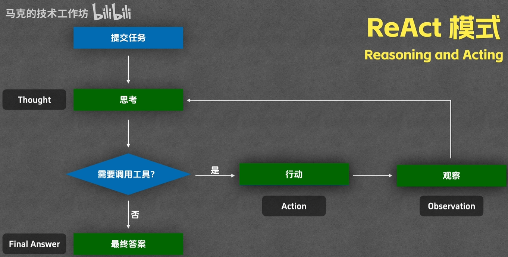
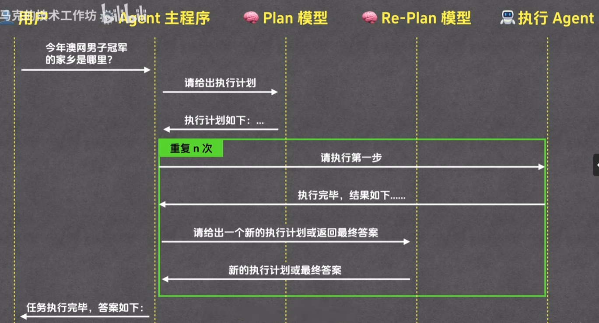

# Agent

# 介绍

Agent（智能体）是指能够自主感知环境、做出决策并采取行动的系统。在自然语言处理（NLP）领域，Agent通常指的是能够理解和生成自然语言的智能体。这些智能体可以用于各种任务，如对话系统、问答系统、文本生成等。其本质就是：**重复 `LLM` 自主调用工具的流程，完成用户任务**。

# ReAct

## 原理

`ReAct（Reasoning and Acting）`是一种结合推理和行动的智能体框架。它允许智能体在执行任务时进行推理，并根据推理结果采取相应的行动。
- `thought`: 通过 `LLM` 进行思考
- `action`: 调用对应的工具、`MCP` 等
- `observation`: 观察工具的输出
- `answer`: 给出最终答案




## 实现

```python
import json
import subprocess
from typing import Any
from openai import OpenAI
from openai.types.chat import ChatCompletionMessageParam, ChatCompletionToolParam

class ReactAgent:
    """简易的 ReAct (Reasoning + Acting) Agent 实现"""

    def __init__(self, model: str, api_key: str, base_url: str, cwd: str):
        self.model = model
        self.tools = self._define_tools()
        self.messages: list[ChatCompletionMessageParam] = []
        self.cwd = cwd
        self.client = OpenAI(
            api_key=api_key,
            base_url=base_url
        )

    def _define_tools(self) -> list[ChatCompletionToolParam]:
        """定义可用的工具"""
        return [
            {
                "type": "function",
                "function": {
                    "name": "file_read",
                    "description": "读取文件内容",
                    "parameters": {
                        "type": "object",
                        "properties": {
                            "file_path": {
                                "type": "string",
                                "description": "要读取文件的绝对路径"
                            }
                        },
                        "required": ["file_path"]
                    }
                }
            },
            {
                "type": "function",
                "function": {
                    "name": "file_write",
                    "description": "将内容写入文件",
                    "parameters": {
                        "type": "object",
                        "properties": {
                            "file_path": {
                                "type": "string",
                                "description": "要写入文件的绝对路径"
                            },
                            "content": {
                                "type": "string",
                                "description": "要写入的内容"
                            }
                        },
                        "required": ["file_path", "content"]
                    }
                }
            },
            {
                "type": "function",
                "function": {
                    "name": "run_command",
                    "description": "执行系统命令",
                    "parameters": {
                        "type": "object",
                        "properties": {
                            "command": {
                                "type": "string",
                                "description": "要执行的系统命令"
                            }
                        },
                        "required": ["command"]
                    }
                }
            }
        ]

    def _execute_tool(self, tool_name: str, tool_input: dict) -> str:
        """执行指定的工具"""
        try:
            if tool_name == "file_read":
                with open(tool_input["file_path"], "r", encoding="utf-8") as f:
                    return f.read()

            elif tool_name == "file_write":
                with open(tool_input["file_path"], "w", encoding="utf-8") as f:
                    f.write(tool_input["content"])
                return f"已成功写入文件: {tool_input['file_path']}"

            elif tool_name == "run_command":
                result = subprocess.run(
                    tool_input["command"],
                    shell=True,
                    capture_output=True,
                    text=True
                )
                stdout = result.stdout.replace('\n', '\\n').replace('\t', '\\t').replace('\r', '\\r').replace(' ', '\\s')
                stderr = result.stderr.replace('\n', '\\n').replace('\t', '\\t').replace('\r', '\\r').replace(' ', '\\s')
                return f"输出: {stdout} \\n 错误: {stderr}"

            else:
                return f"未知工具: {tool_name}"

        except Exception as e:
            return f"执行出错: {str(e)}"

    def run(self, task: str, max_iterations: int = 10) -> str:
        """运行 Agent 的 ReAct 循环"""
        print(f"\n{'='*60}")
        print(f"任务: {task}")
        print(f"{'='*60}\n")

        # 初始化对话
        self.messages = [
            {
                "role": "system",
                "content": f"你是一个 ReAct 模式的 Agent，能够推理、执行工具并观察结果。请根据任务进行推理和行动。当前操作系统是 windows, 且工作目录为 {self.cwd}"
            },
            {
                "role": "user",
                "content": task
            }
        ]

        for iteration in range(max_iterations):
            # 第一步：推理 - 调用大模型
            try:
                response = self.client.chat.completions.create(
                    model=self.model,
                    messages=self.messages,
                    tools=self.tools,
                    tool_choice="auto",
                    max_tokens=1500,
                    stream=False
                )
            except Exception as e:
                print(f"API 调用出错: {str(e)}")
                return f"API 调用失败: {str(e)}"

            # 检查响应类型
            if isinstance(response, str):
                print(f"API 返回了字符串而非对象: {response}")
                return f"API 响应异常: {response}"

            if not hasattr(response, 'choices') or not response.choices:
                print(f"无效的 API 响应: {response}")
                return f"无效的 API 响应"

            assistant_message = response.choices[0].message
            self.messages.append({"role": "assistant", "content": assistant_message.content or ""})  # type: ignore

            # 检查是否需要调用工具
            if not assistant_message.tool_calls:
                # 第四步：答案 - 大模型给出最终答案
                print(f"\n最终答案:\n{assistant_message.content}")
                return assistant_message.content or ""
            else:
                # 第二步：行动 - 执行工具
                print(f"迭代 {iteration + 1}:")
                if assistant_message.content:
                    print(f"推理: {assistant_message.content}")

                tool_results = []
                for tool_call in assistant_message.tool_calls:
                    if tool_call.type != "function":
                        print(f"跳过非函数工具调用: {tool_call.type}")
                        continue
                    tool_name = tool_call.function.name
                    tool_input = json.loads(tool_call.function.arguments)

                    print(f"  执行工具: {tool_name}")
                    print(f"  输入: {tool_input}")

                    
                    result = self._execute_tool(tool_name, tool_input)
                    print(f"  结果: {result[:100]}..." if len(result) > 100 else f"  结果: {result}")
                    print()

                    tool_results.append({
                        "type": "tool",
                        "tool_use_id": tool_call.id,
                        "content": result
                    })

                # 第三步：观察 - 将工具执行结果返回给大模型
                self.messages.append({
                    "role": "user",
                    "content": json.dumps(tool_results)  # type: ignore
                })
        return "达到最大迭代次数，未找到最终答案"


# 使用示例
if __name__ == "__main__":
    agent = ReactAgent(
        model="gpt-4.1-mini", 
        api_key="sk-<YOUR_API_KEY>", 
        base_url="url",
        cwd="E:/testspace/agent/out"
    )

    # 示例任务
    task = """
    请帮我完成以下任务：
    1. 创建一个名为 test.txt 的文件，内容为 "Hello, ReAct Agent!"
    2. 读取这个文件的内容
    3. 使用命令输出文件的行数
    """

    result = agent.run(task)
    print(f"\n任务结果:\n{result}")
```

```term
triangle@LEARN:~$ python ./main.py
============================================================
任务:
    请帮我完成以下任务：
    1. 创建一个名为 test.txt 的文件，内容为 "Hello, ReAct Agent!"
    2. 读取这个文件的内容
    3. 使用命令输出文件的行数

============================================================

迭代 1:
  执行工具: file_write
  输入: {'file_path': 'E:/testspace/agent/out/test.txt', 'content': 'Hello, ReAct Agent!'}
  结果: 已成功写入文件: E:/testspace/agent/out/test.txt

迭代 2:
  输入: {'file_path': 'E:/testspace/agent/out/test.txt'}
  结果: Hello, ReAct Agent!

  执行工具: run_command
  输入: {'command': 'find /v "" /c < E:/testspace/agent/out/test.txt'}
  结果: 输出: 1\n \n 错误:

最终答案:
1. 文件 test.txt 已创建，内容为 "Hello, ReAct Agent!"
3. 使用命令输出的文件行数为1
```

# plan

## 原理

`Plan` 是一种用于任务规划和执行的智能体框架。它允许智能体在执行任务时进行计划，并根据计划结果采取相应的行动。目前行业并没有统一规范，以下给出 `Plan-Execute Agent` 模式的设计思路
- `Plan` 模型：输出执行计划
- `Re-Plan` 模型：修正执行的计划
- `execution agent`: 专门用于执行每步计划的子 `agent`，**可以是 `ReAct` 实现，也能是其他结构实现**
- `main agent`: 实现上述三个组件的调度




## 实现

```python
import json
import subprocess
from typing import Any
from openai import OpenAI
from openai.types.chat import ChatCompletionMessageParam, ChatCompletionToolParam
from dataclasses import dataclass

@dataclass
class ExecutionPlan:
    """执行计划数据类"""
    goal: str
    steps: list[str]
    success_criteria: str

class PlanAgent:
    """计划 Agent: 分析任务并制定执行计划"""

    def __init__(self, model: str, api_key: str, base_url: str):
        self.model = model
        self.client = OpenAI(
            api_key=api_key,
            base_url=base_url
        )
        self.messages: list[ChatCompletionMessageParam] = []


    def generate_plan(self, task: str) -> ExecutionPlan:
        """根据任务生成执行计划"""
        print(f"[PlanAgent] 正在制定执行计划...")
        print(f"{'-'*60}\n")

        self.messages = [
            {
                "role": "system",
                "content": """你是一个计划制定专家。你的任务是分析用户的需求，为 execution agent 制定一个清晰、可执行的计划。

请按以下 JSON 格式返回计划（不要包含任何额外文本）：
{
    "goal": "具体的目标描述",
    "steps": ["步骤1", "步骤2", "步骤3", ...],
    "success_criteria": "成功的标准是什么"
}

每个步骤应该是明确、可执行的操作，且任务步骤简洁明确，避免重复步骤。"""
            },
            {
                "role": "user",
                "content": f"任务: {task}"
            }
        ]

        try:
            response = self.client.chat.completions.create(
                model=self.model,
                messages=self.messages,
                max_tokens=2000,
                stream=False
            )

            plan_text = response.choices[0].message.content or ""

            # 解析 JSON 格式的计划
            try:
                plan_dict = json.loads(plan_text)
                plan = ExecutionPlan(
                    goal=plan_dict.get("goal", ""),
                    steps=plan_dict.get("steps", []),
                    success_criteria=plan_dict.get("success_criteria", "")
                )

                print(f"✓ 目标: {plan.goal}")
                print(f"✓ 执行步骤数: {len(plan.steps)}")
                for i, step in enumerate(plan.steps, 1):
                    print(f"  {i}. {step}")
                print(f"✓ 成功标准: {plan.success_criteria}\n")

                return plan
            except json.JSONDecodeError:
                # 如果 JSON 解析失败，尝试提取内容
                print(f"⚠ 无法解析 JSON，尝试手动提取...")
                return ExecutionPlan(
                    goal=task,
                    steps=[task],
                    success_criteria="任务完成"
                )

        except Exception as e:
            print(f"✗ PlanAgent 调用出错: {str(e)}")
            return ExecutionPlan(
                goal=task,
                steps=[task],
                success_criteria="任务完成"
            )

    def revise_plan(
        self,
        current_plan: ExecutionPlan,
        completed_steps: list[str],
        step_results: list[dict],
        feedback: str
    ) -> ExecutionPlan:
        """根据执行反馈修正计划"""
        print(f"\n{'='*60}")
        print(f"[PlanAgent] 正在基于反馈修正执行计划...")
        print(f"{'='*60}\n")

        # 构建修正提示
        completed_info = "\n".join([f"{i+1}. ✓ {step}: {result.get('result', '')[:100]}"
                                    for i, (step, result) in enumerate(zip(completed_steps, step_results))])
        remaining_steps = current_plan.steps[len(completed_steps):]
        remaining_info = "\n".join([f"{i+1}. [ ] {step}" for i, step in enumerate(remaining_steps)])

        revision_prompt = f"""基于以下信息，请修正剩余的执行计划：

原始目标: {current_plan.goal}
成功标准: {current_plan.success_criteria}

已完成的步骤：
{completed_info}

待执行的步骤：
{remaining_info}

当前反馈/问题:
{feedback}

请根据反馈情况，修正剩余的步骤。如果需要调整策略或添加新步骤，请在 JSON 中体现。
返回修正后的完整计划（包括已完成的步骤作为参考）：

\`\`\`json
{{
    "goal": "修正后的目标描述",
    "steps": ["已完成的步骤1", "已完成的步骤2", "新/修正的待执行步骤1", ...],
    "current_index": 已完成步骤的索引位置,
    "success_criteria": "修正后的成功标准"
}}
\`\`\`
"""
        self.messages = [
            {
                "role": "system",
                "content": "你是一个计划修正专家。根据执行反馈动态调整执行计划。"
            },
            {
                "role": "user",
                "content": revision_prompt
            }
        ]

        try:
            response = self.client.chat.completions.create(
                model=self.model,
                messages=self.messages,
                max_tokens=2000,
                stream=False
            )

            plan_text = response.choices[0].message.content or ""

            try:
                plan_dict = json.loads(plan_text)
                revised_plan = ExecutionPlan(
                    goal=plan_dict.get("goal", current_plan.goal),
                    steps=plan_dict.get("steps", current_plan.steps),
                    success_criteria=plan_dict.get("success_criteria", current_plan.success_criteria)
                )

                print(f"✓ 修正后的目标: {revised_plan.goal}")
                print(f"✓ 修正后的步骤数: {len(revised_plan.steps)}")
                current_index = plan_dict.get("current_index", len(completed_steps))
                print(f"✓ 继续执行位置: 步骤 {current_index + 1}\n")
                for i in range(current_index, len(revised_plan.steps)):
                    print(f"  {i+1}. {revised_plan.steps[i]}")
                print()

                return revised_plan
            except json.JSONDecodeError:
                print(f"⚠ 无法解析修正计划，保持原计划...")
                return current_plan

        except Exception as e:
            print(f"✗ 计划修正出错: {str(e)}")
            return current_plan


class ExecutionAgent:
    """执行 Agent: 根据计划执行具体步骤"""

    def __init__(self, model: str, api_key: str, base_url: str, cwd: str):
        self.model = model
        self.client = OpenAI(
            api_key=api_key,
            base_url=base_url
        )
        self.cwd = cwd
        self.messages: list[ChatCompletionMessageParam] = []
        self.tools = self._define_tools()

    def _define_tools(self) -> list[ChatCompletionToolParam]:
        """定义可用的工具"""
        return [
            {
                "type": "function",
                "function": {
                    "name": "file_read",
                    "description": "读取文件内容",
                    "parameters": {
                        "type": "object",
                        "properties": {
                            "file_path": {
                                "type": "string",
                                "description": "要读取文件的绝对路径"
                            }
                        },
                        "required": ["file_path"]
                    }
                }
            },
            {
                "type": "function",
                "function": {
                    "name": "file_write",
                    "description": "将内容写入文件",
                    "parameters": {
                        "type": "object",
                        "properties": {
                            "file_path": {
                                "type": "string",
                                "description": "要写入文件的绝对路径"
                            },
                            "content": {
                                "type": "string",
                                "description": "要写入的内容"
                            }
                        },
                        "required": ["file_path", "content"]
                    }
                }
            },
            {
                "type": "function",
                "function": {
                    "name": "run_command",
                    "description": "执行系统命令",
                    "parameters": {
                        "type": "object",
                        "properties": {
                            "command": {
                                "type": "string",
                                "description": "要执行的系统命令"
                            }
                        },
                        "required": ["command"]
                    }
                }
            }
        ]

    def _execute_tool(self, tool_name: str, tool_input: dict) -> str:
        """执行指定的工具"""
        try:
            if tool_name == "file_read":
                with open(tool_input["file_path"], "r", encoding="utf-8") as f:
                    return f"{tool_input['file_path']} 文件内容：\n{f.read()}"

            elif tool_name == "file_write":
                with open(tool_input["file_path"], "w", encoding="utf-8") as f:
                    f.write(tool_input["content"])
                return f"已成功写入文件: {tool_input['file_path']}"

            elif tool_name == "run_command":
                result = subprocess.run(
                    tool_input["command"],
                    shell=True,
                    capture_output=True,
                    text=True,
                    cwd=self.cwd
                )
                return f"返回码: {result.returncode}\n输出: {result.stdout}\n错误: {result.stderr}"

            else:
                return f"未知工具: {tool_name}"

        except Exception as e:
            return f"执行出错: {str(e)}"

    def execute_step(self, step: str, max_iterations: int = 5) -> dict[str, Any]:
        """执行计划中的一个步骤"""
        print(f"\n  [ExecutionAgent] 执行步骤: {step}")
        print(f"  {'-'*50}")

        self.messages = [
            {
                "role": "system",
                "content": f"""你是一个执行专家，负责执行具体的任务步骤。请根据给定的步骤，使用可用的工具完成任务。在完成任务后，清晰地说明你做了什么。
当前工作目录: {self.cwd}
当前操作系统: Windows
"""
            },
            {
                "role": "user",
                "content": step
            }
        ]

        for iteration in range(max_iterations):
            try:
                response = self.client.chat.completions.create(
                    model=self.model,
                    messages=self.messages,
                    tools=self.tools,
                    tool_choice="auto",
                    max_tokens=1500,
                    stream=False
                )
            except Exception as e:
                print(f"  ✗ API 调用出错: {str(e)}")
                return {"success": False, "error": str(e), "result": ""}

            assistant_message = response.choices[0].message
            self.messages.append({"role": "assistant", "content": assistant_message.content or ""})  # type: ignore

            # 如果没有工具调用，表示 Agent 完成了任务
            if not assistant_message.tool_calls:
                result = assistant_message.content or ""
                print(f"  ✓ 步骤完成: {result[:100]}..." if len(result) > 100 else f"  ✓ 步骤完成: {result}")
                return {"success": True, "error": "", "result": result}

            # 执行工具调用
            print(f"  正在执行工具...")
            tool_results = []
            for tool_call in assistant_message.tool_calls:
                if tool_call.type != "function":
                    continue

                tool_name = tool_call.function.name
                tool_input = json.loads(tool_call.function.arguments)

                print(f"    - {tool_name}: {str(tool_input)[:50]}...")
                result = self._execute_tool(tool_name, tool_input)

                tool_results.append({
                    "type": "tool",
                    "tool_use_id": tool_call.id,
                    "content": result
                })

            # 添加工具结果到消息历史
            self.messages.append({
                "role": "user",
                "content": json.dumps(tool_results)  # type: ignore
            })

        return {"success": False, "error": "达到最大迭代次数", "result": ""}

# 使用示例
if __name__ == "__main__":
    # API 配置
    MODEL = "gpt-4.1-mini"
    API_KEY = "sk-zBsSeEV8Jsnr6TD3rhTUkCeJv2EC8Zy1NFHoG8fyXCDvY2O4"
    BASE_URL = "https://vectorengine.ai/v1"
    WORK_DIR = "E:/testspace/agent/out"

    print(f"""
╔{'='*58}╗
║{'Plan-Execution Agent 模式 (带动态计划修正)':^58}║
╚{'='*58}╝
""")

    # 定义任务
    task = """
    创建一个名为 test.txt 的文件，在文件中写入 "Hello, Plan-Execution Agent!", 并统计文件的行数
    """

    # 步骤 1: 使用 PlanAgent 制定计划
    print(f"\n【阶段 1】制定执行计划")
    print("="*60)
    plan_agent = PlanAgent(
        model=MODEL,
        api_key=API_KEY,
        base_url=BASE_URL
    )

    execution_plan = plan_agent.generate_plan(task)

    # 步骤 2: 使用 ExecutionAgent 执行计划（带反馈循环）
    print(f"\n【阶段 2】执行计划步骤（支持动态修正）")
    print("="*60)
    execution_agent = ExecutionAgent(
        model=MODEL,
        api_key=API_KEY,
        base_url=BASE_URL,
        cwd=WORK_DIR
    )

    all_results = []
    step_index = 0
    max_revisions = 2  # 最多修正次数

    while step_index < len(execution_plan.steps):
        step = execution_plan.steps[step_index]
        print(f"\n[步骤 {step_index + 1}/{len(execution_plan.steps)}]")

        # 执行本步骤
        result = execution_agent.execute_step(step)
        all_results.append(result)

        # 根据执行结果判断是否需要修正计划
        if not result["success"] and max_revisions > 0:
            print(f"\n⚠️  步骤执行失败，触发计划修正流程...")

            # 准备修正反馈
            feedback = f"步骤 '{step}' 执行失败。错误: {result.get('error', '未知错误')}"

            # 调用 PlanAgent 进行计划修正
            execution_plan = plan_agent.revise_plan(
                current_plan=execution_plan,
                completed_steps=execution_plan.steps[:step_index],
                step_results=all_results[:-1],  # 排除当前失败的步骤
                feedback=feedback
            )

            max_revisions -= 1

            # 根据修正后的计划重新定位到当前步骤
            # (通常修正后还是在同一个步骤，但可能有不同的执行内容)
            if step_index < len(execution_plan.steps):
                print(f"\n【动态调整】重新执行修正后的步骤 {step_index + 1}")
                # 不增加 step_index，继续执行修正后的同一步骤
            else:
                print(f"\n✓ 计划已调整完毕，继续执行...")
                step_index += 1
        else:
            # 步骤成功或者达到最大修正次数，继续下一步
            step_index += 1

    # 步骤 3: 总结结果
    print(f"\n【阶段 3】任务总结")
    print("="*60)
    print(f"\n目标: {execution_plan.goal}")
    print(f"成功标准: {execution_plan.success_criteria}")
    print(f"\n执行结果:")
    successful = sum(1 for r in all_results if r["success"])
    print(f"✓ 成功步骤: {successful}/{len(all_results)}")

    for i, result in enumerate(all_results, 1):
        status = "✓" if result["success"] else "✗"
        print(f"  {status} 步骤 {i}: {'成功' if result['success'] else f'失败 - {result['error']}'}")


```

```term
triangle@LEARN:~$ python ./main.py

╔==========================================================╗
║            Plan-Execution Agent 模式 (带动态计划修正)      ║
╚==========================================================╝


【阶段 1】制定执行计划
============================================================
[PlanAgent] 正在制定执行计划...
------------------------------------------------------------

✓ 目标: 创建一个名为 test.txt 的文件，写入指定文本，并统计文件行数
✓ 执行步骤数: 3
  1. 创建文件 test.txt
  2. 向 test.txt 文件中写入文本 'Hello, Plan-Execution Agent!'
  3. 读取 test.txt 文件，统计其行数
✓ 成功标准: 文件 test.txt 存在，内容为 'Hello, Plan-Execution Agent!'，且正确返回文件的行数


【阶段 2】执行计划步骤（支持动态修正）
============================================================

[步骤 1/3]

  [ExecutionAgent] 执行步骤: 创建文件 test.txt
  --------------------------------------------------
  正在执行工具...
    - file_write: {'file_path': 'E:/testspace/agent/out/test.txt', '...
  ✓ 步骤完成: 我已成功创建了文件 test.txt，路径为 E:/testspace/agent/out/test.txt。请问接下来需要执行什么操作？

[步骤 2/3]

  [ExecutionAgent] 执行步骤: 向 test.txt 文件中写入文本 'Hello, Plan-Execution Agent!'
  --------------------------------------------------
  正在执行工具...
    - file_write: {'content': 'Hello, Plan-Execution Agent!', 'file_...
  ✓ 步骤完成: 我已将文本 'Hello, Plan-Execution Agent!' 成功写入到文件 E:/testspace/agent/out/test.txt 中。

[步骤 3/3]

  [ExecutionAgent] 执行步骤: 读取 test.txt 文件，统计其行数
  --------------------------------------------------
  正在执行工具...
    - file_read: {'file_path': 'E:/testspace/agent/out/test.txt'}...
  正在执行工具...
    - file_read: {'file_path': 'E:/testspace/agent/out/test.txt'}...
  正在执行工具...
    - file_read: {'file_path': 'E:/testspace/agent/out/test.txt'}...
  正在执行工具...
    - file_read: {'file_path': 'E:/testspace/agent/out/test.txt'}...
  ✓ 步骤完成: test.txt 文件共有 1 行内容。

我已经读取了 test.txt 文件，并统计了其行数。

【阶段 3】任务总结
============================================================

目标: 创建一个名为 test.txt 的文件，写入指定文本，并统计文件行数
成功标准: 文件 test.txt 存在，内容为 'Hello, Plan-Execution Agent!'，且正确返回文件的行数

执行结果:
✓ 成功步骤: 3/3
  ✓ 步骤 1: 成功
  ✓ 步骤 2: 成功
  ✓ 步骤 3: 成功
```