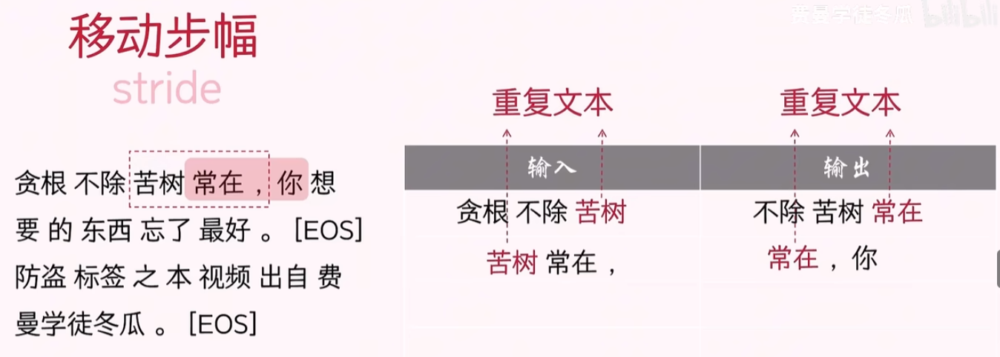
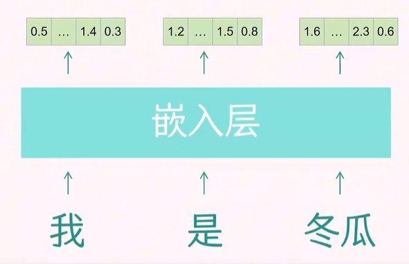
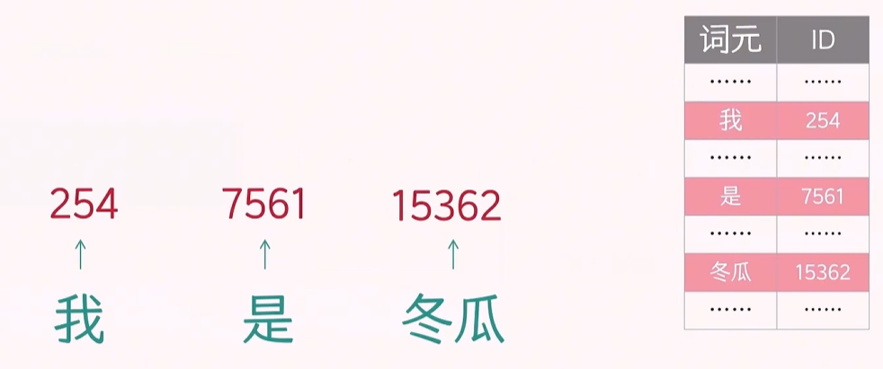
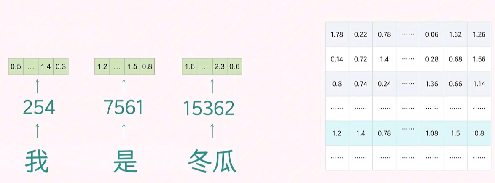
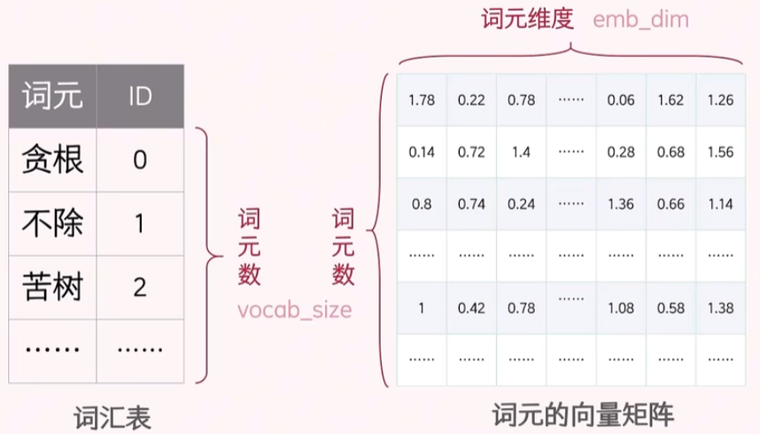
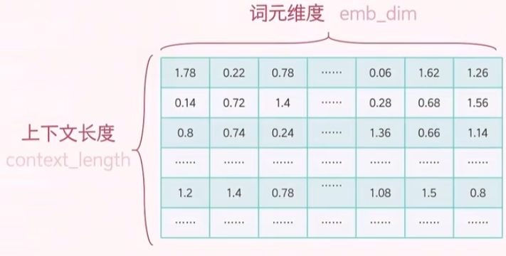
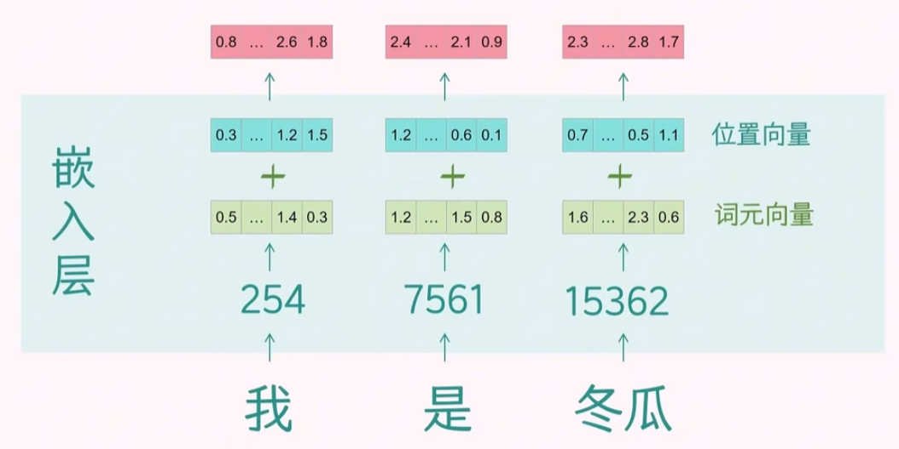

# 数据

# 训练数据

## token

提前准备的文本会通过 `Tokenizer` 分词器拆分一个个词元 `Token`

只要文本量足够的大，便能得到所有词元，然后为每个词元分配一个唯一的编号，便得到了「词表 `Vocabulary`」。词表的大小通常在几万到几十万之间。通过词表便能实现编号与词元间的相互查询
- 通过词元查询 `ID`
- 通过 `ID` 查询词元

## EOS

`EOS`（End of Sentence）是一个特殊的标记，用于指示文本的结束。它在自然语言处理任务中非常重要，尤其是在生成模型中。模型在生成文本时会持续输出词元，直到遇到 `EOS` 标记，这表示生成过程已经完成。

## 数据对

- 训练数据对： 一组训练数据由实际输入文本期望输出文本组成，**且输出文本与输出文本的 `Token` 长度一样**
- **上下文长度`context_length`**: 输入文本与输出文本的 `Token` 数量。
- **移动步幅`stride`**: 从文本中获取到一组训练数据对后，滑动窗口向后移动指定个数 `Token`后，获取下一组数据对。移动步幅通常小于上下文长度，这样可以确保每次获取的训练数据对之间有重叠部分，从而提高模型的学习效果。

    

- 批样本数`batchsize`: 一次模型训练放入多少个数据对

# 词嵌入

## 词元向量

上述得到的数据对虽然完成了`token`拆分，但仍然只是文本，因此，还需要通过「词嵌入」将其转换为向量表示，才能输入到模型中进行训练

词嵌入的工作流程为
1. 将连续文本段拆分为单个 `token`
2. 通过词表 `Vocabulary` 将每个 `token` 转换为唯一的 `ID`

    

3. 通过「嵌入矩阵 `Embedding Matrix`」将每个 `ID` 转换为对应的向量表示

    

其中词表与嵌入矩阵的维度关系为

## 位置向量

由于自然语言文本是有顺序的，因此需要为每个 `token` 添加位置信息。通过有两种计算方式
- 转换矩阵：用词元向量与转换矩阵进行乘法运算得到位置向量，这样转换矩阵便可当作模型参数训练得到

    

- **位置编码 `Positional Encoding`**：标准的数学公式，更为常用

    $$
    PE_{(pos, i)} =\left\{ \begin{array}{c}
    \sin \left(\frac{p o s}{10000^{2 i / d_{\text {model }}}}\right), i \% 2 = 0 \\
    \cos \left(\frac{p o s}{10000^{2 i / d_{\text {model }}}}\right), i \% 2 \ne 0
    \end{array} \right.
    $$

    其中，$pos$ 表示词元在序列中的位置，$i$ 表示词元向量的维度索引，$d_{\text{model}}$ 表示词元向量的维度。

综上，结合词元向量与词嵌入向量，便得到最终的词嵌入向量

