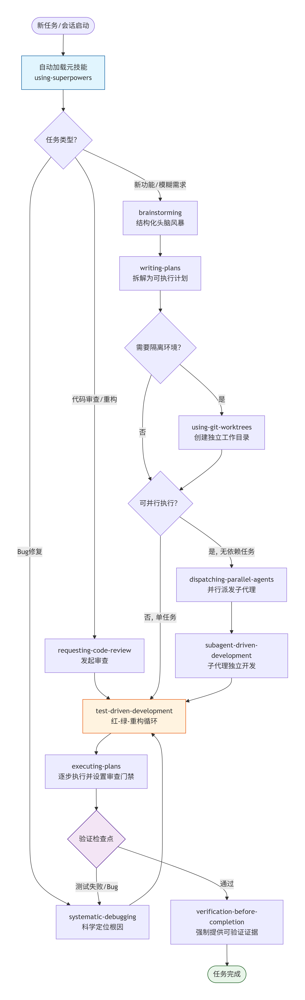

# AI 辅助编程工具

# 概念

一个单纯的 `Agent` 只是成为了一个能干活的工具，执行简单任务完全没问题，但是针对复杂的流程性任务，`Agent` 就极大可能偷工减料、胡说八道。对此，就需要通过「AI 辅助开发工具」来让 `Agent` 按照计划干活，**经典编程思维，问题难解决，就再套一层。** 

截至 `2026` 年，最流行的 AI 开发套件
- [superpowers](https://github.com/obra/superpowers): 适合重型复杂任务，让 `AI` 老老实实守规矩，但流程死板
- [OpenSpec](https://github.com/Fission-AI/OpenSpec): 工作流灵活，且文档管理更加规范


# superpowers

## 介绍

`superpowers` 属于测试驱动开发 `TDD` 开发流程，通过 `red-green-Refactor` 机制实现高质量代码
- `红`: 先写好测试用例，才允许开发
- `绿`: 用最简单的实现让测通过
- `重构`: 测试全绿，就开始优化代码

其文档有
- `spec`: 需求 + 概要设计
- `plan`: 详细设计 + 测试用例 + 执行流程

## skill


|阶段|技能名称 (Skill)|一句话核心作用|使用|
|-|-|-|-|
|启动|using-superpowers|元技能，技能系统的总开关和导航图。|不用管|
|规划|**brainstorming**| 理清需求和技术方案 | 需求唠嗑，构建 `spec` 文档 |
||**writing-plans**|将设计蓝图拆解为精确到文件的可执行、可验证任务清单。| 将 `spec` 需求文档，转换为 `plan` 设计文档|
|执行环境|using-git-worktrees|为不同任务创建隔离的Git工作目录，避免上下文干扰。| 可选 |
|开发与执行|**executing-plans**|按计划逐步执行任务，并设置审查门禁（质量检查点）。| 按照 `plan` 构建代码 |
||subagent-driven-development|将任务派发给独立的AI子代理，实现隔离和并行开发。| executing-plans 管理 |
||dispatching-parallel-agents|自动识别无依赖的任务，派发多个子代理同时开工，实现并行加速。| executing-plans 管理 |
||test-driven-development|强制遵循“红-绿-重构”循环（先写测试，再写代码）。| 自动 |
|调试|systematic-debugging|采用“假设-验证”的科学方法定位Bug根源，拒绝盲目试错。|修改bug，**不会更新文档**|
|代码审查|requesting-code-review|主动发起代码审查，甚至可派多个子代理并行审查，保证代码质量。| 代码优化、代码入库前检查 |
|验证与完成|verification-before-completion|根据 `plan/spec` 校验代码，**没在`plan/spec` 的代码改动，会被还原**|半自动|
|扩展|writing-skills|将成功经验固化为新的自定义Skill，实现方法论的持续积累。|总结技能|

## 使用流程



- **新建项目**
  1. `brainstorming`: 阐述需求，输出 `spec`
  2. `writing-plans`: 写设计，输出 `plan`
  3. 有修改还能继续直接让 ai 改文档
  4. `executing-plans`: 按设计执行
  5. `verification-before-completion`: 验证实现是否与文档一致，**可选，但可能自动进行**
  6. 转人工验收功能
  7. **功能有问题，不能让 AI 直接修改，应当按照「修改 `BUG`」流程处理**
- **迭代需求/设计缺陷**
  1. `brainstorming`: 阐述需求或异常情况，更新 `spec`
  2. `writing-plans`: 写设计，更新 `plan`
  3. 有修改还能继续直接让 ai 改文档
  4. `executing-plans`: 按设计执行
  5. `verification-before-completion`: 验证实现是否与文档一致，**可选，但可能自动进行**
  6. 转人工验收功能
  7. **功能有问题，走「修改 `BUG`」流程**
- **修改 `BUG`**
  - **非 `spec/plan` 错误导致**：使用 `systematic-debugging` 直接修改，**不会修改`spec/plan`**
  - **由 `spec/plan` 错误导致**: 走「设计缺陷」流程
  - **无法准确判断**：走「设计缺陷」流程
- **代码审核**
  1. `requesting-code-review` : 发起代码审核
  2. 人工确认审核报告
     - 要修改: 走 「迭代需求/设计缺陷」 流程
     - 不修改: 结束
- **修改代码同步文档**: **不建议这么干**，`superpowers` 是以文档为基准，因此，没有处理该流程的命令
  - **已经修改**：让 `AI` 同步文档
  - **准备编码**：走「修改 `BUG`」流程

>[!tip]
> - `superpower` 的执行流程是强约束，必须创建 `spec` 文档，然后创建 `plan` 文档，最后才能生成代码，且执行过程流程不能回退
> - 当 AI 重启、消息回滚、异常中断都会导致 `superpower` 流程失效，**对话恢复后，必须使用相应环节的命令重启流程**

## 特点

- **缺点**
  1. 可以看出，「设计缺陷」和「迭代需求」的流程是一样的，这就导致在功能实现后改设计，使用 `superpower` 会很痛苦。**但是大项目的功能细节巨多，也只有实现过程才能发现**
  2. 在 `superpower` 的流程中，没有 `spec/plan` 文档归档功能，这些文档会一致累加
- **优点**
  1. 代码生成质量高（**网友评价的**）


# openspec

## 介绍

`openspec` 属于规范驱动开发`SSD`，**把规范（Specification）作为唯一的事实来源**。其规范文档有
- `proposal.md`: 目标
- `specs/`: 需求
- `design.md`: 设计
- `tasks.md`: 实现计划

文档的目录管理结构设计和代码版本管理工具类似
- `specs`: 主版本，需求的固化结果
- `changes`: 开发分支，每个分支独立执行互不影响。开发完成后，可合并到主分支 `specs` 中

```
openspec/               # 项目目录
├── specs/              # 实现完成且归档的修改
│   └── <domain>/
│       └── spec.md
├── changes/            # 正在执行的修改，即各个修改分支
│   └── <change-name>/  
│       ├── proposal.md
│       ├── design.md
│       ├── tasks.md
│       └── specs/ 
│           └── <domain>/
│               └── spec.md
└── config.yaml         # 项目配置
```

`openspec` 拥有两套工作流程
- `core`: 只有核心步骤，快速上手

    ```txt
    /opsx:propose ──► /opsx:apply ──► /opsx:sync ──► /opsx:archive
    ```

- `custom`: 精细化控制更细化

    ```txt
    /opsx:new ──► /opsx:ff or /opsx:continue ──► /opsx:apply ──► /opsx:verify ──► /opsx:archive
    ```

命令行

```term
triangle@LEARN:~$ openspec config profile       # 配置工具
option
    Delivery        配置在 agent 的交互方式，可选择 skill 或 command
    Workflows       配置工作流模式，激活对应的命令
triangle@LEARN:~$ openspec init                 # 初始化项目
triangle@LEARN:~$ openspec update               # 更新应用配置
```

## slash

在 `openspec` 中有两套命令，功能都是等价的

- `/opsx:*` 都是 `command` 实现
- `/openspec-*` 都是 `skill` 实现

|阶段|工作流模式|Skill 名|作用 / 目的|
|-|-|-|-|
|挖掘需求|both|explore|在正式提案前，进行自由思考、调研和需求澄清，不修改任何文件。|
|创建计划|Core|propose| 创建变更文件夹，并生成提案、设计、任务清单等所有规划制品。|
||Custom|new|创建一个新的变更目录及其基础脚手架，供后续分步填充。|
||Custom|continue|分步生成`*.md`文档，实现精细控制。|
||Custom|ff|一次性生成当前`change`缺失的`*.md`|
|实施|both|apply|读取并严格遵循 `tasks.md` 中的任务清单，逐步实现功能代码。|
|验证|both|verify|对照规范文件，自动运行检查以验证代码实现是否符合预期。|
|生命周期|both|sync|将当前变更中的规范增量合并到主规范，但不进行归档，适合长期分支。|
|生命周期|both|archive|将已完成的变更归档，并将其规范增量合并回项目主规范。|
|生命周期|both|bulk-archive|一次性归档多个已完成的变更，并具备冲突检测能力。|
|学习|both|onboard|提供交互式引导教程，帮助新用户快速上手 OpenSpec 工作流。|


## 使用

- **新建项目/迭代需求**
  1. `/opsx:propose`: 创建 `change` 文件夹，并生成 `*.md` 文档
  2. `/opsx:explore`: 对需求
  3. `/opsx:apply`: 执行代码
  4. 转人工校验功能
    - 存在异常：走 「设计缺陷」流程
    - 功能正常：`/opsx:archive` 归档 `change` 
- **设计缺陷/修改`bug`**
  1. `/opsx:explore` : 说明异常情况，继续唠嗑
  2. `/opsx:apply`: 执行代码修改缺陷
  3. 转人工校验
    - 存在异常：继续「设计缺陷」流程
    - 功能正常：`/opsx:archive` 归档 `change` 
- **代码审核**:
  1. 使用 `/opsx:explore` 相关唠嗑工具，说明要审核的内容
  2. 人工确认审核报告
     - 要修改: 走 「新建项目/迭代需求」 流程
     - 不修改: 结束
- **修改代码同步**: **不建议这么干**
  - **已经修改**：让 `AI` 同步文档
  - **准备编码**：走「修改 `BUG`」流程
- **文档验证**： `/opsx:verify` 验证代码是否与文档一致
- **仅归档规范**：利用 `/opsx:sync` 可以提前将当前 `change` 的 `spec` 提交到系统 `specs` 中，方便其他同事开发新功能，且当前 `change` 仍然可以继续修改
- **批量归档**：在使用 `/opsx:explore` 过程中可能会出现大问题，需要单独创建一个 `change` 进行问题修复，即拉分支。此时便能使用 `/opsx:bulk-archive` 将多个完成的 `change` 归档

> [!tip]
> 当 AI 重启、消息回滚、异常中断都会导致 `openspec` 流程失效，**对话恢复后，必须使用相应环节的命令重启流程**