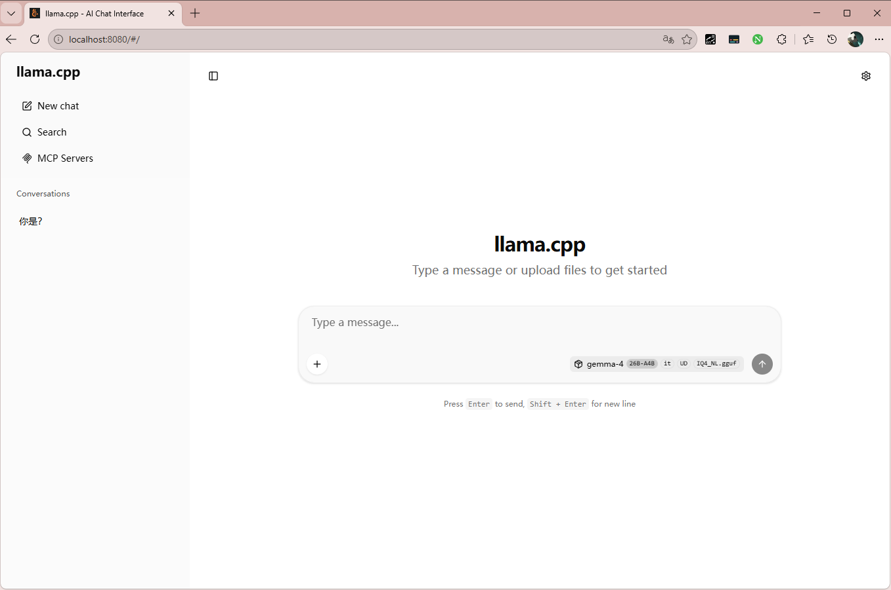

# llama.cpp

# 概念

## 参数

- **参数尺寸**

描述大模型的模型参数个数的单位为 $\text{B}$ ，$1 \text{B} = 1e^{9}$ , 例如 `qwen3.5-9B`，`qwen3.5-4B`。同系列模型，参数越多越聪明，但所需要的资源也更多

- **保存格式**

格式|核心特点|主要运行框架|典型适用场景
|-|-|-|-|
GGUF|单文件内嵌元数据，支持多种量化（Q4_K_M等），CPU优先，内存映射加载|llama.cpp、Ollama、LM Studio、llama-cpp-python|本地CPU推理、边缘设备、桌面应用
GPTQ|4-bit量化，需校准数据集，显存友好|AutoGPTQ、vLLM、ExLlamaV2、TGI、Hugging Face Transformers (auto-gptq)|单卡/多卡GPU服务端部署
AWQ|4-bit量化，保护重要权重，精度损失小|AutoAWQ、vLLM、TGI、Hugging Face Transformers (autoawq)|GPU推理，高质量低显存占用
EXL2|ExLlamaV2专用格式，支持混合精度（2~6 bit），性能极致|ExLlamaV2|高性能GPU推理，对速度要求极高
ONNX|开放神经网络交换格式，算子级优化，跨框架|ONNX Runtime (CPU/CUDA/TensorRT后端)|跨平台部署、硬件加速（Intel、NVIDIA）
TensorRT|NVIDIA专用格式，深度融合GPU优化，推理速度最快|TensorRT-LLM、NVIDIA Triton Inference Server|NVIDIA GPU生产环境，极致吞吐与低延迟
OpenVINO|Intel硬件专用格式，CPU/GPU/VPU深度优化|OpenVINO Runtime|Intel CPU/GPU边缘端与服务器部署
Core ML|Apple生态专用，iOS/macOS设备原生推理|Core ML Tools、mlx间接支持|iPhone、iPad、Mac应用内推理
MLX|Apple Silicon专用NumPy式数组框架，直接加载Safetensors|MLX、mlx-lm|Mac本地开发、推理与微调
Safetensors|安全张量存储（无pickle），单文件或多分片，Hugging Face默认格式|Hugging Face Transformers、vLLM、TGI、多数PyTorch推理库|模型训练、微调、开发调试、通用推理
PyTorch Bin|传统pickle格式，与Safetensors并存|PyTorch、Hugging Face Transformers|旧模型兼容、快速实验
Flax / JAX|Google生态，用于TPU训练与推理|Hugging Face Transformers (Flax)、JAX|TPU训练、Google Cloud部署
TFLite|TensorFlow Lite格式，轻量化移动端推理|TensorFlow Lite Interpreter|Android、iOS、嵌入式设备
ONNX Runtime Mobile|ONNX移动端版本，轻量高效|ONNX Runtime Mobile|移动设备跨平台推理
WebLLM / MLC格式|转换为WebGPU可运行的格式，浏览器内推理|WebLLM、MLC-LLM|Web端大模型应用，无需后端

> [!tip]
> - `vllm`: 团队部署最佳选择
> - `llama.cpp` : 个人用户最佳选择，支持纯 `CPU` 部署

## 量化

**量化**：缩减实际模型参数所占用的位宽，一般会缩减到 `4bit` 存储一个参数。例如 `GGUF` 格式对应的量化方式

量化类型|说明|模型大小（相对 FP16）|质量保留
|-|-|-|-|
Q4_0|4-bit 简单量化|~25%|较低
Q4_K_S|K-quant 4-bit 小模型|~25%|较好
Q4_K_M|K-quant 4-bit 中等质量|~25%|优秀
Q5_K_M|K-quant 5-bit 中等质量|~30%|接近 FP16
Q6_K|6-bit K-quant|~35%|几乎无损
Q8_0|8-bit 量化|~50%|极高
FP16|半精度（未量化）|100%|基准


# llama.cpp

## 介绍

[llama.cpp](https://github.com/ggml-org/llama.cpp/tree/master) : 是基于 `c++` 实现的大模型推理框架，性能好，**能在单机上部署轻量模型, 个人用户最佳选择**

- `llama-cli`: 能与`LLM`直接对话的交互式窗口
- `llama-bench`: 性能测试
- [llama-completion](https://github.com/ggml-org/llama.cpp/blob/master/tools/completion/README.md): 是 `llama-cli` 的加强版，能进行更复杂的对话设置
- [llama-server](https://github.com/ggml-org/llama.cpp/blob/master/tools/server/README.md): 启动 `LLM` 服务的工具，支持 `OpenAI`、`Anthropic` 等接口协议

**`llama.cpp` 只支持 `GGUF` 格式的模型**
- [modelscope](https://www.modelscope.cn/home)
- [Hugging face hub](https://huggingface.co/models)

## llama-cli

加载模型，直接对话即可

```term
triangle@LEARN:~$ ./llama-cli -m  Qwen3.5-4B.Q5_K_S.gguf


▄▄ ▄▄
██ ██
██ ██  ▀▀█▄ ███▄███▄  ▀▀█▄    ▄████ ████▄ ████▄
██ ██ ▄█▀██ ██ ██ ██ ▄█▀██    ██    ██ ██ ██ ██
██ ██ ▀█▄██ ██ ██ ██ ▀█▄██ ██ ▀████ ████▀ ████▀
                                    ██    ██
                                    ▀▀    ▀▀

build      : b8550-a308e584c
model      : Qwen3.5-4B.Q5_K_S.gguf
modalities : text

available commands:
  /exit or Ctrl+C     stop or exit
  /regen              regenerate the last response
  /clear              clear the chat history
  /read               add a text file


> 你好

[Start thinking]

The user has simply said "你好" (Hello) in Chinese. This is a basic greeting. I should respond in a friendly, conversational manner, acknowledging their greeting and offering my assistance. Since the user is communicating in Chinese, I'll respond in Chinese as well.

[End thinking]

你好！有什么我可以帮助你的吗？😊

[ Prompt: 121.1 t/s | Generation: 128.4 t/s ]

>
```

## llama-bench

```term
triangle@LEARN:~$ .\llama-bench.exe -m ..\DeepSeek-Coder-V2-Lite-Instruct-Q4_K_M.gguf  -fa 1
ggml_cuda_init: found 1 CUDA devices (Total VRAM: 16302 MiB):
  Device 0: NVIDIA GeForce RTX 5070 Ti, compute capability 12.0, VMM: yes, VRAM: 16302 MiB
load_backend: loaded CUDA backend from D:\Program\llm\llama13\ggml-cuda.dll
load_backend: loaded RPC backend from D:\Program\llm\llama13\ggml-rpc.dll
load_backend: loaded CPU backend from D:\Program\llm\llama13\ggml-cpu-haswell.dll
| model                          |       size |     params | backend    | ngl | fa |            test |                  t/s |
| ------------------------------ | ---------: | ---------: | ---------- | --: | -: | --------------: | -------------------: |
| deepseek2 16B Q4_K - Medium    |   9.65 GiB |    15.71 B | CUDA       |  99 |  1 |           pp512 |      2225.56 ± 34.84 |
| deepseek2 16B Q4_K - Medium    |   9.65 GiB |    15.71 B | CUDA       |  99 |  1 |           tg128 |         91.50 ± 0.49 |

build: 65097181e (8575)
triangle@LEARN:~$ .\llama-bench.exe --help
test parameters:
  -m, --model <filename>                      (default: models/7B/ggml-model-q4_0.gguf)
  -hf, -hfr, --hf-repo <user>/<model>[:quant] Hugging Face model repository; quant is optional, case-insensitive
                                              default to Q4_K_M, or falls back to the first file in the repo if Q4_K_M doesn't exist.
                                              example: ggml-org/GLM-4.7-Flash-GGUF:Q4_K_M
                                              (default: unused)
  -hff, --hf-file <file>                      Hugging Face model file. If specified, it will override the quant in --hf-repo
                                              (default: unused)
  -hft, --hf-token <token>                    Hugging Face access token
                                              (default: value from HF_TOKEN environment variable)
  -p, --n-prompt <n>                          (default: 512)
  -n, --n-gen <n>                             (default: 128)
  -pg <pp,tg>                                 (default: )
  -d, --n-depth <n>                           (default: 0)
  -b, --batch-size <n>                        (default: 2048)
  -ub, --ubatch-size <n>                      (default: 512)
  -ctk, --cache-type-k <t>                    (default: f16)
  -ctv, --cache-type-v <t>                    (default: f16)
  -t, --threads <n>                           (default: 8)
  -C, --cpu-mask <hex,hex>                    (default: 0x0)
  --cpu-strict <0|1>                          (default: 0)
  --poll <0...100>                            (default: 50)
  -ngl, --n-gpu-layers <n>                    (default: 99)
  -ncmoe, --n-cpu-moe <n>                     (default: 0)
  -sm, --split-mode <none|layer|row>          (default: layer)
  -mg, --main-gpu <i>                         (default: 0)
  -nkvo, --no-kv-offload <0|1>                (default: 0)
  -fa, --flash-attn <0|1>                     (default: 0)
  -dev, --device <dev0/dev1/...>              (default: auto)
  -mmp, --mmap <0|1>                          (default: 1)
  -dio, --direct-io <0|1>                     (default: 0)
  -embd, --embeddings <0|1>                   (default: 0)
  -ts, --tensor-split <ts0/ts1/..>            (default: 0)
  -ot --override-tensor <tensor name pattern>=<buffer type>;...
                                              (default: disabled)
  -nopo, --no-op-offload <0|1>                (default: 0)
  --no-host <0|1>                             (default: 0)
```

## llama-completion

- `-no-cnv, --no-conversation`: 无会话窗口，以命令行的形式执行一次

```term
triangle@LEARN:~$ .\llama-completion.exe -m ..\Qwen3.5-4B.Q5_K_S.gguf -no-cnv -p "who are you" 
```

- `--chat-template` : 让 `llama` 自动生成特殊的 `prompt` 文本

```term
triangle@LEARN:~$ ./llama-completion.exe  -m qwen2.5-7b.Q4_K_M.gguf --chat-template chatml
```

用户输入 `你好` 后，`llama` 便会将提示词转换为 `chatml` 格式的文本

```txt
<|im_start|>system
You are a helpful assistant.<|im_end|>
<|im_start|>user
你好<|im_end|>
<|im_start|>assistant
```


## llama-server

```term
triangle@LEARN:~$ ./llama-server -m  Qwen3.5-4B.Q5_K_S.gguf --host 0.0.0.0 --port 2223
```

其他 `agent` 工具调用 `http://localhost:2223` 即可访问模型，且 `llama` 会自动适配请求接口
- `OpenAI` 风格
- `Anthropic` 风格
- 其他

当启用 `--webui, --no-webui` 时，便能通过 `http://localhost:2223` 访问一个简易对话的 `web` 界面




## 通用参数


- 模型参数
  - `-c, --ctx-size N` : 设置模型推理的上下文长度，**需要根据机器、模型情况进行估算，设置太长会导致推理降速、卡死**
    - `-c` 值会影响总的 `KV Cache` 内存大小。内存有限时，需要降低该值
  - `--rope-scale N`: 如果模型支持 `RoPE` 扩展上下文，则实际上下文长度是 `ctx-size * rope-scale`
- 参数分配
  - `-ngl, --gpu-layers, --n-gpu-layers N`: CPU 与 GPU 混合使用，在显存中只加载部分模型，剩下的放到内存
  - `-fit [on|off]`: 自动调节参数适应显存
  - `-fitt, --fit-target N`: 设置显存保留余量，单位 `MB`
  - `-sm, --split-mode {none,layer,row}`: 控制多 GPU 推理模式
  - `-cmoe, --cpu-moe`: 将专家权重 `MoE(Mixture of Experts)` 全部放到内存中
  - `-ncmoe, --n-cpu-moe N`: 将部分 `MoE(Mixture of Experts)` 全部放到内存中
  - `-ot, --override-tensor <tensor name pattern>=<buffer type>,..`: 使用表达式更加精细化控制

    ```term
    triangle@LEARN:~$ // 所有专家层（exps）放到CPU，其余（默认）放GPU
    triangle@LEARN:~$ ./llama-cli -m model.gguf -ngl 999 -ot "exps=CPU"
    triangle@LEARN:~$ 
    triangle@LEARN:~$ // 将第0-9层的所有内容放GPU0，其余专家放CPU
    triangle@LEARN:~$ ./llama-cli -m model.gguf -ot "blk\.([0-9])\.=CUDA0,exps=CPU" 
    ```

- 推理流程
  - `-b, --batch-size N`: 指定模型在逻辑上一次处理的最大 token 数量。这里的“逻辑”指的是模型内部计算的批次大小，它会影响前向传播时的并行度。
    - 内存紧张时，可降低该值
    - **该值会被用作 KV 缓存分配的上限之一，如果设置过小，可能会导致 KV 缓存碎片化或效率降低**
  - `-ub, --ubatch-size N`: 底层一次送入模型的实际 token 数。**内存紧张的情况，可以降低该值，但推理速度会降低**
    - `GPU` 模式: 采用默认设置即可
    - `CPU` 模式: 内存紧张时，可适当降低到 `256`、`128`

  - `-ctk, --cache-type-k TYPE`: 设置 `K` 矩阵参数存储位宽
    - **内存紧张，但想要扩充上下文时修改**
    - 建议选项 `q8_0`
  - `-ctv, --cache-type-v TYPE`: 设置 `V` 矩阵参数存储位宽
    - **内存紧张，但想要扩充上下文时修改**
    - 建议选项 `q8_0`
  - `-kvu, --kv-unified`: 使用统一 `KV` 缓冲区，内存利用更加高效
  - `-fa, --flash-attn [on|off|auto]`: 一种高效的自注意力实现，通过将注意力计算分块进行，显著减少 GPU 显存访问次数，从而提升推理速度。**某些模型，需要配合 `-ctk`、`-ctv` 一起使用**
  - `-n, --predict, --n-predict N` : 模型推理生成的 token 数
    - `-1`: 无限生成，遇到 `STOP` 标记时停止，**默认**
    - `-2`: 直到上下文总是达到 `--ctx-size` 时停止，遇到 `STOP` 标记不停止，**主要用于测试**
    - `N` : 最大生成上限，当遇到遇到 `STOP` 标记会提前停止，**最好设置一个上限，防止死循环**
- 推理思考
  - `-rea, --reasoning [on|off|auto]`: 是否启动思考模式
  - `--reasoning-format FORMAT`: 模型思考内容的输出格式
    - `none`: 思考内容有普通输出一样，都放在 `message.content` 中返回
    - `deepseek`: 思考内容放在 `message.reasoning_content`
    - `deepseek-legacy`: 思考内容会通过 `<think></think>`  包裹放在 `message.content` 中，同时也会放到 `message.reasoning_content`
  - `--reasoning-budget N`: 限定模型用于思考的最大`Token`数量，防止其“过度思考”。**会加快推理速度，但只能可能下降**
    - `-1`: 无限制
    - `0`: 禁用
  - `--reasoning-budget-message MESSAGE`: 在抵达 `--reasoning-budget` 长度限制后，模型就会被迫中断推理。这样的中断操作太过暴力，`--reasoning-budget-message` 的作用便是在中断前给 `LLM` 传递一段 `MESSAGE` 提示词，让中断更自然一些，例如 `请立刻给出最终答案。`

- 并发推理
  - `-t, --threads N`: 控制生成阶段（逐 `token` 生成）使用的线程数量。**不是越大越好，结合 `GPU` 推理，太大反而降低速度**
  - `-tb, --threads-batch N`: 控制批处理阶段(输入的 `prompt` 转换为 `token`)使用的线程数量
  - `--prio-batch N`: 控制批处理阶段线程的调度优先级。**影响的是操作系统`CPU`时间片调度，让响应更快点**
  - `--cache-prompt, --no-cache-prompt`: 缓存 `prompt` 转换 `token` 的计算结果，避免重复计算。**但是可能造成内存浪费**
  - `-np, --parallel N`: 服务能同时处理的最大会话数，**该值虽然增加了请求并发数，但是也会导致每个会话可用的上下文减少**
    - `slot`: 服务中用于隔离请求会话推理的模块，格式由 `-np` 控制
    - 上下文：每个 `slot` 可用的上下文数量为 `-c / -np`, 即将总上下文数均分给各个 `slot` 使用，**并不是每个 `slot` 都具有 `-c` 大小的上下文**
  - `--threads-http N`: 处理 `http` 服务请求的线程数
  - `-cb, --cont-batching, -nocb, --no-cont-batching` : 启用后，服务器才能真正并行地处理多个槽位中的任务

- **重复循环惩罚**
  - `--repeat-penalty N`: 重复惩罚强度。**降低在一次迭代中，同一 `token` 被重复作为生成结果的概率**

    $$
      \text{logit\_new} = \text{logit\_old} / \text{repeat\_penalty}
    $$

    - `=1.0`: 无惩罚
    - `>1.0`: 降低 `token` 再次被选中的概率，建议值 `1.05 ~ 1.2`
    - `<1.0`: 鼓励重复，一般不用

  - `--repeat-last-n N`: 抑制暂时重复。取最近 `N` 个 `token` 进行重复统计，并对这些重复 token 施加惩罚。
    - `0`: 无惩罚
    - `-1`: 对所有 `token` 进行检测，最严格
    - `N`: 建议值 `64`、`128`、`256`、`512`
  - `--presence-penalty N`: 固定惩罚。阻止主题重复，鼓励引入新词
    - 建议值 `0.1~0.3`

    $$ 
        logit_new = logit_old - (presence_penalty * (token_count > 0 ? 1 : 0))
    $$

  - `--frequency-penalty N` : 抑制长期重复（如重复的大段文字）

    $$ \text{logit\_new} = \text{logit\_old} - frequency-penalty * token_count $$

    - `=0.0`: 无惩罚
    - `>0.0`: 惩罚，建议范围 `0.0 ~ 2.0`
    - `<0.0`: 鼓励重复
- 操作系统
  - `--mlock`: 降低系统内存切换，可加快推理速度
  - `--no-mmap`: 关闭内存映射，**设置该选项时，建议也同时启用 `--mlock`**
