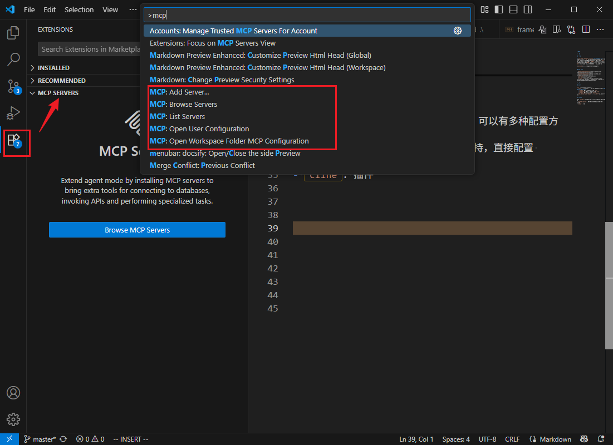
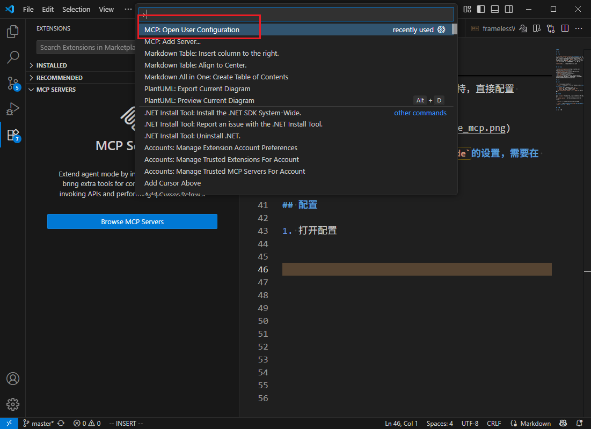
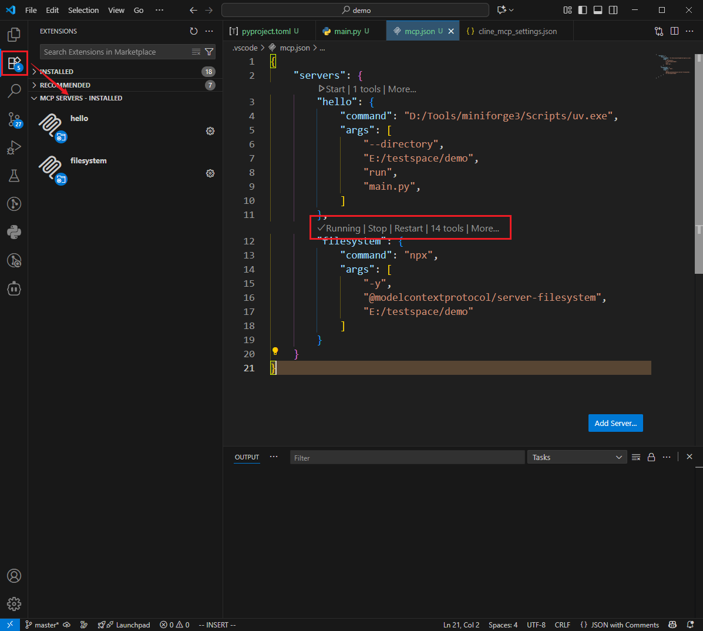
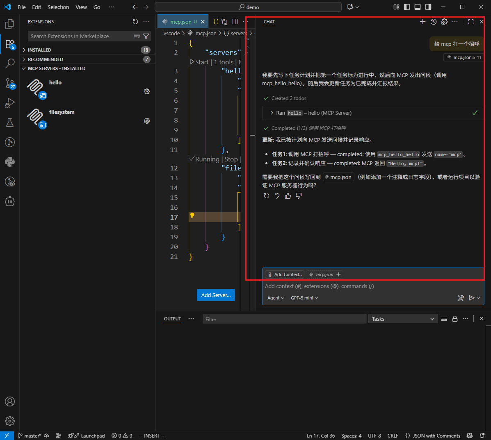
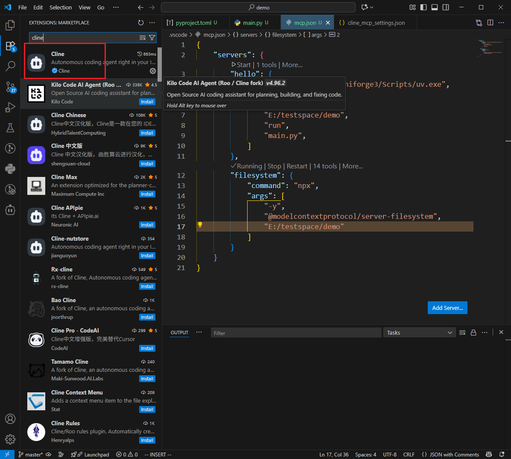
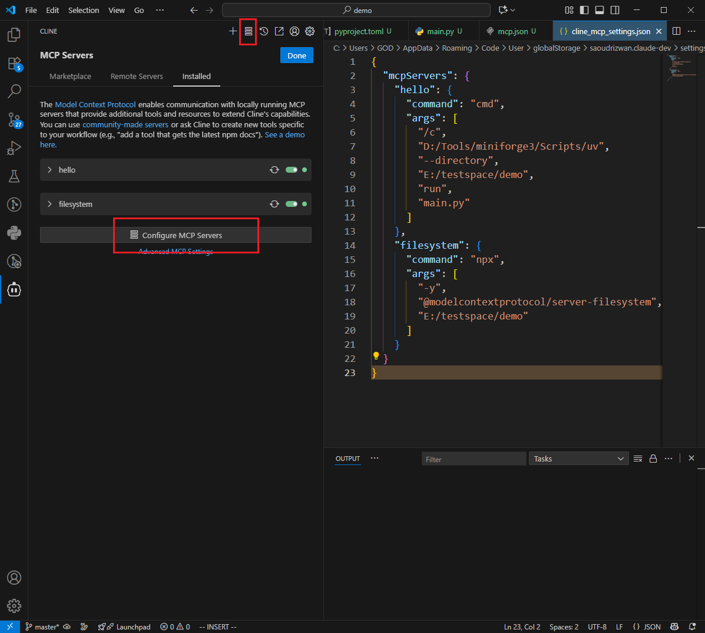
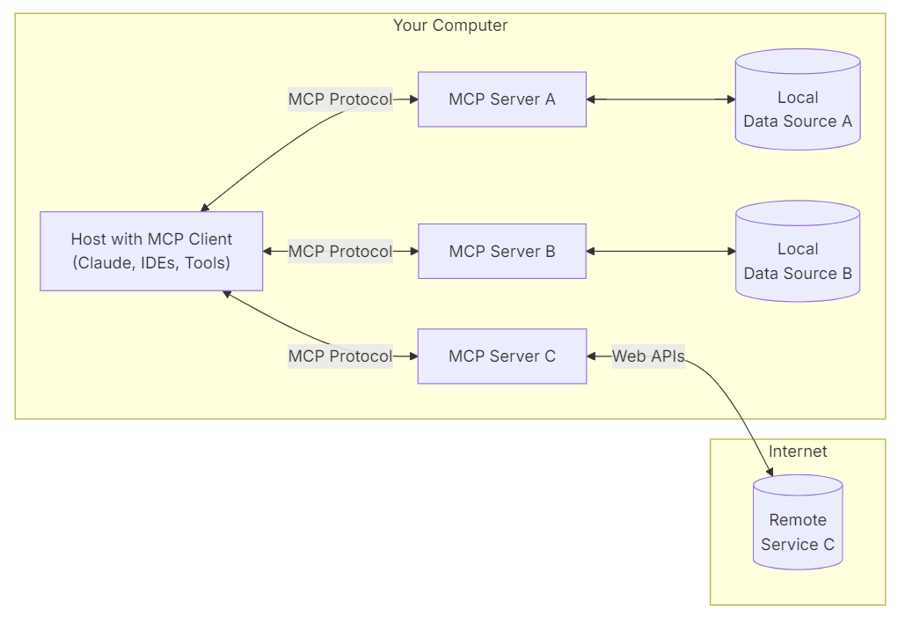
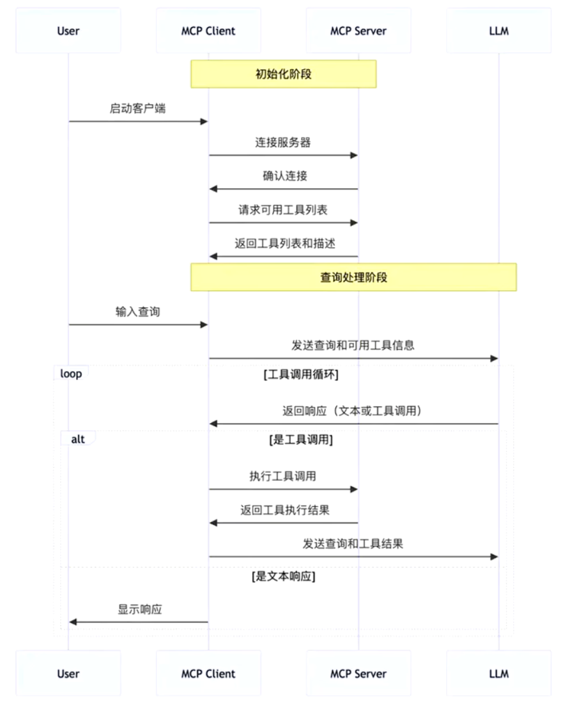

# MCP

# 简介

## 概念

**`MCP,Model Context Protocol`模型上下文协议**: 定义了应用程序和 `AI` 模型之间的消息通信。这使得开发者能够以一致的方式将各种数据源、工具和功能连接到 `AI` 模型（一个中间协议层），就像 `USB-C` 让不同设备能够通过相同的接口连接一样。`MCP` 的目标是创建一个通用标准，使 `AI` 应用程序的开发和集成变得更加简单和统一。


## MCP 仓库

- [modelcontextprotocol](https://github.com/modelcontextprotocol/servers)
- [awesome-mcp-servers](https://github.com/punkpeye/awesome-mcp-servers)
- [smithery](https://smithery.ai/)
- [mcp.so](https://mcp.so/)
- [阿里云百炼](https://bailian.console.aliyun.com/?spm=5176.29619931.J__Z58Z6CX7MY__Ll8p1ZOR.1.34f7521cSqUARw&tab=mcp#/mcp-market)


## 类型

`MCP` 根据通信模式有两种类型
- `stdio` 标准输入输出 : 服务与客户端均在本地，**但需要自己部署环境**
  - `python` 服务: 需要提前安装 `uv`，会用到配套的 `uvx` 工具
  - `Typescript` 服务: 需要提前安装 `nodejs`，会用到配套的 `npx` 工具
  - `docker` 服务：提前安装 `docker`
- `SSE, Server-sent Events` : 基于`HTTP`协议的远程服务

# vscode 使用


## 类型

针对 `vscode` 根据大模型的使用方式，可以有多种配置方案
- `github copilot`: 亲儿子，天然支持，直接配置 vscode

  

- `cline`: 插件，**不支持读取`vscode`的设置，需要在 `cline` 中单独添加 `MCP`**


## copilot

1. 打开`map.json`配置
   - 全局配置

    

   - 本地配置: `.vscode/mcp.json`

2. 从`MCP`仓库找到找到配置，**有些`server`可能有问题，多换几个**

    ```json
    {
        "mcpServers": {
            "filesystem": {
                "command": "npx",
                "args": [
                    "-y",
                    "@modelcontextprotocol/server-filesystem",
                    "<target_path>"
                ]
            }
        },
        "everything": {
            "command": "npx",
            "args": ["-y", "@modelcontextprotocol/server-everything"]
        }
    }
    ```

    

3. 配置成功后，大模型便能自动调用对应的 `MCP` 工具

  

> [!tip]
> 使用 `vscode` 的 `MCP` 配置可对 `MCP Server` 进行检查，`cline` 的报错没 `vscode` 详细

## cline

1. 安装 `cline` 插件

  

2. 登录 `cline` 或者配置第三方的 `LLM` 使用

3. 配置 `MCP` 或者从市场安装配置

  

# 工作原理

## 结构



`MCP` 由三个核心组件构成：`Host`、`Client` 和 `Server`。
- `Host` : 实现 `LLM` 与 `MCP client` 交互的智能体`agent`，例如 `coplit`、`cline`
- `Client`:  接收 `LLM` 的请求，并将请求转发给 `MCP Server` ，最后将 `Server` 的处理结果返回给 `LLM`
- `Server`: 遵循 `MCP` 协议实现的业务服务，处理 `Client` 请求
  - `stdio`: 本地服务实现，通过 `uvx` 或 `npx` 运行
  - `SSE`: 远程服务实现，通过 `HTTP` 接口访问

> [!tip]
> `Host` 与 `Server` 可根据业务进行自定义开发，`Client` 则由`MCP`框架内部封装

## API 流程



`MCP` 的 `API` 协议主要有两个，**但开发`MCP Server` 并不需要协议细节，框架内部会自行实现**
- `tools/list`: 列出 `server` 支持的能力
- `tools/call`: 调用具体能力


```python
#!/usr/bin/env python3
# -*- coding: utf-8 -*-
"""
基于 python 的 MCP 客户端实现
修复了 anyio 内存流阻塞问题，使用直接 JSON-RPC 通信
"""

import asyncio
import subprocess
import json
from typing import Any, Dict, Optional, List


class MCPClient:
    """
    MCP 客户端，封装 MCP 协议的基础功能。
    支持连接到 MCP 服务器并调用工具、访问资源。
    修复了 anyio 内存流阻塞问题。
    """
    
    def __init__(self, server_command: str, server_args: Optional[List[str]] = None):
        """
        初始化客户端，连接 MCP 服务器。
        
        :param server_command: MCP 服务器启动命令
        :param server_args: MCP 服务器启动参数
        """
        self.server_command = server_command
        self.server_args = server_args if server_args is not None else []
        self.process: Optional[subprocess.Popen] = None
        self.request_id = 1
        

    
    async def _send_request(self, method: str, params: Dict[str, Any]) -> Optional[Dict[str, Any]]:
        """发送 JSON-RPC 请求"""
        if not self.process:
            raise RuntimeError("客户端未连接")
        
        try:
            request = {
                "jsonrpc": "2.0",
                "id": self.request_id,
                "method": method,
                "params": params
            }
            
            self.request_id += 1
            
            # 发送请求
            request_str = json.dumps(request) + "\n"
            if self.process.stdin:
                self.process.stdin.write(request_str)
                self.process.stdin.flush()
            
            # 读取响应
            if self.process.stdout:
                response_line = self.process.stdout.readline()
                if response_line:
                    return json.loads(response_line)
            
            return None
            
        except Exception as e:
            print(f"[MCPClient] 请求失败: {method}, 错误: {e}")
            return None

    async def connect(self):
        """连接到 MCP 服务器 - 修复阻塞问题"""
        try:
            print(f"启动 MCP 服务器: {self.server_command} {' '.join(self.server_args)}")
            
            # 直接启动子进程，使用文本模式
            self.process = subprocess.Popen(
                [self.server_command] + self.server_args,
                stdin=subprocess.PIPE,
                stdout=subprocess.PIPE,
                stderr=subprocess.PIPE,
                bufsize=0,
                text=True,
                encoding='utf-8'
            )
            
            # 发送初始化请求
            init_request = {
                "jsonrpc": "2.0",
                "id": self.request_id,
                "method": "initialize",
                "params": {
                    "protocolVersion": "2024-11-05",
                    "capabilities": {},
                    "clientInfo": {
                        "name": "MCPClient",
                        "version": "1.0.0"
                    }
                }
            }
            
            self.request_id += 1
            
            # 发送初始化请求
            request_str = json.dumps(init_request) + "\n"
            if self.process.stdin:
                self.process.stdin.write(request_str)
                self.process.stdin.flush()
            
            # 读取初始化响应
            if self.process.stdout:
                response_line = self.process.stdout.readline()
                if response_line:
                    response = json.loads(response_line)
                    if response.get("result"):
                        print(f"[MCPClient] 成功连接到 MCP 服务器: {self.server_command}")
                        return True
            
            return False
                
        except Exception as e:
            print(f"[MCPClient] 连接失败: {e}")
            if self.process:
                self.process.terminate()
            return False

    async def list_tools(self) -> List[Dict[str, Any]]:
        """列出可用的工具"""
        response = await self._send_request("tools/list", {})
        if response and "result" in response:
            return response["result"].get("tools", [])
        return []
    
    async def list_resources(self) -> List[Dict[str, Any]]:
        """列出可用的资源"""
        response = await self._send_request("resources/list", {})
        if response and "result" in response:
            return response["result"].get("resources", [])
        return []
    
    async def call_tool(self, tool_name: str, arguments: Dict[str, Any]) -> Optional[Dict[str, Any]]:
        """
        调用 MCP 工具。
        
        :param tool_name: 工具名称
        :param arguments: 工具参数
        :return: 工具返回结果
        """
        response = await self._send_request("tools/call", {
            "name": tool_name,
            "arguments": arguments
        })
        
        if response and "result" in response:
            return response["result"]
        return None
    
    async def read_resource(self, resource_uri: str) -> Optional[Dict[str, Any]]:
        """
        读取 MCP 资源。
        
        :param resource_uri: 资源 URI
        :return: 资源内容
        """
        response = await self._send_request("resources/read", {
            "uri": resource_uri
        })
        
        if response and "result" in response:
            return response["result"]
        return None
    
    async def close(self):
        """关闭连接"""
        if self.process:
            try:
                # 发送退出通知
                exit_request = {
                    "jsonrpc": "2.0",
                    "id": self.request_id,
                    "method": "notifications/exit",
                    "params": {}
                }
                
                request_str = json.dumps(exit_request) + "\n"
                if self.process.stdin:
                    self.process.stdin.write(request_str)
                    self.process.stdin.flush()
                
                # 等待进程退出
                self.process.wait(timeout=5)
            except:
                try:
                    self.process.terminate()
                    self.process.wait(timeout=2)
                except:
                    try:
                        self.process.kill()
                    except:
                        pass
            self.process = None
            
        print("[MCPClient] 连接已关闭")


async def main():
    """示例用法"""
    # 示例：连接到本地文件系统 MCP 服务器
    # 使用完整的 npx 路径
    server_command = "D:\\Program Files\\nodejs\\npx.cmd"
    server_args = ["-y", "@modelcontextprotocol/server-filesystem", "E:/testspace/demo"]
    
    client = MCPClient(server_command, server_args)
    
    try:
        # 连接服务器
        print("正在连接 MCP 服务器...")
        if await client.connect():
            print("连接成功！")
            
            # 列出可用工具
            print("获取工具列表...")
            tools = await client.list_tools()
            print(f"可用工具: {len(tools)} 个")
            for tool in tools:
                print(f"  - {tool.get('name', 'Unknown')}: {tool.get('description', 'No description')}")
            
            # 列出可用资源
            print("获取资源列表...")
            resources = await client.list_resources()
            print(f"可用资源: {len(resources)} 个")
            for resource in resources:
                print(f"  - {resource.get('uri', 'Unknown')}: {resource.get('name', 'No name')}")
            
            # 示例：调用工具（如果有可用的工具）
            if tools:
                # 使用第一个工具作为示例
                tool_name = tools[0].get('name', '')
                print(f"\n尝试调用工具: {tool_name}")
                
                # 根据工具描述尝试传递合适的参数
                arguments = {}
                if "read" in tool_name.lower() or "file" in tool_name.lower():
                    arguments = {"path": "README.md"}
                elif "list" in tool_name.lower() or "dir" in tool_name.lower():
                    arguments = {"path": "."}
                    
                result = await client.call_tool(tool_name, arguments)
                print(f"工具调用结果: {result}")
            else:
                print("没有可用的工具")
            
            # 关闭连接
            await client.close()
        else:
            print("连接失败")
            
    except Exception as e:
        print(f"客户端运行出错: {e}")
        # 确保连接被关闭
        try:
            await client.close()
        except:
            pass


if __name__ == "__main__":
    # 运行异步主函数
    asyncio.run(main())
```


# python 开发

## 环境

```term
triangle@LEARN:~$ pip install uv // 包管理器, 类似 npm
triangle@LEARN:~$ uv init demo // 初始化项目
triangle@LEARN:~$ uv venv // 创建本地虚拟环境
triangle@LEARN:~$ uv add mcp //  mcp 框架
```

## server

### stdio

- `server.py`

```python
from mcp.server.fastmcp import FastMCP

mcp = FastMCP("mcp_demo")

@mcp.tool()
async def hello(name: str) -> str:
  """ mcp 需要提供的能力 """
    return f"Hello, {name}!"

if __name__ == "__main__":
    mcp.run(transport="stdio")
```

- `mcp.json` 配置

```json
{
    "servers":{
      "hello": {
        "command": "D:/Tools/miniforge3/Scripts/uv.exe",    // uv 绝对路径
        "args": [
            "--directory",
            "E:/testspace/demo",                            // server.py 的工作目录
            "run",
            "server.py",                                    // mcp server 脚本
        ]
      },
    }
}
```

> [!note]
> 源码项目部署，**`command` 一定要写 `uv.exe` 的绝对路径**，否则无法启动 `MCP Server`

### sse

- `server.py`

```python
from mcp.server.fastmcp import FastMCP

mcp = FastMCP("mcp_demo",host="127.0.0.1", port=2333)

@mcp.tool()
async def hello(name: str) -> str:
    return f"Hello, {name}!"

if __name__ == "__main__":
    mcp.run(transport="sse")
```

```term
triangle@LEARN:~$ uv run server.py // 启动 http 服务
INFO:     Started server process [12544]
INFO:     Waiting for application startup.
INFO:     Application startup complete.
INFO:     Uvicorn running on http://127.0.0.1:2333 (Press CTRL+C to quit)
  ...
```

- `mcp.json` 配置

```json
{
    "servers":{
      "hello": {
        "transport": "sse",
        "url": "http://127.0.0.1:2333/sse"    // 默认 mcp 访问路径为 '/sse'
      }
    }
}
```


## agent

```term
triangle@LEARN:~$ pip install openai-agents
```

```python
import asyncio
from agents.mcp import MCPServer
from agents.mcp.server import MCPServerStdio,MCPServerStdioParams
from agents import Agent, Runner, AsyncOpenAI, OpenAIChatCompletionsModel


async def run(mcp_server: MCPServer):
    external_client = AsyncOpenAI(
        api_key="",
        base_url="",
    )
    agent = Agent(
        name="Assistant",
        instructions="",
        mcp_servers=[mcp_server],
        model=OpenAIChatCompletionsModel(
            model="Qwen3-Coder-Flash",
            openai_client=external_client,
        )
    )

    prompt = "给 mcp_hello 打个招呼"
    print("input:",prompt)

    result = await Runner.run(starting_agent=agent, input=prompt)
    print("output:",result.final_output)

async def main():
    async with MCPServerStdio(
            name="mcp_hello",
            params=MCPServerStdioParams(
                command="D:/Program/miniforge3/Scripts/uv.exe",
                args=[
                    "--directory",
                    "E:/document/mcp/demo",
                    "run",
                    "server.py"
                ]
            )

    ) as server:
        await run(server)

if __name__ == "__main__":
    asyncio.run(main())
```

## client

### 坑

不能直接使用 `stdio_client` 获取客户端，得使用 `contextlib.AsyncExitStack` 进行包装，否则无法连接 `MCP Server`，

```python
  async with contextlib.AsyncExitStack() as stack:
    server_params = StdioServerParameters(
        command=command,
        args=args,
        env=env,
        cwd=cwd,
    )
    transport = await stack.enter_async_context(stdio_client(server_params))
    read_stream, write_stream = transport
```

**因此，客户端建议使用 `fastmcp` 库，而不是 `mcp`**

```term
triangle@LEARN:~$ uv add fastmcp
```

### 实现

```python
#!/usr/bin/env python3
# -*- coding: utf-8 -*-
"""
基于 fastmcp 库的 MCP 客户端实现
使用 fastmcp 的 Client 类实现 MCP 客户端
"""

import asyncio
from typing import Any, Dict, Optional, List
from fastmcp.client import Client, NpxStdioTransport


class MCPClient:
    """
    MCP 客户端，基于 fastmcp 库实现。
    使用 Client 类连接到 MCP 服务器。
    """
    
    def __init__(self, package: str, args: Optional[List[str]] = None):
        """
        初始化客户端，连接 MCP 服务器。
        
        :param package: npm 包名
        :param args: 包参数
        """
        self.package = package
        self.args = args if args is not None else []
        self.mcp_client: Optional[Client] = None
        
    async def connect(self):
        """连接到 MCP 服务器"""
        try:
            print(f"启动 MCP 服务器: {self.package} {' '.join(self.args)}")
            
            # 使用 NpxStdioTransport 连接到 npx 服务器
            transport = NpxStdioTransport(
                package=self.package,
                args=self.args
            )
            
            # 创建 Client 实例并使用异步上下文管理器
            self.mcp_client = Client(transport=transport)
            self._client_context = self.mcp_client.__aenter__()
            await self._client_context
            
            print(f"[MCPClient] 成功连接到 MCP 服务器: {self.package}")
            return True
                
        except Exception as e:
            print(f"[MCPClient] 连接失败: {e}")
            return False
    
    async def list_tools(self) -> List[Any]:
        """列出可用的工具"""
        if not self.mcp_client:
            raise RuntimeError("客户端未连接，请先调用 connect() 方法")
        
        try:
            # 使用 fastmcp 的工具列表功能
            tools = await self.mcp_client.list_tools()
            return tools
        except Exception as e:
            print(f"[MCPClient] 获取工具列表失败: {e}")
            return []
    
    async def list_resources(self) -> List[Any]:
        """列出可用的资源"""
        if not self.mcp_client:
            raise RuntimeError("客户端未连接，请先调用 connect() 方法")
        
        try:
            # 使用 fastmcp 的资源列表功能
            resources = await self.mcp_client.list_resources()
            return resources
        except Exception as e:
            print(f"[MCPClient] 获取资源列表失败: {e}")
            return []
    
    async def call_tool(self, tool_name: str, arguments: Dict[str, Any]) -> Optional[Any]:
        """
        调用 MCP 工具。
        
        :param tool_name: 工具名称
        :param arguments: 工具参数
        :return: 工具返回结果
        """
        if not self.mcp_client:
            raise RuntimeError("客户端未连接，请先调用 connect() 方法")
        
        try:
            # 使用 fastmcp 的工具调用功能
            result = await self.mcp_client.call_tool(tool_name, arguments)
            return result
        except Exception as e:
            print(f"[MCPClient] 工具调用失败: {tool_name}, 错误: {e}")
            return None
    
    async def read_resource(self, resource_uri: str) -> Optional[Any]:
        """
        读取 MCP 资源。
        
        :param resource_uri: 资源 URI
        :return: 资源内容
        """
        if not self.mcp_client:
            raise RuntimeError("客户端未连接，请先调用 connect() 方法")
        
        try:
            # 使用 fastmcp 的资源读取功能
            result = await self.mcp_client.read_resource(resource_uri)
            return result
        except Exception as e:
            print(f"[MCPClient] 资源读取失败: {resource_uri}, 错误: {e}")
            return None
    
    async def close(self):
        """关闭连接"""
        if self.mcp_client and hasattr(self, '_client_context'):
            try:
                # 关闭 fastmcp 客户端上下文
                await self.mcp_client.__aexit__(None, None, None)
            except Exception as e:
                print(f"[MCPClient] 关闭连接时出错: {e}")
            self.mcp_client = None
            
        print("[MCPClient] 连接已关闭")


async def main():
    """示例用法"""
    # 示例：连接到本地文件系统 MCP 服务器
    # 直接使用包名，NpxStdioTransport 会自动处理 npx
    package = "@modelcontextprotocol/server-filesystem"
    args = ["E:/testspace/demo"]
    
    client = MCPClient(package, args)
    
    try:
        # 连接服务器
        print("正在连接 MCP 服务器...")
        if await client.connect():
            print("连接成功！")
            
            # 列出可用工具
            print("获取工具列表...")
            tools = await client.list_tools()
            print(f"可用工具: {len(tools)} 个")
            for tool in tools:
                # 使用属性访问而不是 get 方法
                tool_name = getattr(tool, 'name', 'Unknown')
                tool_description = getattr(tool, 'description', 'No description')
                print(f"  - {tool_name}: {tool_description}")
            
            # 列出可用资源
            print("获取资源列表...")
            resources = await client.list_resources()
            print(f"可用资源: {len(resources)} 个")
            for resource in resources:
                # 使用属性访问而不是 get 方法
                resource_uri = getattr(resource, 'uri', 'Unknown')
                resource_name = getattr(resource, 'name', 'No name')
                print(f"  - {resource_uri}: {resource_name}")
            
            # 示例：调用工具（如果有可用的工具）
            if tools:
                # 使用第一个工具作为示例
                tool_name = getattr(tools[0], 'name', '')
                print(f"\n尝试调用工具: {tool_name}")
                
                # 根据工具描述尝试传递合适的参数
                arguments = {}
                if "read" in tool_name.lower() or "file" in tool_name.lower():
                    arguments = {"path": "README.md"}
                elif "list" in tool_name.lower() or "dir" in tool_name.lower():
                    arguments = {"path": "."}
                    
                result = await client.call_tool(tool_name, arguments)
                print(f"工具调用结果: {result}")
            else:
                print("没有可用的工具")
            
            # 关闭连接
            await client.close()
        else:
            print("连接失败")
            
    except Exception as e:
        print(f"客户端运行出错: {e}")
        # 确保连接被关闭
        try:
            await client.close()
        except:
            pass


if __name__ == "__main__":
    # 运行异步主函数
    asyncio.run(main())
```
