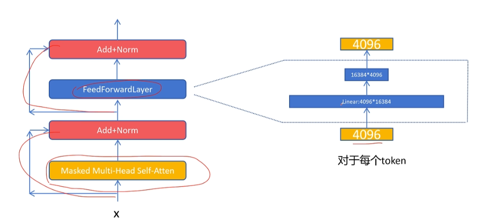
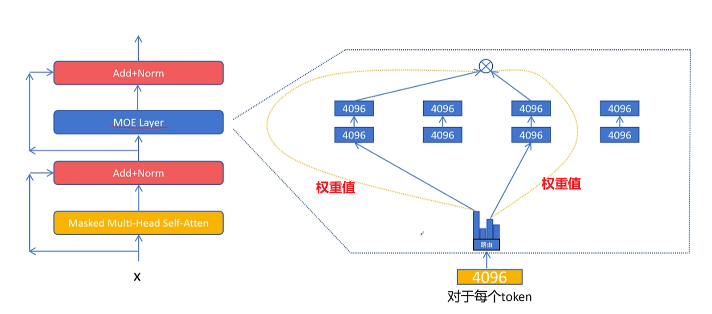
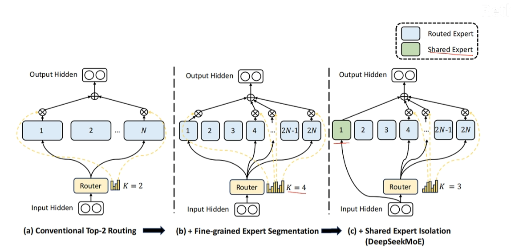

# 混合专家模型

# 模型结构

- **密集模型 `Dense Model`**: 最传统、最标准的神经网络结构，**即标准的`FFN`网络结构**
  - 一次推理， `FFN` 层的参数全部参与计算

    

- **混合专家模型 `MoE(Mixture of Experts)`**: 密集模型`FFN`层的改进版本，能在降低计算量同时，维持与密集模型同样的质量
  - 一次推理，只有部分参数参与计算
  - `gemma-26B-A3B` 中的 `A3B` 就是指，在一次推理中， `MoE` 模型只有 `3B` 参数参与计算

    

- **`MoE` 推理流程**
  - `MoE` 由多个小尺寸的 `FFN` (即专家) 与路由 `router` 构成
  - 针对一个词嵌入向量（非批量处理）`router` 会从所有专家中选择 `2` 个进行计算
  - 两个专家的计算结果会由 `router` 给出权重值，进行加权平均，得到 `MoE` 层的输出

>[!note]
> `MoE` 并未减少参数内存占用，但降低了 `FFN` 的计算量

# Deepseek MoE

针对传统的 `MoE` 模型，`Deepseek` 又进一步改进
- `Router` 选择的专家由 `2` 个变为 `4` 个，使得推理的计算方式增加，例如 `8` 个专家选 `2` 只有 `28` 方式，但是 `8` 个专家选 `4` 个就有 `1820` 种方式
- `4` 个专家由 `Routed Expert` 与 `Shared Expert` 构成
  - `Routed Expert`: 由 `Router` 选择，不固定
  - `Shared Expert`: 常驻专家，用于处理公共特征计算

