# Transformer

# 作用

`Transformer` 是一种用于处理序列数据的深度学习模型结构，广泛应用于自然语言处理（NLP）任务。以 `token` 的词嵌入向量为输入，通过自注意力机制（Self-Attention）来捕捉序列中各个元素之间的关系，从而更好地理解上下文信息。

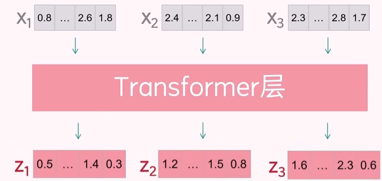

# 注意力机制

## 注意力矩阵

由词嵌入向量 $x_1,x_2,x_3$ 经过 `Transformer` 处理后，会得到 $z_1,z_2,z_3$。其中 $z_2$ 的计算流程为
1. $x_2$ 与所有输入向量 $x_1, x_2, x_3$ 进行点积，得到注意力得分

    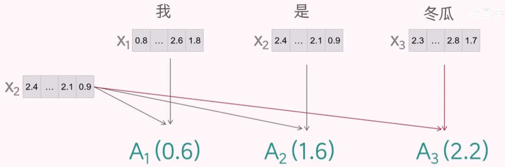

2. 通过 `softmax` 函数将注意力得分归一化，得到注意力权重

    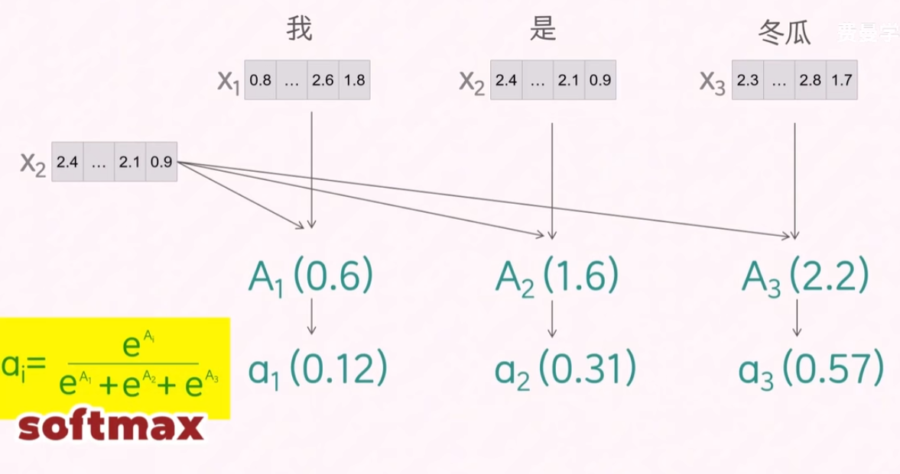

3. 将注意力权重与输入向量加权求和，得到 $z_2$

    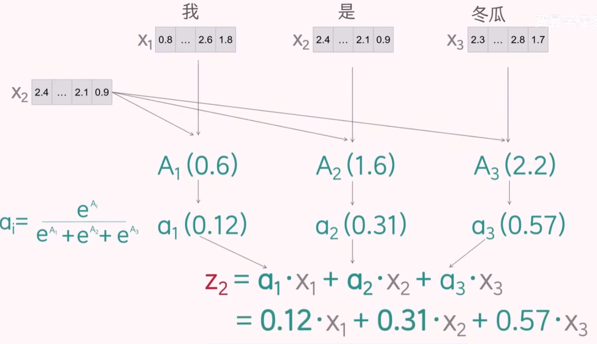

其中 $a_1, a_2, a_3$ 为 $x_2$ 与输入向量 $x_1, x_2, x_3$ 的注意力权重向量，将 $x_1, x_2, x_3$ 的注意力向量全部拼接起来，便能得到最终的「注意力矩阵」。

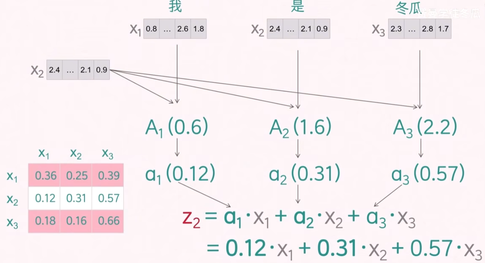

**注意力矩阵中一行系数表达的是其他`token`对当前`token`的影响程度**，例如第一行向量表示的是 $x_1, x_2, x_3$ 对 $x_1$ 的影响程度

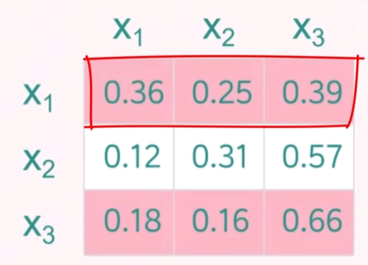

注意力矩阵与输入向量做点积运算，便能得到最终的输出向量 $z_i$。

## 掩码机制

根据自回归模型的工作流程可知，模型是逐步生成输出的，因此在计算注意力矩阵时，需要确保每个位置只能关注到**当前及之前的位置，而不能看到未来的信息**。「掩码机制」就是为了解决该问题。针对 $z_2$ 而言，$x_3$ 不应参与 $z_2$ 的计算，$a_3$ 应当为 $0$，其思路为将 $A_3$ 的结果变成 $-\infty$，在 `softmax` 计算后，$a_3$ 便趋近于 $0$。

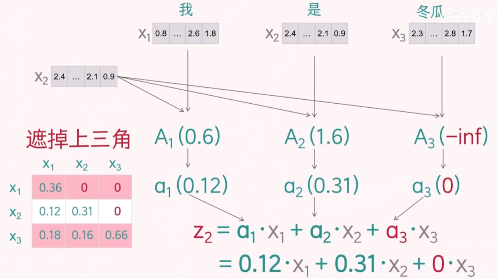

最终得到的「注意力矩阵」上三角均为 $0$

## QKV 机制

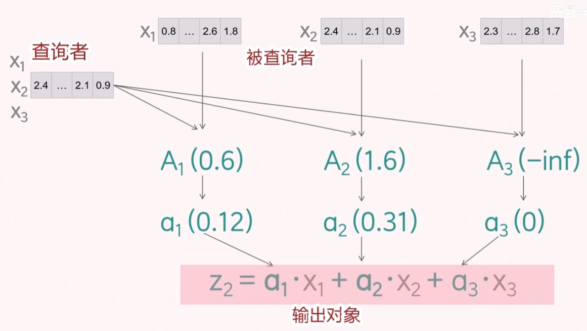

上述注意力机制实现流程中输入向量 $x_i$ 身兼数职，既作为查询（Query），又作为键（Key）和值（Value）。为了更好地表示不同的语义信息，通常会通过线性变换将输入向量 $x_i$ 映射为三个不同的向量 $q_i, k_i, v_i$，分别用于计算注意力得分和加权求和。
- $q_i$ 查询向量（Query）: **我想要什么**
- $k_i$ 键向量（Key）: **我拥有什么**
- $v_i$ 值向量（Value）: **我能提供什么**

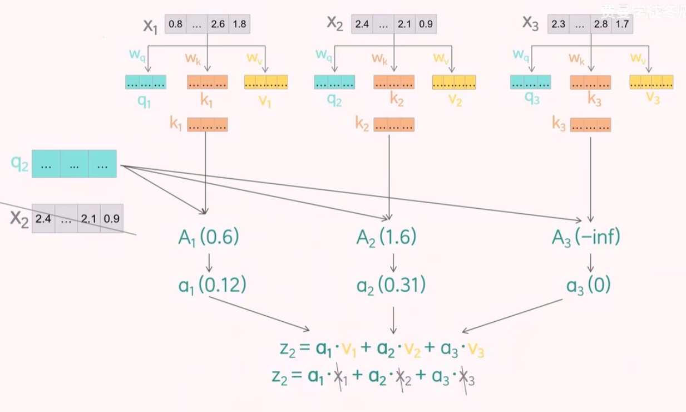

## 矩阵运算

假设词嵌入向量的维度为 `emb_dim = 768`

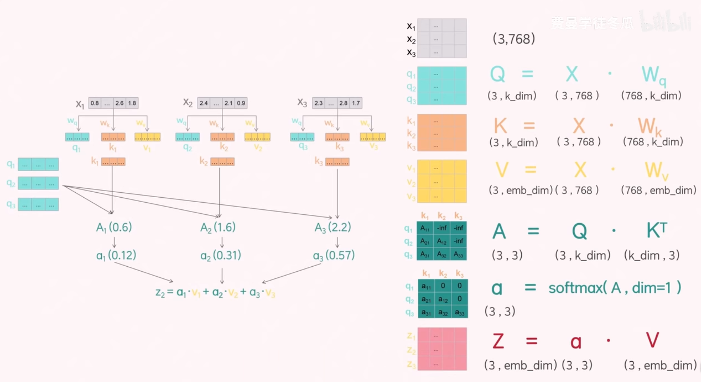

对于 $A = Q \cdot K^T$ 运算会导致 $A$ 标准差变化，为了维持 $A$ 的稳定需要修正公式

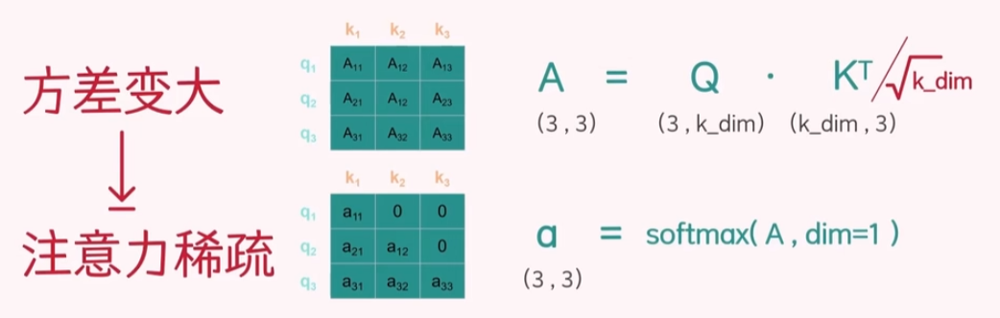

## 多头注意力

上述注意力机制中，每个输入向量只能关注到一个方面的信息, 即单头`head`注意力。**但马哲说所有事物都是多面的，需要我们辩证的看。** 因此，为了更全面地观察信息，`Transformer` 引入了「多头注意力机制」。通过将查询、键和值向量分成多个头（head），每个头独立计算注意力，然后将结果拼接起来。这样可以让模型在不同的子空间中学习到更多的特征。

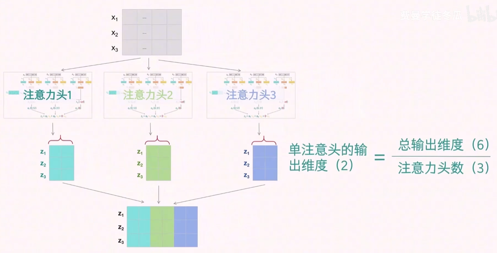

# 输出

## 损失值

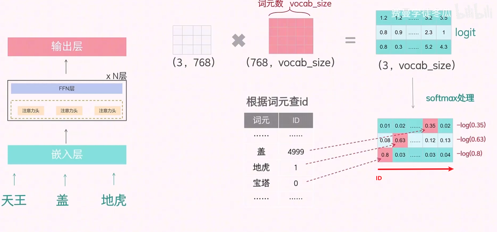

`Transformer` 的最终输出结果与嵌入矩阵点积运算，然后对所有元素进行 `softmax` 处理得到预测概率分布向量。根据词表，查询期望输出 `token` 的 `ID`。以 `ID` 索引，在预测概率分布向量中便能获得该 `token` 的输出概率。收集了的 `token` 概率，便能构建损失函数。

## 推理

在模型推理阶段，选择预测概率分布向量中概率最高的位置索引为目标 `token` 的 `ID`, 然后通过 `ID` 查询词表获得实际 `Token`。该方式虽然看着简单，但这种方式会导致模型输出的 `Token` 过于单一，缺乏多样性。为了解决这个问题，通常会使用「采样」方法来生成更丰富的输出。
- 在 `logit` 阶段除以一个 `tempreture` 参数，改变概率分布
  - `> 1`: 概率大小更均匀，增加多样性
  - `< 1`: 大概率的值更大，减少多样性

    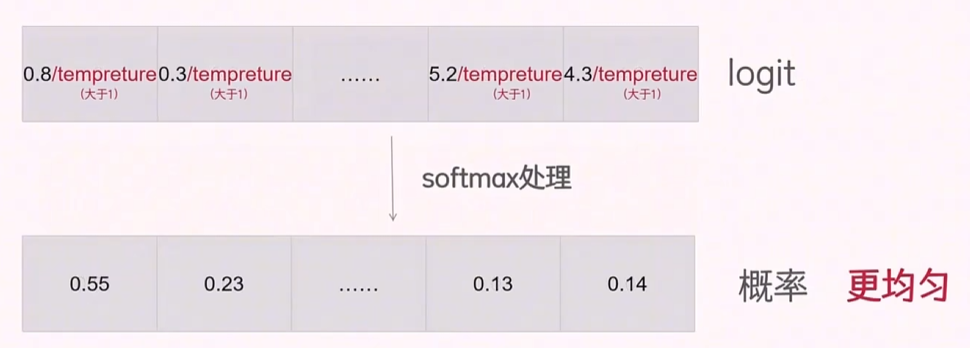

- `TopK` 采样：防止概率值小的输出参与采样，即对概率进行排序，设置一个阈值 `K`，只考虑概率最高的 `K` 个 `Token` 进行采样

    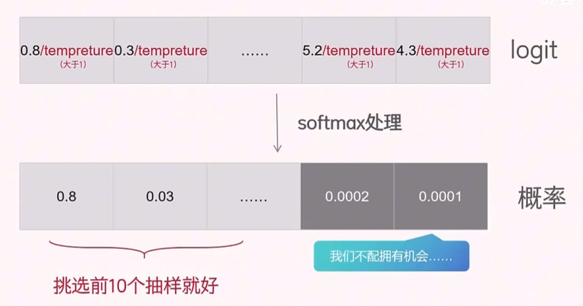

- `TopP` 采样：对概率进行排序，概率值从高到低进行累加，当和大于阈值 `K` 时，停止采样。即只考虑概率值累加和小于阈值 `K` 的 `Token` 进行采样

    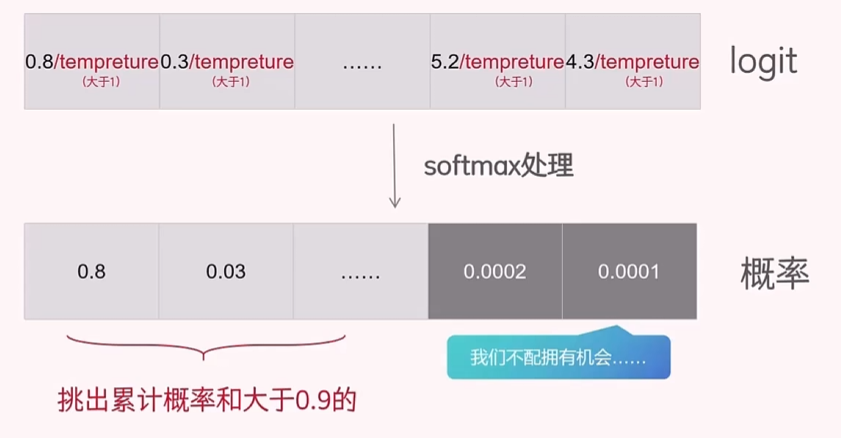

- `MinP` 采样：输出概率低于阈值的不参与采样

# Transformer

## 单层

`Transformer` 中的前馈神经网络（Feed Forward Neural Network, FNN）是一个简单的全连接层，用于对注意力机制的输出进行非线性变换。FNN 通常由两个线性变换和一个激活函数组成。
- 层1: 升维
- 层2: 降维

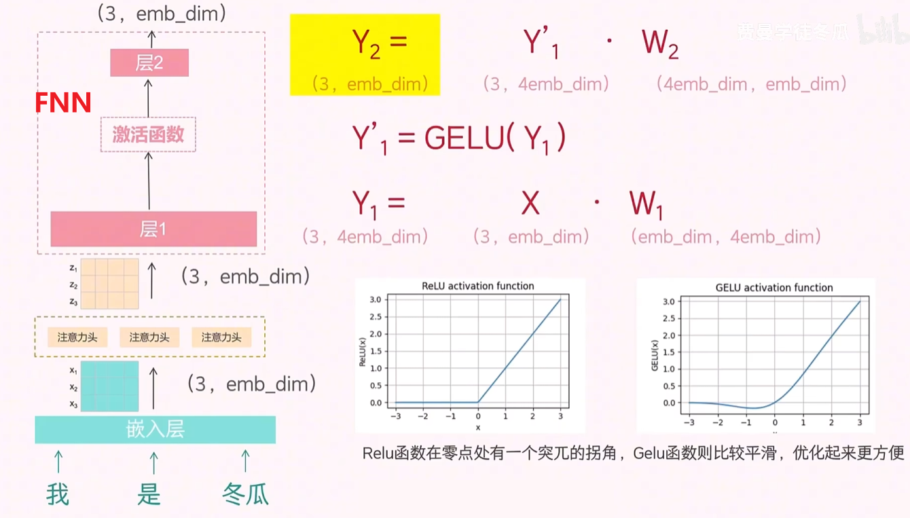

通过引入 `FNN` ，便实现了基本的 `Transformer` 结构。

## 多层

`Transformer` 由多个相同的层堆叠而成，每一层都包含自注意力机制和前馈神经网络。每一层的输出会作为下一层的输入。通过多层堆叠，模型可以学习到更复杂的特征表示。

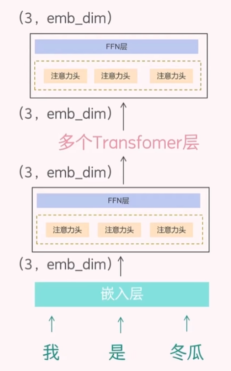

## 大的问题

`LLM` 中的第一个 `L` 就是 `Large`。神经网络层级太大，也会导致一系列问题
- 前向传播不稳定：参数归一化
- 反向传播梯度消失：残差网络

    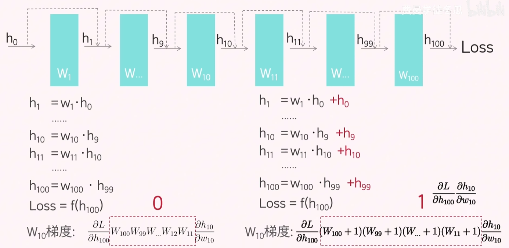

- 过拟合： `dropout` 机制

## 完整结构

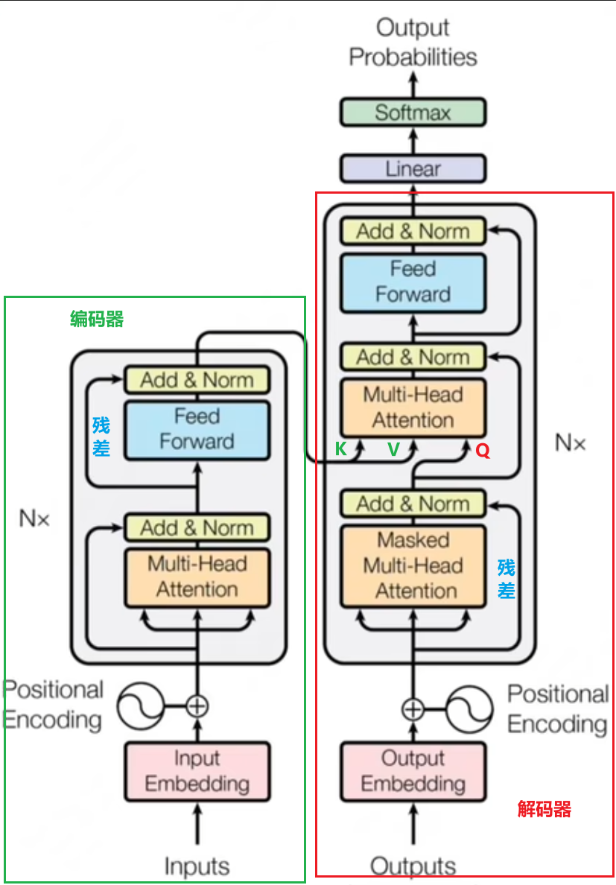

 `transformer` 完整结构的输入有两部分
- 编码器：处理用户输入，提供 `K`，`V` 矩阵
- 解码器：处理已经预测出来的结果，提供 `Q` 矩阵

最终，通过解码器与解码器的 `QKV` 矩阵预测出新的 `token`，然后将新的 `token` 添加到解码器输入，进行下一轮预测，最终实现「自回归生成」。

