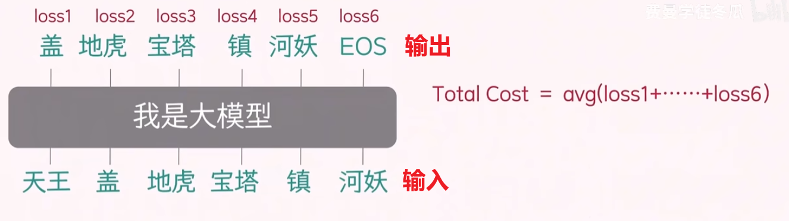

# 工作流程

# 推理

大模型`LLM`的工作机制可以简要概括为：输入一段文本，模型根据上下文预测下一个最有可能出现的词或字符，将预测结果与原输入进行拼接，然后再进行模型推理，继续预测后续的输出；当预测结果以 `EOS` 结束标记结尾时，预测结束。这种方式称之为「自回归`autoregressive`」。每一步的输出都依赖于之前的所有输入和已生成的内容。通过不断地迭代预测和拼接，模型能够生成连贯的长文本。
- 输入通常被称为`prompt`（提示词）
- 模型生成的内容则称为`completion`（补全）

工作流程如下

这种机制使得大模型能够完成诸如文本生成、对话、翻译、摘要等多种自然语言处理任务。

# 训练

一组训练数据包含
- 实际输入文本
- 期望输出文本

每个训练样本都由输入和期望输出组成。模型通过对比自身生成的输出与期望输出，计算损失（loss），并利用损失函数进行反向传播，调整参数，实现模型训练。