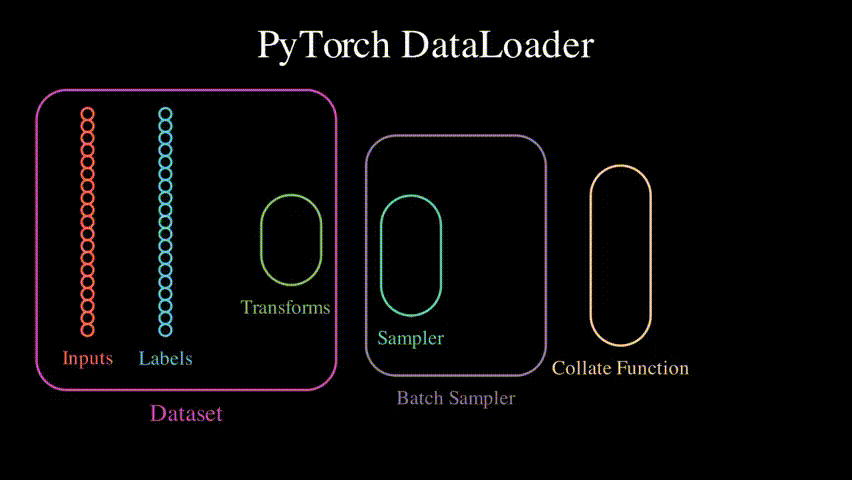

# 数据管理

# datasets

## 标准数据集

- <a href="https://pytorch.org/vision/stable/datasets.html" class="jump_link"> 标准数据集 </a>

- **使用**：以 CIFAR10 数据集为例，其他数据集类似
    ```python
    # root：数据存放路径
    # train：区分训练集，还是测试集
    # transform：对数据集中的图进行预处理
    # target_transfrom：对期望输出进行预处理
    # download：从网上直接下载数据集
    torchvision.datasets.CIFAR10(root: str, train: bool=True, 
            transform=None, 
            target_transform=None, 
            download=False)
    ```

## 自定义数据集

- **文件路径操作：**
    ```python
    rootPath = '..\\asset'
    path = '..\\asset\\cat.jpeg'

    # 测试路径
    os.path.exists(rootPath)

    # 文件类型判断
    os.path.isfile(path)
    os.path.islink(path)
    os.path.isdir(path)

    # 获取绝对路径 
    os.path.abspath(rootPath)

    # 罗列出文件夹下的所有文件名
    os.listdir(rootPath)

    # 路径拼接
    os.path.join(rootPath,'cat.jpeg')
    ```
- **数据集**
   ```python
    class ImgaeAssets(torch.utils.data.Dataset):
        """ 自定义数据集类 """
        def __init__(self,path):
            self.root = path
            self.files = os.listdir(path)
            pass

        def __getitem__(self,id):
            """ 用于数据集中的样本获取 """
            filePath = os.path.join(self.root,self.files[id])
            img = Image.open(filePath)
            return img

        def __len__(self):
            """ 数据的数量 """
            return len(self.files)

    # 创建数据集
    assets = ImgaeAssets('../asset')

    # 获取数据
    img = assets[0]
    img.show()

   ```

# dataLoader

- **作用：** 控制数据集 `dataSets` 的获取
- <a href="https://pytorch.org/docs/stable/data.html?highlight=dataloader#torch.utils.data.DataLoader" class="jump_link"> DataLoader 文档 </a>

<p style="text-align:center;"></p>

利用 dataloader 将 dataset 中的数据取出打包成 batch 的过程中，会通过 sampler 从 dataset 中取出 batch_size 个样本，然后通过 collect function 将取出的样本整理并打包成最终的 batch。

sampler 获取从 dataset 中获取样本，首先通过 `__len__` 获取总样本数，然后根据总样本数生成索引序列（数组的索引号），最后根据索引号通过 `__getitem__` 加载真正的样本数据（dataset 只预先加载了数据的文件路径，真正的文件并没直接加载）。

通过 sampler 获取到的数据样本，其实是一个「tuple(tensor) 类型数组」，并非真正的一个 tensor。将 tensor 数组最终整合成一个 tensor 就需要通过 dataset 的 collect function 实现。

```python
# dataset：设置数据集
# batch_size：一个 batch 包含多少样本
# shuffle：下一次 epoch 是否需要将数据打乱，再划分 batch
# drop_last：当最后一个 batch 不具有 batch_size 个样本时，是否需要舍弃
# num_workers：线程数
# collate_fn：自定义 collate_fn
# sampler：自定义采集
torch.utils.data.DataLoader(dataset,batch_size,shuffle=False,drop_last=False,num_workers=0,
                    worker_init_fn,collate_fn,sampler)
```


# Tensorboard

- **作用：** 将模型训练的中间过程生成日志，方便查看。

- **添加图片：**
   ```python
    from torch.utils.tensorboard import SummaryWriter
   # 创建日志生成器
    writer = SummaryWriter('../log')

    # 添加日志内容
    # tag：图片标题，区分图片，同意标签显示在同一个窗口
    # img_tensor：tensor类型的图片
    # global_step：那一个步骤的图片，同一窗口可以存储多帧图片
    writer.add_image(tag,img_tensor,global_step=None,dataformats='CHW')

    # 关闭
    writer.close()
   ```
- **添加数据**
   ```python
    x = torch.linspace(-10, 10,100,dtype=torch.float)

    for i in range(len(x)):
        # 记录每一步的数据
        writer.add_scalar('sin', torch.sin(x[i]),global_step=i)
   ```
