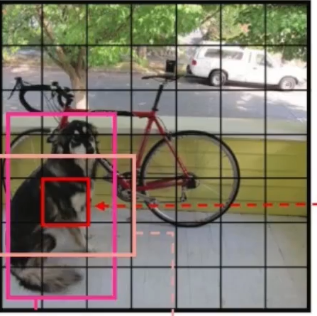

# YOLO - V1

# 网络模型

对于第一版 YOLO 的网络模型就两个部分：<a href="https://spite-triangle.github.io/artificial_intelligence/#/./DeepLearning/README" class="jump_link"> 卷积层、全连接层 </a> 。
- **输入：** 尺寸为 `448x448x3` 的图片， 图片尺寸定死 

- **输出：** 图片中被检测目标的位置（矩形框坐标）与被检测物体的分类。

# 目标检测原理

1. 将输入图片通过 `7x7` 网格，划分为 `49` 个单元格
2. 每个单元格负责一个检测目标：存储检测目标外接矩形的「中心点坐标」、长宽；存储检测目标的类型。 即当检测目标的外接矩形「中心点坐标」位于该单元格内时，就让该单元格全权负责储存这个检测目标的信息。 
3. 每个单元格持有`2`个候选矩形框，会通过置信度选择一个最好的当作预测结果输出
    

# 模型输出

V1 版本的输出结果为 `7x7x30` 的一个向量，对该向量进行维度转换得到

其中 `7x7` 表示利用 `7x7` 的网格，将输入图片划分为 `49` 个单元格；`30` 表示对每个单元格预测结果的描述：两个目标位置候补框、置信度、目标的分类

- bounding box 1 ：第一个候补框的参数，外接矩形中心坐标 $(x_1,y_1)$ ；长宽 $(w_1,h_1)$
- confidence 1 ：第一个候补框是待检测目标的置信度
- bounding box 2 ：第二个候补框的参数，外接矩形中心坐标 $(x_1,y_1)$ ；长宽 $(w_1,h_1)$
- confidence 2 ：第二个候补框是待检测目标的置信度
- 分类：检测目标为 `20` 个分类的概率

> [!note]
> 其中，对于中心坐标 $(x,y)$ 、长宽 $(w,h)$ 值的存储是一个百分比。
> - 中心坐标 $(x,y)$ ：相对单元格长宽的比值
> - 长宽 $(w,h)$：相对于输入图片长宽的比值

# 损失函数

## 定义

- $i$：表示对`SxS`的单元格的索引，将二维数组将维为一维数组进行处理
- $j$：对`B`个候补矩形的索引
- $1_i^{obj}$：标记单元格中是否存在检测目标，存在值为`1`，不存在值为`0`。
- $1_{ij}^{obj}$：标记单元格的「候补框」中是否存在检测目标，存在值为`1`，不存在值为`0`
- $1_{ij}^{noobj}$：标记单元格的「候补框」中是否存在检测目标，存在值为`0`，不存在值为`1`
- $\hat{C}$：期望输出的置信度
  - 存在目标时：
    $$
    \hat{C} = Pr(Object) * IOU_{pred}^{truth} 
    $$

    都认为是存在目标了，那么 $Pr(Object) = 1$
  - 不存在目标时：
    $$
    \hat{C} = 0
    $$

## 位置预测

当预测外接框与目标外接框的宽度、高度的差值一样时，对于较大的物体而言相对误差小，而对于较小物体而言相对误差较大。因此为了让损失函数对小物体的外接矩形的宽度、高度更敏感一些，在 YOLO V1 中采用了 **「根号」: 自变量在[0,1]取值时，根号的斜率变化比直线要大。**

# 模型预测

## 思路

训练好的 YOLO 网络，输入一张图片，将输出一个 `7x7x30` 的张量（tensor）来表示图片中所有网格包含的对象（概率）以及该对象可能的`2`个位置（bounding box）和可信程度（置信度）。每个单元格有两个 bounding box ，一共有 `7x7` 个单元格，现在将所有的 `7x7x2=98` 个 bounding box 绘制出来

可以看见图上到处都是 bounding box，现在就需要从这些 bounding box 中，筛选出能正确表示目标的 bounding box。

为了实现该目的， YOLO 采用 NMS（Non-maximal suppression，非极大值抑制）算法。

## 筛选步骤

1. 计算每个 bounding box 对应分类的得分
    $$
    Score_{ij} = P_i(C) * C_j
    $$

    其中 $C_j$ 是 bounding box 置信度；$P_i(C)$ 不同分类对应的概率。将计算结果写成矩阵形式

    

2. 对 Score 矩阵里面的所有得分进行检测，将得分小于阈值的全部设置为零
  

3. 由于这里存在 `20` 个分类，因此需要对不同的分类进行分开处理。在得分矩阵中，每一行就对应一个分类。
4. 对一行分类的 Score 进行排序，并对排序好的类型进行极大值抑制处理。
  

5. 重复步骤4，完成对所有分类的处理。 

## 极大值抑制

1. 

2. 之后 Score 不为零的 bounding box 都要与「基准框」计算 IOU。然后对这些 bounding box 进行过滤
   $$
   IOU > 0.5
   $$

   - 不等式成立：认为当前的 bounging box 与「基准框」都是标记的同一目标，重复了，因此就需要将当前 bounding box 的 Score 置为 0
   - 不等式不成立：认为当前的 bounging box 与「基准框」标记的是不同目标，当前 bounding  box 需要保留

3. 

4. 重复步骤 2 ，消除与当前「基准框」重合的 bounding box 。
5. 重复上述步骤，直到所有的重复 bounding box 都消除。

