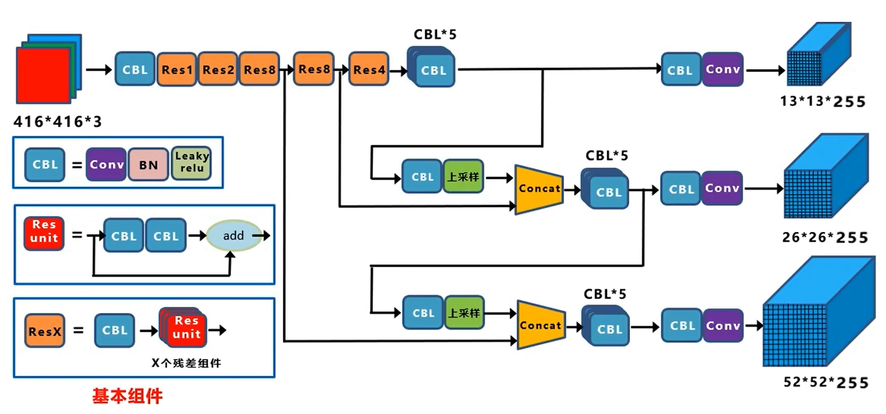
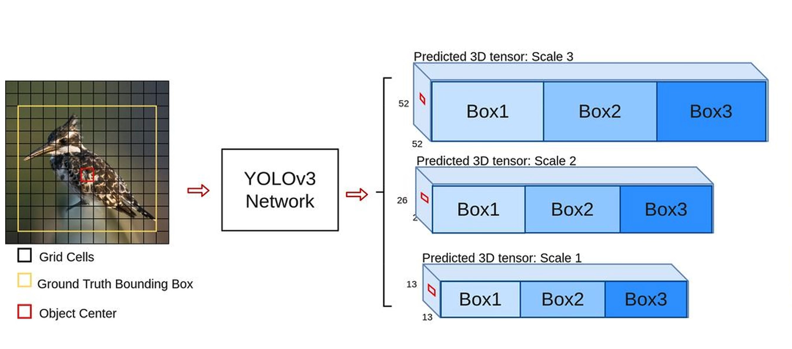
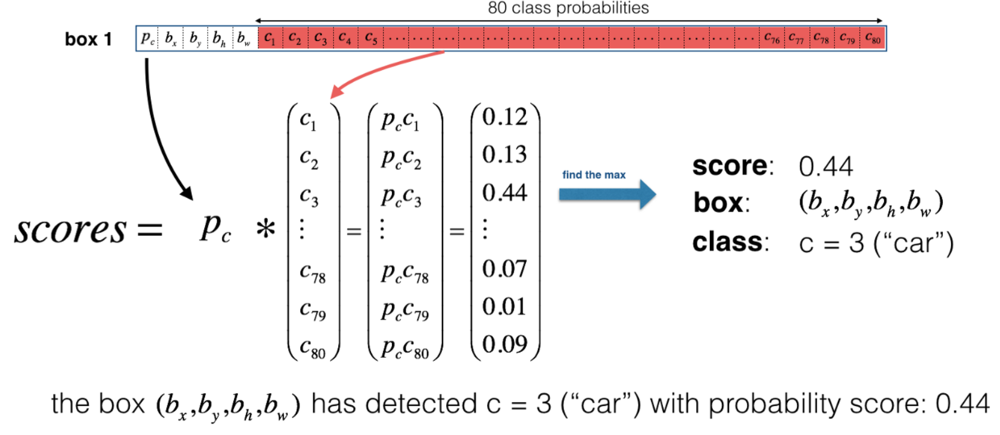
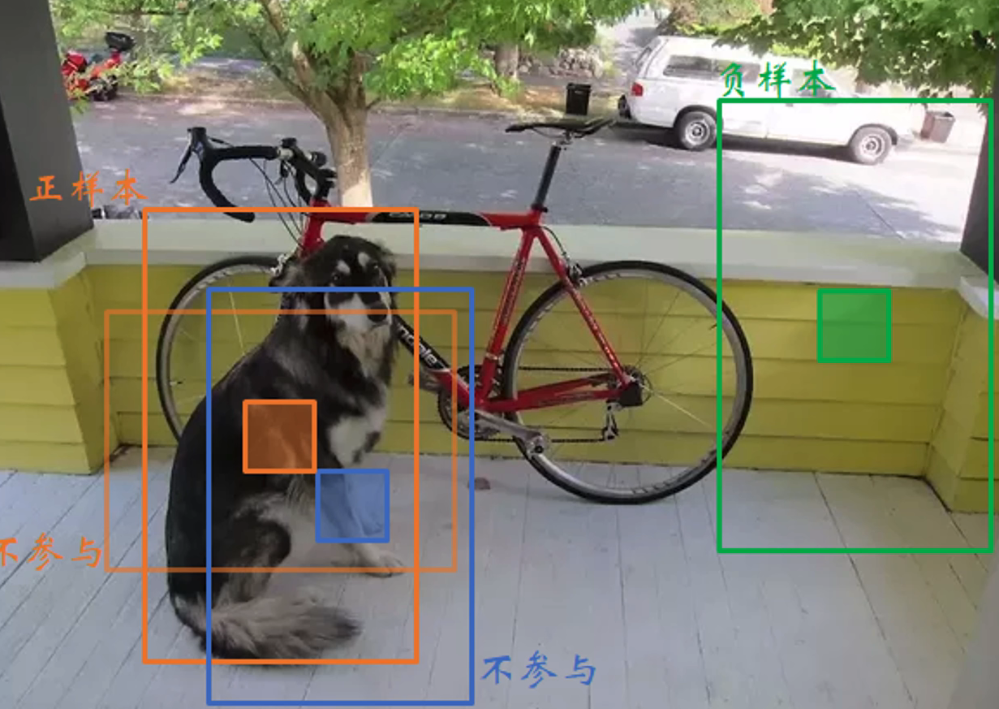

# YOLOV3

# 网络模型

YOLOV3 相对于 YOLOV2 而言，着重对网络结构进行了改进。
- 在网络中引入的 <a href="https://spite-triangle.github.io/artificial_intelligence/#/./DeepLearning/chapter/convolution" class="jump_link"> 残差网络 </a>
- **没有池化层**，使用步幅为2的卷积层替代池化层进行特征图的降采样过程
- **多尺度预测结果**：根据 <a href="https://spite-triangle.github.io/artificial_intelligence/#/./DeepLearning/chapter/convolution" class="jump_link"> 感受野 </a> ，将网络主干下层的卷积结果与上层的卷积结果进行合并，使得上层卷积结果对「物体局部」敏感的同时也能兼顾「物体整体」的信息。因此，利用最上层的结果预测小物体，利用下层的卷积结果预测大物体。

# Anchor Box

对于三类预测结果而言，不同尺度的预测结果具有不同的「感受野」

为每一个预测结果分别配置三类 Anchor Box。对于感受野较大的预测结果分配较大的三类 Anchor Box；对于感受野较小的预测结果分配较小的三类 Anchor Box。

# 预测结果

输入图片根据尺度的不同，输出结果为具有三中网格尺寸的特征结果。每个网格中的单元格均对应了三个 Anchor Box 长宽、位置的修正值 $(t_x,t_y,t_w,t_h)$，以及 Anchor Box 中检测目标是否存在的概率 $P_o$ 、分类概率 $P_i$。

**分类概率与检测目标存在概率相乘，就能得到该 Anchor Box 中的检测目标种类概率**

# 损失函数

- **预测结果 bounding box 种类划分**：与样本的真实 bounding box 计算 IOU
  - **正样本：** 对于同一个目标，IOU 最大的 bounding Box
  - **舍弃的样本：** 对于同一个目标，IOU 不是最大值的 bounding Box
  - **负样本：** IOU 小于阈值的的 bounding box

- **损失函数**
    

