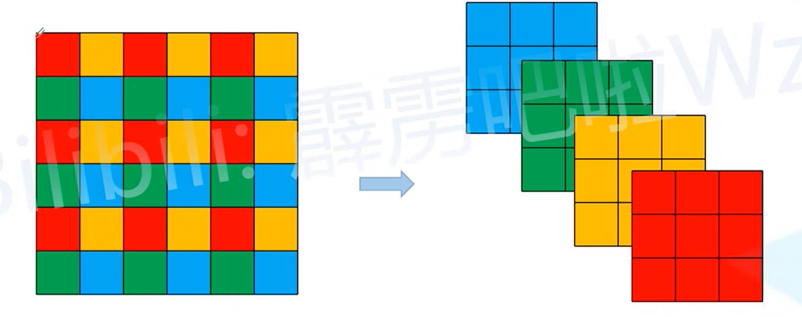
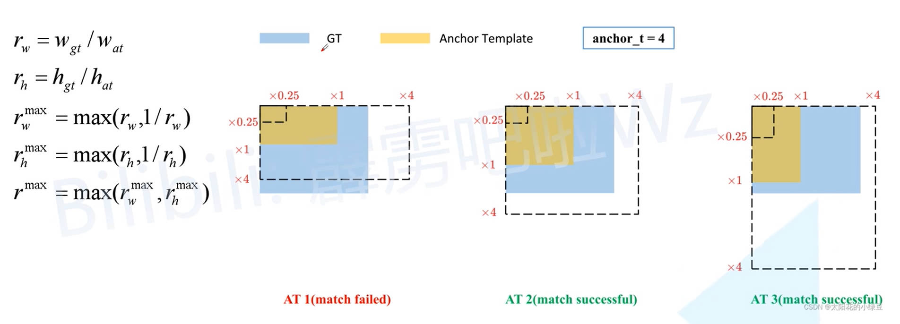

# YOLO - V5

# 网络模型

## Focus 模块改进

- **Focus 模块：** 将一个输入图片划分为一个个 `2x2` 的像素块，然后将`2x2`像素块相同的颜色位置的像素拼接在一起，最终实现输入图片长宽减半，并且通过数变为`4`。之后在对变换后的结果，通过`3x3`的卷积核进行卷积。
- **改进方案：** 上面的一顿操作，其实和直接对图片进行 `6x6` 卷积核卷积的结果是等效的

## SPPF 模型

SPPF 模块就是 V4 中的 SPP 模型改进，运算结果是等效的，但是计算速度更快（类似于 OpenCV 中，利用多次简单高斯模糊来代替一次复杂的高斯模糊，这可以使得计算量降低，上一步的计算结果可以重复利用，并且最终计算结果等价）。

# 置信度损失

1. 描述的不再是当前预测结果中是否存在检测目标的概率，而是预测结果与 Ground True Box 的 CIOU。

2. 加权合并不同尺度的置信度损失，对于不同预测尺度对应的损失值，给定不同的权重

$$
confLoss  = 4 \ confLoss_{13} + 1 \ confLoss_{26} + 0.4 \ confLoss_{52}
$$

# 预测框宽高改进

在 v2 - v4 版本中，预测框的宽高计算公式如下

$$
\begin{aligned}
    b_w = P_w e^{t_w} \\
    b_h = P_h e^{t_h}
\end{aligned}
$$

可以看出，对于 Anchor Box 宽高的调节比列 $e^x$ 是没有最大值限制的。因此，在 v5 中将宽高的调节比列修改为

$$
\begin{aligned}
    b_w &= P_w \left [ 2 \sigma(t_w) \right]^2 \\
    b_h &= P_h \left [ 2 \sigma(t_h) \right]^2 \\
\end{aligned}
$$

# 正样本匹配改进

由于对预测框宽高进行了限制，v5 不在根据 IOU 结果来确定 Ground True Box 与哪个 Anchor Box 所对应，而是通过计算 Ground True Box 与  Anchor Box 的长宽比列。**并且认为宽高比列小于 4 的 Anchor Box 与 Ground True Box 对应（预测结果的 Anchor Box 宽高的调节比列就被限制在 $(0,4)$）**。
