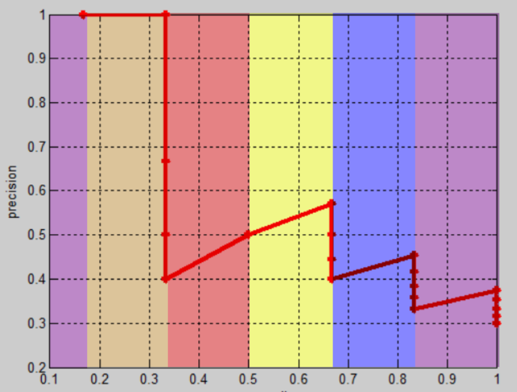
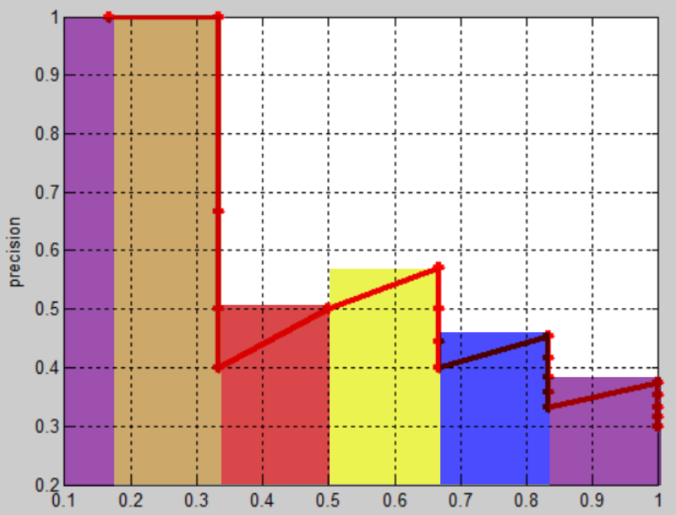

# 基础概念

# YOLO简介

YOLO（You Only Look Once）：是一种基于深度神经网络的对象识别和定位算法，其最大的特点是运行速度很快，可以用于实时系统。

# 目标检测算法

- **RCNN**：该系列算法实现主要为两个步骤：先从图片中搜索出一些可能存在对象的候选区（Selective Search），大概2000个左右；然后对每个候选区进行对象识别。检测精度较高，但速度慢。

- **YOLO**：将筛选候选区域与目标检测合二为一，大大加快目标检测速度，但准确度相对较低。

# 评价指标

## IOU 

**IOU（Intersection over Union）**：交并比，候选框（candidate bound，紫色框）与原标记框（ground truth bound，红色框）的交叠率，IOU值越高，说明算法对目标的预测精度越高。
- **Area of overlap**：原标记框与候选框的交集面积
- **Area of union**：原标记框与候选框的并集面积

## 置信度

**confidence**：预测框里存在检测目标的可信度，当置信度大于设定阈值时，就认为该预测框内有检测目标， 即通过「置信度」来实现对「待检测目标」与「背景」的划分。 

$$
confidence = Pr(Object) * IOU_{pred}^{truth} 
$$

- $Pr(Object)$，候选框里存在物体的概率；
- $IOU_{pred}^{truth}$，「预测框」与原标记框的交叠率。
  - **预测框：** 从一堆「候选框」中，选择了一个效果最好的当作「预测框」，一般取最值
    $$
    IOU_{pred}^{truth} = \max(IOU_0,IOU_1,\dotsm,IOU_B)
    $$

## 二分类指标

在「二分类」任务中，对样本的描述：
- **Position**：正例，二分类中的一类样本，一般是想要的
- **Negative**：负例，二分类中另一类样本，一般是不想要的
- **TP（True Position）**：在拿出样本中，正确识别为正例
- **FP（False Position）**：在拿出样本中，错误识别为正例，即本身是负例（误判）
- **TN（True Negative)**：未拿出样本中，正确当负例舍弃
- **FP（False Negative)**：未拿出样本中，错误当负例舍弃，即本身是正例（遗漏）

二分类结果的评判指标：

- **精度（Accuracy）**：正确分类样本占总样本的比列
    $$
    Accuracy = \frac{TP + TN}{TP+FP+TN+FN}
    $$
- **准确度（Precision）**：识别正确的样本占被拿出样本的比列
    $$
    Precision = \frac{TP}{TP + FP}
    $$
- **查准度（Recall）**：识别正确的样本占目标样本总数的比列
    $$
    Recall = \frac{TP}{TP + FN}
    $$

## MAP

### 问题

> [!tip]
> 由于 Precision 与 Recall 只适用于「二分类问题」。当存在多样本分类时，利用  Precision 与 Recall 评估模型的准确度，其实是在评估分辨结果的「对、错」，而并非关注具体分类。

当确认的样本越少，出错的风险也就越小；当选择出的样本量越大，得到全部目标样本的可能性越大。因此 Precision 与 Recall 是一度矛盾的关系
- Precision 较大时，Recall 较小：当要分辨 10 个苹果时，我只拿出一个苹果，那么 Precision 就是 `100 %`，而 Recall 确是 `10 %`
- Precision 较大时，Recall 较小：若选择出 100 个水果，10 个苹果我们都拿出来了，但是还有 90 个其他水果。Precision 就是 `10 %`，而 Recall 是 `100 %`

### 定义

**MAP（Mean Average Precision）**：Precision-Recall曲线下方的面积。结合 Precision 与 Recall ，更加全面的对模型的好坏进行评价。

1. **绘制完整的 Precision-Recall曲线**：根据模型预测结果的置信度阈值来划分正例与负例（划分检测目标与背景），计算不同阈值下的检测目标识别正确与否的 Precision 与 Recall，然后绘制成曲线。

    

2. 根据 Recall 对曲线划分区域
    

3. 找出每个 Recall 区间内，Precision 的最大值，然后用这个最大值来代表这个区间内的 Precision
    

4. 最后计算彩色矩形区域的面积，该值就是 MAP
